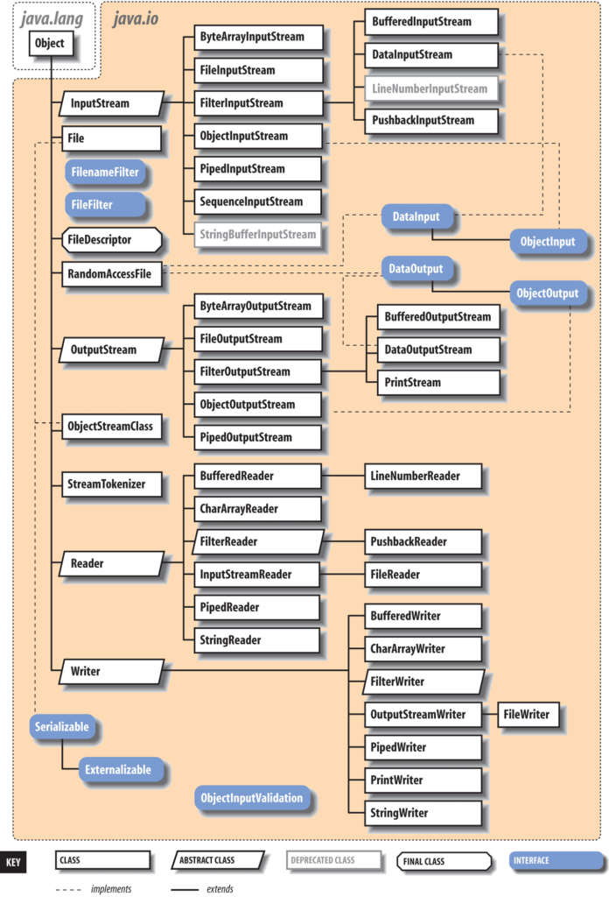
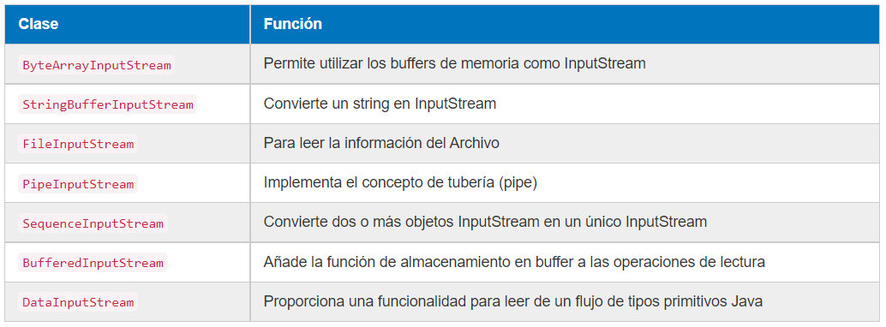
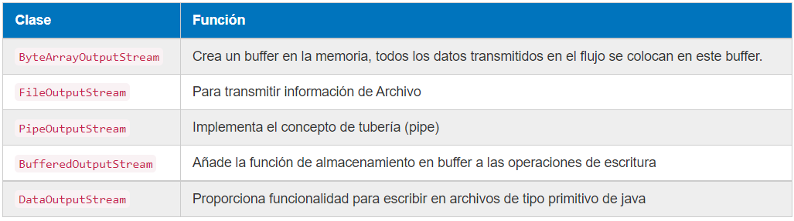
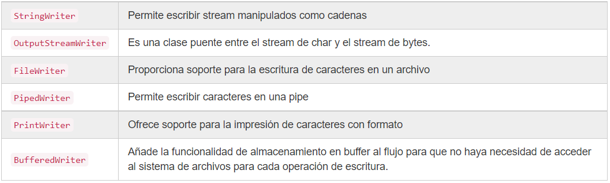
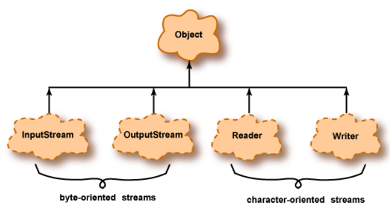
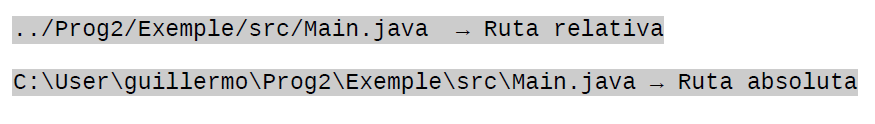

# I/O Input/Output - Entrada/Salida de la información

Todo dato tiene un origen de entrada o un destino de salida (convenientemente en inglés: I/O). **Input** o entrada implica leer datos de una fuente y **Output** o salida implica escribirlos en un destino. Un programa trabaja con datos que provienen de una entrada la cual puede ser un teclado, un archivo en disco o un socket a través de la red. Así mismo un programa genera resultados enviándolos a una salida la cual puede ser la pantalla, un archivo en disco o un socket a través de la red. En Java, la conexión entre un programa y un origen o destino de datos se denomina **flujo** (en inglés: **stream**).

Un flujo de entrada _(input stream)_ maneja los datos que fluyen hacia un programa. Un flujo de salida _(output stream)_ maneja los datos que salen de un programa.

La siguiente imagen muestra la jerarquía de clases dentro del paquete java.io:

El paquete java.io es uno de los más antiguos de Java, e incluye clases para:
- Entrada/salida en archivos
    File → representa rutas de archivos/directorios

- FileInputStream, FileOutputStream → lectura/escritura en binario
    FileReader, FileWriter → lectura/escritura en texto

- Lectura/escritura con buffers
    BufferedReader, BufferedWriter
    BufferedInputStream, BufferedOutputStream

- Serialización
    ObjectInputStream, ObjectOutputStream
    Serializable (interfaz)

- Comunicación entre procesos
    PipedInputStream, PipedOutputStream
    PipedReader, PipedWriter

- Flujos abstractos
    InputStream, OutputStream (abstractas)
    Reader, Writer (abstractas)

- Otros
    PrintWriter, PrintStream
    IOException, EOFException, FileNotFoundException, etc.

En las primeras versiones de Java el sistema de entrada/salida proporcionado en el paquete `java.io` era básico. En la versión 1.4 de Java se añadió un nuevo sistema de entrada/salida llamado `java.NIO` (New IO) para suplir algunas de sus deficiencias que posteriormente en Java 7 se mejoró aún más `java.NIO`. Entre las mejoras se incluyen permitir navegación de directorios sencillo, soporte para reconocer enlaces simbólicos, leer atributos de ficheros como permisos e información como última fecha de modificación, soporte de entrada/salida asíncrona y soporte para operaciones básicas sobre ficheros como copiar y mover ficheros.

## Tipos de Datos - Caracteres y bytes

Existen dos tipos de flujos (streams) según el tipo de datos, flujos binarios y flujos de caracteres. Los tipos de datos que se pueden leer/escribir suelen ser bytes o caracteres y los métodos que se utilizan son similares, pero se utilizan clases diferentes.

Internamente, todos los datos consisten en patrones de bits agrupados en bytes. Entonces, lógicamente, todos los flujos podrían llamarse "flujos de bytes" **(byte streams)**. Sin embargo, los flujos destinados a bytes que representan caracteres se denominan "flujos de caracteres" **(character streams)** y todos los demás se denominan "flujos de bytes".

Al escribir y leer datos de caracteres, éstos están en un formato legible para el ser humano, sin embargo, los datos binarios implican leer y escribir bytes que no son legibles si los abrimos en un editor de texto.

+ Flujos binarios (byte streams): almacenan variables, clases del programa, archivos de imagen, sonido, etc. Por ejemplo, el archivo de código de bytes creado por el compilador de Java contiene instrucciones de máquina para la máquina virtual de Java. Estos no están destinados a representar caracteres, y la entrada y salida de ellos debe usar flujos de bytes. Las clases principales para manejar estos flujos son las clases abstractas **InputStream** y **OutputStream**.

_Clases principales de InputStream:_

_Clases principales de OutputStream:_

+ Flujos de caracteres (character streams): están optimizados para datos de caracteres. Se utilizan con frecuencia para leer/escribir ficheros de texto, xml y json. Las clases principales para manejar estos flujos son las clases abstractas **Reader** y **Writer**.

_Clases principales de Reader_:

_Clases principales de Writer:_

La siguiente figura muestra la jerarquía del paquete `java.io`.
Los streams pueden estar orientados a bytes u orientados a caracteres. Cada tipo tiene flujos de entrada y flujos de salida.

### Flujos orientados a bytes

+ Diseñado para entrada y salida de propósito general.
+ Los datos pueden ser tipos de datos primitivos o bytes sin procesar.

### Flujos orientados a caracteres

+ Destinado a datos de caracteres.
+ Los datos se transforman de/a caracteres Java de 16 bits utilizados dentro de los programas al formato utilizado externamente.

## Ficheros

Un fichero es un conjunto lógico de información o de datos que se designa con un nombre y se configura como una unidad autónoma completa para el sistema o el usuario. Un archivo o fichero informático es un conjunto de bits que son almacenados en un dispositivo. Para poder acceder a ellos haremos uso de una ruta (path) ya sea relativa o absoluta.

### Tipos de acceso a ficheros

1. Acceso secuencial: Una lectura secuencial implica tener que acceder a un elemento antes de acceder al siguiente, es decir, de una manera lineal (sin saltos). Las clases `InputStream` y `OutputStream` son secuenciales.

2. Acceso aleatorio: los ficheros de acceso aleatorio permiten acceder a sus datos de una forma aleatoria, esto es indicando una determinada posición desde la que leer/escribir.
