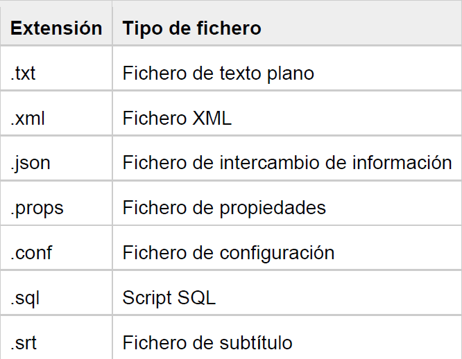

# Ficheros de caracteres

Las clases Java `FileWriter` y `FileReader` se utilizan para escribir y leer datos de archivos de texto (son clases de flujo de caracteres, **character stream**). Se recomienda no utilizar las clases `FileInputStream` y `FileOutputStream` si vamos a leer o escribir información de texto.



## Escritura de caracteres

La clase Java `FileWriter` del paquete java.io se utiliza para escribir datos en forma de caracteres en un archivo.

+ Esta clase hereda de la clase `OutputStream`.
+ Los constructores de esta clase asumen que la codificación de caracteres predeterminada y el tamaño de búfer de bytes predeterminado son aceptables.
+ `FileWriter` está diseñado para escribir secuencias de caracteres. Si queremos escribir flujos de bytes sin procesar, tendríamos que usar la clase `FileOutputStream`.

```java
public static void main(String[] args) {
    String str = "Este es un ejemplo de escritura usando FileWriter.";

    try {
        FileWriter fw = new FileWriter("output.txt");
        fw.write(str);
        fw.close();
    } catch(IOException e) {
        System.out.println("Error E/S: " + e);
    }
}
```

Cuando se cierra el stream `close()` se escribe en el fichero. Si quisiéramos grabar en el fichero en algún momento antes de cerrar, podemos usar el método `flush()`.

## Lectura de datos

`FileReader` es una clase en el paquete java.io que se usa para leer una secuencia de caracteres de los ficheros. Esta clase se hereda de la clase `InputStreamReader`.

+ `FileReader` está diseñada para leer flujos de caracteres. Para leer flujos de bytes sin procesar, usaremos `FileInputStream`.

```java
    int ch;
    try {
        FileReader fr = new FileReader("output.txt");
        ch = fr.read();
        while (ch != -1) { //fin de fichero
            System.out.print((char) ch);
            ch = fr.read();
        }
        fr.close();
    } catch (IOException fe) {
        System.out.println("Error de E/S");
    }
```

Al igual que ocurría con los ficheros binarios, disponemos de las clases `BufferedReader` y `BufferedWriter` para leer y escribir usando el búfer y así acceder a los datos más rápidamente.
