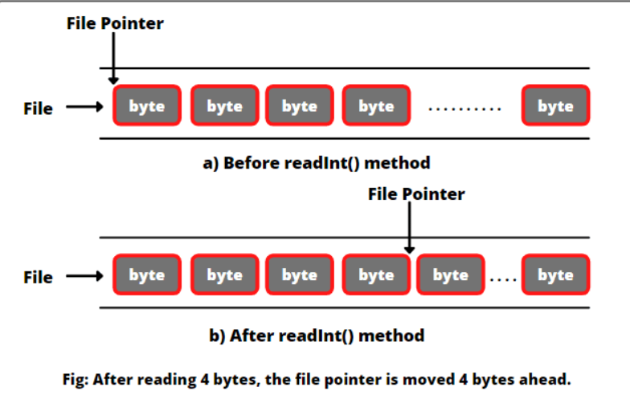

# Acceso aleatorio a ficheros

Hasta ahora, hemos escrito en un fichero, bien al principio del fichero, o bien al final del mismo. Controlando este comportamiento utilizando valores en el enum `StandardOpenOptions`.
Todos estos flujos de E/S que hemos usado se conocen como flujos **secuenciales** en Java.

Un fichero que se lee o escribe mediante un flujo secuencial se denomina **fichero de acceso secuencial**. Los datos de un fichero de acceso secuencial **NO se pueden actualizar**.

Hay otra forma de acceder a los datos de un fichero, y es con la clase `RandomAccessFile` (ficheros de acceso aleatorio). Esta clase ofrece la posibilidad de acceder directamente a los datos y modificarlos en cualquier posición específica del fichero. Permite leer y escribir datos simultáneamente. Los archivos de acceso aleatorio son útiles para muchas aplicaciones diferentes.

La clase `RandomAccessFile` se usa tanto para leer como para escribir. Escribe y lee datos binarios utilizando métodos especiales, que llevan la cuenta de cuántos bytes serán leídos o escritos.

## Puntero de la clase `RandomAccessFile`

Un fichero de acceso aleatorio se comporta como **un gran array de bytes** almacenados en el sistema de archivos.
Hay un puntero especial, o índice en el array implícito, llamado **file pointer** (**puntero de fichero**). El puntero indica la posición actual en el fichero.

Se coloca en uno de estos bytes en el fichero y se puede mover a cualquier posición arbitraria antes de leer o escribir.
**En otras palabras, se lleva a cabo una operación de lectura o escritura en la ubicación del puntero.**

Cuando se abre un `RandomAcessFile`, el puntero se establece en 0, lo que indica el inicio del fichero. Para mover el file pointer, se ejecuta el método `seek`, pasándole un valor long, que es la posición en el fichero a la que deseamos movernos.

**Para obtener la posición del file pointer** se ejecuta el método `getFilePointer()`.

Cuando leemos o escribimos datos en el archivo usando métodos de lectura o escritura, el puntero del archivo avanza al siguiente elemento de datos (es decir, el siguiente byte). Pero, dependiendo del tipo de método de lectura o escritura que estemos usando, el puntero se moverá un determinado número de bytes cuando finalicen esas operaciones.

Por ejemplo, si leemos un valor int usando el método readInt() del archivo, JVM lee 4 bytes usando el puntero, y ahora el puntero del archivo está 4 bytes por delante de la posición anterior, como se muestra en la figura a continuación.



```java
RandomAccessFile raf = ....

raf.seek(position); //mueve el puntero a una posición
raf.seek(0); //mueve el puntero al inicio del fichero
raf.seek(raf.length()); //mueve el puntero al final del fichero
```

## ¿Cuándo usamos lectura/escritura con ficheros de acceso aleatorio?

Imagina que tenemos un fichero con mucho millones de registros, y en un momento dado, necesitas acceder a unos 50 registros solamente. En vez de cargar un millón de registros en memoria, se puede cargar simplemente un array o mapa, con información sobre cómo localizar los registros deseados en el fichero.
No queremos usar acceso secuencial, y leer desde el principio del fichero, que pueden ser 10 millones de registros, comprobando cada uno para ver si coincide.

RandomAccessFile nos permite avanzar o retroceder rápidamente a una posición específica del fichero. Es decir, nos permite leer solo los datos importantes que necesita mi aplicación.

## Constructor de la clase RandomAccessFile

Para construir un objeto de la clase tenemos que especificar el modo (**mode**) que determina qué tipo de acceso a ficheros está permitido.

+ r: el fichero es de solo lectura.
+ rw: se abre en modo lectura-escritura.
+ rws: se abre para lectura y escritura y cada cambio en los datos del fichero se escribirá inmediatamente en el dispositivo físico.

> RandomAccessFile raf = new RandomAccessFile("myfile.dat", "rw");

## Ejemplo de un programa que añade texto al final de un fichero

```java
public static void main(String[] args) {
    //Se abre con el puntero al inicio del fichero
    try (RandomAccessFile ra = new RandomAccessFile("files/file.dat", "rw")) {
        ra.writeUTF("Java");
        ra.writeChar('\n');
        ra.seek(0); //muevo el puntero al inicio del fichero
        ra.seek(ra.length());//muevo el punto al final del fichero
        ra.writeUTF("Acceso aleatorio");
    } catch (IOException e) {
        throw new RuntimeException(e);
    }
}
```
