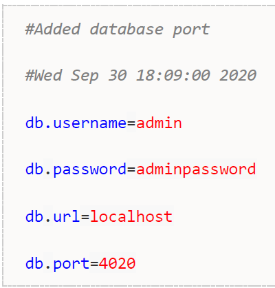

# Ficheros de configuración

En Java es habitual guardar algunos parámetros de configuración de nuestro programa en un fichero de propiedades. Un fichero de propiedades no es más que un fichero de texto, habitualmente con la extensión **“.properties”**, en donde cada línea tiene una pareja *clave=valor*.

En la API de Java se incluyen librerías para trabajar con los ficheros de configuración. Puesto que todos siguen un mismo patrón, es la librería la que se encarga de acceder al fichero a bajo nivel y el programador sólo tiene que indicar a que propiedad quiere acceder o que propiedad quiere modificar, sin tener que añadir nada de código para leer o escribir el fichero tal.

Aquí se muestra un ejemplo de fichero de configuración, llamado `datasource.properties`, que almacena información sobre la base de datos:


La primera línea del ejemplo es un comentario, que se indica con #, y las posteriores cada clave, parte izquierda del =, será un parámetro de nuestra configuración separado por un igual donde está su valor correspondiente, parte derecha del =.

Java nos proporciona la clase `Properties`, para leer de forma sencilla los ficheros de configuración.

## Cargar el fichero de configuración

Lo primero que haremos será inicializar nuestro objeto Properties.

```java
Properties properties = new Properties();
```

Esta clase tiene un método `load()` que permite cargar el fichero. No tenemos más que pasarle un `InputStream` o un `Reader` de java.

```java
properties.load(new FileReader("datasource.properties"));
```

## Leer una propiedad

El método `properties.getProperty(String)` nos permite, pasándole una clave, obtener el valor asociado a ella. En nuestro ejemplo, pasando como clave *"db.username"*, obtendríamos el valor asociado a ella *"admin"* (siempre como String, aunque sea un número).

Si la clave no existe, obtendremos `null` como resultado. Sin embargo, tenemos una variante de `getProperty()` que permite obtener un valor por defecto en caso de que no exista la clave, como en el siguiente código:

```java
properties.getProperty("db.username", "default value"));
```

Al método `getProperty()` le pasamos como primer parámetro la clave cuyo valor queremos obtener, y como segundo parámetro el valor que queremos por defecto, en caso de que la clave no tenga valor asociado.

## Leer todas las propiedades

La clase `Properties` tiene varios métodos que nos permiten obtener todas las claves que hay en el fichero. Para ello recurriremos a un objeto `Enumeration` que nos permitirá iterar sobre ellas. En este objeto almacenamos todas las claves de nuestro properties. Recorriendo estas claves, podemos obtener todos los valores. El siguiente código consulta todas las claves con el método `keys()` y luego realiza un bucle para ir sacando por pantalla todos los valores.

```java
Enumeration<Object> keys = properties.keys(); 
while (keys.hasMoreElements()) {
    Object key = keys.nextElement(); 
    System.out.println(key + " = "+ properties.get(key));
}
```

## Añadir o modificar una propiedad

Para añadir/modificar el valor de una propiedad, la clase `Properties` tiene un método llamado `setProperty(String key, String value)` que te permite añadir una pareja clave/valor nuevas o modificar una ya existente.

```java
properties.setProperty("db.port", "4020");
```

Una vez que hemos modificado/añadido valores, tendremos que guardar el fichero. Para ello la clase `Properties` tiene dos métodos: `save()` y `store()`. El método `save()` está obsoleto, por lo que no se aconseja su uso. Para guardar los cambios, debemos llamar a `store()` pasándole un `OutputStream` o un `Writer` de java.

```java
properties.store(new FileWriter("datasource.properties"),"Added database port");
```

El método `store()` admite un segundo parámetro que es un comentario que se añadirá como una línea de cabecera en el fichero. El resultado de esta llamada es un fichero con un contenido como el siguiente:



Contiene el comentario que pusimos en la llamada a `store()` y la fecha, que la inserta de regalo.
