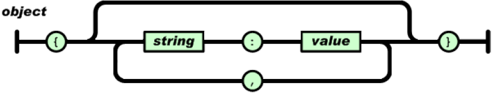
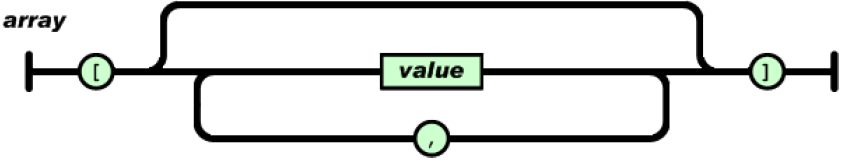
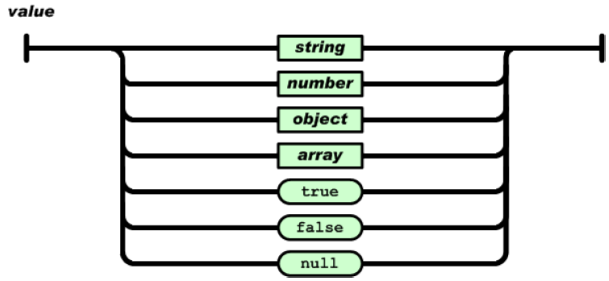
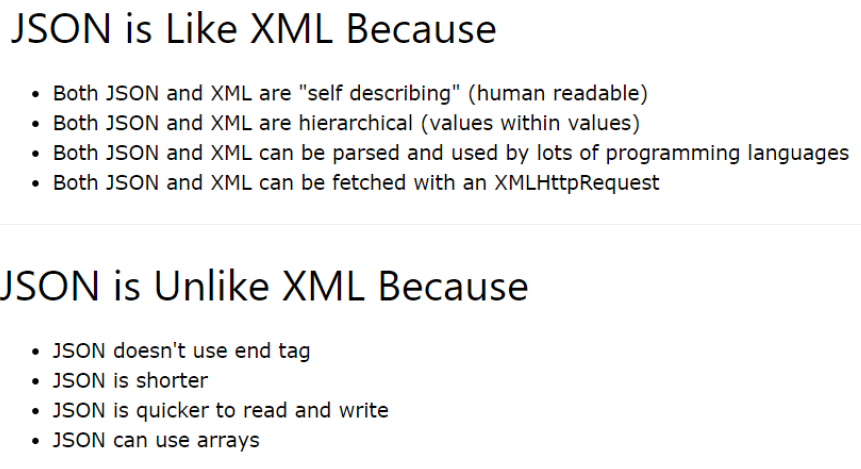

# Ficheros JSON

JSON (**JavaScript Object Notation**) es un formato ligero de intercambio de datos. Es un fichero fácil de leer y escribir para los humanos y también fácil de analizar y generar para las máquinas. Se basa en un subconjunto del lenguaje de programación JavaScript. Debido a su amplia adopción como alternativa a XML.
JSON es un formato de texto que es completamente independiente del lenguaje pero utiliza convenciones que son ampliamente conocidos por los programadores de la familia de lenguajes C, incluyendo C, C++, C#, Java, JavaScript, Perl, Python, y muchos otros. Estas propiedades hacen que JSON sea un lenguaje ideal para el intercambio de datos.

JSON se utiliza hoy en día en cada API web única.

JSON se basa en dos estructuras que son universales; virtualmente todos los lenguajes de programación las soportan de una forma u otra:

+ Una colección de pares de **name/value**. En varios lenguajes, esto se realiza como un objeto, registro, estructura, diccionario, tabla hash, lista con clave o matriz asociativa.
+ Una lista ordenada de valores. En la mayoría de los lenguajes, esto se realiza como una matriz, vector, lista o secuencia.

## Tipos de datos disponibles

1. Números: Se permiten números negativos y opcionalmente pueden contener parte fraccional separada por puntos. Ejemplo: 123.456
2. Cadenas: Representan secuencias de cero o más caracteres. Se ponen entre doble comilla y se permiten cadenas de escape. Ejemplo: "Hola"
3. Booleanos: Representan valores booleanos y pueden tener dos valores: true y false
4. null: Representan el valor nulo.
5. Array: Representa una lista ordenada de cero o más valores los cuales pueden ser de cualquier tipo. Los valores se separan por comas y el vector se mete entre corchetes.
6. Objetos: Son colecciones no ordenadas de pares de la forma `nombre:valor` separados por comas y puestas entre llaves. El nombre tiene que ser una cadena entre comillas dobles. El valor puede ser de cualquier tipo.

## Formato JSON

+ Un objeto es un conjunto desordenado de pares de name/value. Un objeto comienza con {(llave izquierda) y termina con} (llave derecha). Cada nombre va seguido de: (dos puntos) y los pares de name/value están separados por, (coma).



+ Un array es una colección ordenada de valores. Una matriz comienza con [(corchete izquierdo) y termina con] (corchete derecho). Los valores están separados por (coma).



+ Un value puede ser una cadena entre comillas dobles, un número, verdadero, falso, nulo, un objeto o una matriz. Estas estructuras se pueden anidar.



## Ejemplo de fichero JSON

```json
# Fichero JSON 

{"web-app": {
  "servlet": [   
    {
      "servlet-name": "cofaxCDS",
      "servlet-class": "org.cofax.cds.CDSServlet",
      "init-param": {
        "configGlossary:installationAt": "Philadelphia, PA",
        "configGlossary:adminEmail": "p.marti2@edu.gva.es",
        "configGlossary:poweredBy": "Patricia Marti",
        "configGlossary:poweredByIcon": "/images/cofax.gif",
        "configGlossary:staticPath": "/content/static",
        "templateProcessorClass": "org.cofax.WysiwygTemplate",
        "templateLoaderClass": "org.cofax.FilesTemplateLoader",
        "templatePath": "templates",
        "templateOverridePath": "",
        "defaultListTemplate": "listTemplate.htm",
        "defaultFileTemplate": "articleTemplate.htm",
        "useJSP": false,
        "dataStoreMaxConns": 100
        }
    },
    null,
    {
      "servlet-name": "cofaxEmail",
      "servlet-class": "org.cofax.cds.EmailServlet",
      "init-param": {
        "mailHost": "mail1",
        "mailHostOverride": "mail2"
      }
    }],
  "servlet-mapping": {
    "cofaxCDS": "/",
    "cofaxEmail": "/cofaxutil/aemail/*",
    "cofaxAdmin": "/admin/*",
    "fileServlet": "/static/*",
    "cofaxTools": "/tools/*"
    },
  "taglib": {
    "taglib-uri": "cofax.tld",
    "taglib-location": "/WEB-INF/tlds/cofax.tld"
    }
}
}

```

El fichero anterior se puede traducir como un array de objetos, por ejemplo de la clase `Servlet`, donde la clase `Servlet` estará compuesta por atributos como: servlet-name, servlet-class, etc.

Existen varias librerías en Java para parsear ficheros JSON. Entre las más comunes están: Gson, Jackson, JSON.simple, org.json, JsonPATH, etc.

### URL oficial

[The JSON Specification](http://www.json.org/json-es.html)

## JSON vs XML



## Java JSON

Java por defecto no ofrece ninguna funcionalidad integrada para analizar o crear JSON, en lugar de eso, tendremos que confiar en una biblioteca/paquete de terceros.

En la actualidad existen varias librerías para pasar transformar un objeto Java en una cadena JSON (serialización) o viceversa (deserialización).

Desde la página en donde se encuentra la especificación de JSON se indican las librerías más conocidas para tratar/generar información relativa al formato JSON en los diferentes lenguajes de programación.

Vamos a ver cómo parsear un JSON utilizando el paquete [org.json](https://mvnrepository.com/artifact/org.json/json/20220924).
Los archivos en este paquete implementan codificadores/decodificadores JSON en Java.

### Leer un JSON a partir de una API

```java
//Este método accede a una URL y se descarga el contenido en forma de String
public static String stream(String url) {
    try (InputStream input = new URL(url).openStream()) {
        InputStreamReader isr = new InputStreamReader(input);
        BufferedReader reader = new BufferedReader(isr);
        StringBuilder json = new StringBuilder();
        int c;
        while ((c = reader.read()) != -1) {
            json.append((char) c);
        }
        return json.toString();
    } catch (IOException e) {
        throw new RuntimeException(e);
    }
}

public static void main(String[] args) {
        String caturl = "https://catfact.ninja/facts";

        //parseamos un string a un JSONObject
        JSONObject jsonObject = new JSONObject(stream(caturl));
        JSONArray a = jsonObject.getJSONArray("data");
        JSONObject o = (JSONObject) a.get(0);
        System.out.println(o.getString("fact"));

}
```

Un `JSONObject` es una colección desordenada de pares clave y valor, que se asemeja a las implementaciones Map nativas de Java.
