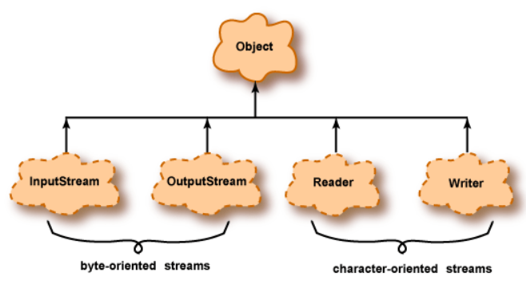

# I/O Input/Output - Entrada/Salida de la información

Todo dato tiene un origen de entrada o un destino de salida (convenientemente en inglés: I/O). **Input** o entrada implica leer datos de una fuente y **Output** o salida implica escribirlos en un destino. Un programa trabaja con datos que provienen de una entrada la cual puede ser un teclado, un archivo en disco o un socket a través de la red. Así mismo un programa genera resultados enviándolos a una salida la cual puede ser la pantalla, un archivo en disco o un socket a través de la red. En Java, la conexión entre un programa y un origen o destino de datos se denomina **flujo** (en inglés: **stream**).


Un flujo de entrada _(input stream)_ maneja los datos que fluyen hacia un programa. Un flujo de salida _(output stream)_ maneja los datos que salen de un programa.


En las primeras versiones de Java el sistema de entrada/salida proporcionado en el paquete `java.io` era básico. En la versión 1.4 de Java se añadió un nuevo sistema de entrada/salida llamado `java.NIO` (New IO) para suplir algunas de sus deficiencias que posteriormente en Java 7 se mejoró aún más `java.NIO`. Entre las mejoras se incluyen permitir navegación de directorios sencillo, soporte para reconocer enlaces simbólicos, leer atributos de ficheros como permisos e información como última fecha de modificación, soporte de entrada/salida asíncrona y soporte para operaciones básicas sobre ficheros como copiar y mover ficheros.

## Tipos de Datos - Caracteres y bytes

Existen dos tipos de flujos (streams) según el tipo de datos, flujos binarios y flujos de caracteres. Los tipos de datos que se pueden leer/escribir suelen ser bytes o caracteres y los métodos que se utilizan son similares, pero se utilizan clases diferentes.

Internamente, todos los datos consisten en patrones de bits agrupados en bytes. Entonces, lógicamente, todos los flujos podrían llamarse "flujos de bytes" **(byte streams)**. Sin embargo, los flujos destinados a bytes que representan caracteres se denominan "flujos de caracteres" **(character streams)** y todos los demás se denominan "flujos de bytes".

Al escribir y leer datos de caracteres, éstos están en un formato legible para el ser humano, sin embargo, los datos binarios implican leer y escribir bytes que no son legibles si los abrimos en un editor de texto.

+ Flujos binarios (byte streams): almacenan variables, clases del programa, archivos de imagen, sonido, etc. Por ejemplo, el archivo de código de bytes creado por el compilador de Java contiene instrucciones de máquina para la máquina virtual de Java. Estos no están destinados a representar caracteres, y la entrada y salida de ellos debe usar flujos de bytes. Las clases principales para manejar estos flujos son las clases abstractas **InputStream** y **OutputStream**.

_Clases principales de InputStream:_


_Clases principales de OutputStream:_


+ Flujos de caracteres (character streams): están optimizados para datos de caracteres. Se utilizan con frecuencia para leer/escribir ficheros de texto, xml y json. Las clases principales para manejar estos flujos son las clases abstractas **Reader** y **Writer**.

_Clases principales de Reader_:


_Clases principales de Writer:_


La siguiente figura muestra la jerarquía del paquete `java.io`.
Los streams pueden estar orientados a bytes u orientados a caracteres. Cada tipo tiene flujos de entrada y flujos de salida.



### Flujos orientados a bytes

+ Diseñado para entrada y salida de propósito general.
+ Los datos pueden ser tipos de datos primitivos o bytes sin procesar.

### Flujos orientados a caracteres

+ Destinado a datos de caracteres.
+ Los datos se transforman de/a caracteres Java de 16 bits utilizados dentro de los programas al formato utilizado externamente.

## Tipos de acceso a ficheros

1. Acceso secuencial: Una lectura secuencial implica tener que acceder a un elemento antes de acceder al siguiente, es decir, de una manera lineal (sin saltos).

2. Acceso aleatorio: los ficheros de acceso aleatorio permiten acceder a sus datos de una forma aleatoria, esto es indicando una determinada posición desde la que leer/escribir.

## Escribir datos en un fichero binario

La escritura en ficheros binarios representa el flujo de salida de bytes, es decir, necesitamos utilizar las clases que derivan de `OutputStream`. Se puede escribir datos en un fichero binario de muchas formas. Veamos un ejemplo utilizando la clase `FileOutputStream`.

```java
public static void main(String[] args) {
    try {
        DataOutputStream fos = new DataOutputStream(new FileOutputStream("datos.dat"));
        fos.writeInt(0);
        fos.writeInt(1);
        fos.writeInt(33);
        fos.writeInt(-77);
        fos.close();
    } catch (FileNotFoundException e) { //todas pueden derivar de IOException
        System.out.println(e.getMessage());
    } catch (IOException e) {
        System.out.println(e.getMessage());
    }
}
```

En el ejemplo, el constructor `FileOutputStream` abre el fichero `datos.dat` para escritura. Se crea un nuevo fichero; si un fichero antiguo tiene el mismo nombre, se eliminará. Luego, un `DataOutputStream` se conecta al `FileOutputStream`.

`DataOutputStream` tiene métodos para escribir datos primitivos en un flujo de salida. El método writeInt() escribe los cuatro bytes de un tipo de datos int en la secuencia.

El programa escribe cuatro enteros en el flujo de salida y luego cierra el flujo.

!!! Warning
    Siempre hay que cerrar el flujo para asegurarse de liberar todos los recursos asociados a él y que el sistema operativo no consuma recursos.

## Escritura en un fichero binario usando el búfer

Ahora vamos a escribir más enteros en el fichero. Para ello utilizamos `BufferedOutputStream`. Este búfer almacena los bytes antes de que se escriban en el disco. Recuerda que un búfer es un bloque de memoria que se usa para ensamblar datos antes de que se escriban todos a la vez.

**El almacenamiento en búfer hace que las operaciones de E/S sean más eficientes.** Para un programa que realiza E/S masivas, el almacenamiento en búfer es esencial. La E/S es muy lenta en comparación con las operaciones con almacenamiento principal. Sin almacenamiento en búfer, la E/S sería muy, muy lenta.

```java
 public static void writeBuffer() {
    try {
        DataOutputStream out = new DataOutputStream(
                new BufferedOutputStream(
                        new FileOutputStream("datosBufer.dat")));
        for (int i = 0; i < 1000; i++) {
            out.writeInt(i);
        }
        out.close();
    } catch (FileNotFoundException e) {
        throw new RuntimeException(e);
    } catch (IOException e) {
        throw new RuntimeException(e);
    }
}
```

## Lectura de datos en un fichero binario

Para leer un fichero, primero hemos de preguntarnos un poco sobre él, es decir, si fue escrito por un programa Java, entonces necesitaremos saber qué tipos de datos se usaron, y así poder usar una subclase de `InputStream` para leer bytes para ese tipo de datos.

`InputStream`, como hemos visto en los diagramas, es una clase abstracta para objetos que leen flujos de bytes. Aunque, no todas las clases que derivan de ella están relacionadas con la entrada de ficheros de disco. Por ejemplo, `PipedInputStream` representa datos provenientes de otro programa en ejecución.

```java
public static void main(String[] args) {
    int sum = 0;
    try {
        DataInputStream dis = new DataInputStream(new FileInputStream("datos.dat"));

        sum += dis.readInt();
        sum += dis.readInt();
        sum += dis.readInt();
        sum += dis.readInt();

        System.out.println(sum);
        dis.close();
    } catch (FileNotFoundException e) { //todas pueden derivar de IOException
        System.out.println(e.getMessage());
    } catch (IOException e) {
        System.out.println(e.getMessage());
    }
}
```

Al igual que en la escritura para la lectura también disponemos de la clase `BufferedInputStream`.

## Path vs File

En Java, `Path` y `File` son clases responsables de las operaciones de E/S de ficheros. Realizan las mismas funciones pero pertenecen a diferentes paquetes.

### `java.io.File`

Las primeras versiones de Java incluyen el paquete `java.io`, que contiene casi todas las clases que podríamos necesitar para realizar operaciones de entrada y salida. La clase `File` es una representación abstracta de nombres de rutas de archivos y directorios.
