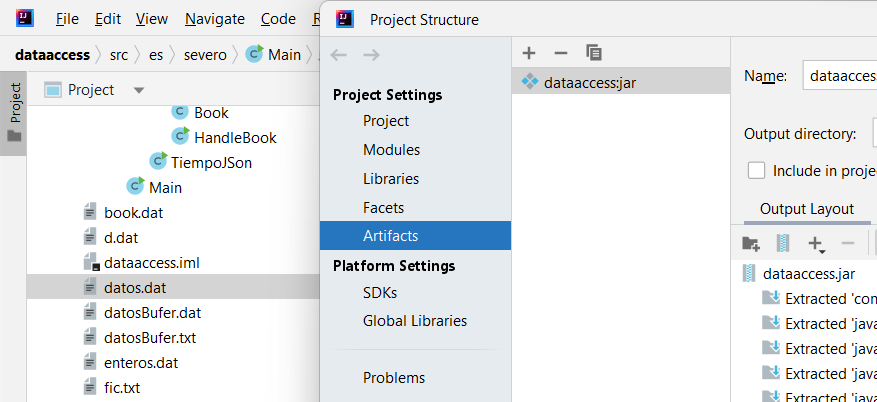
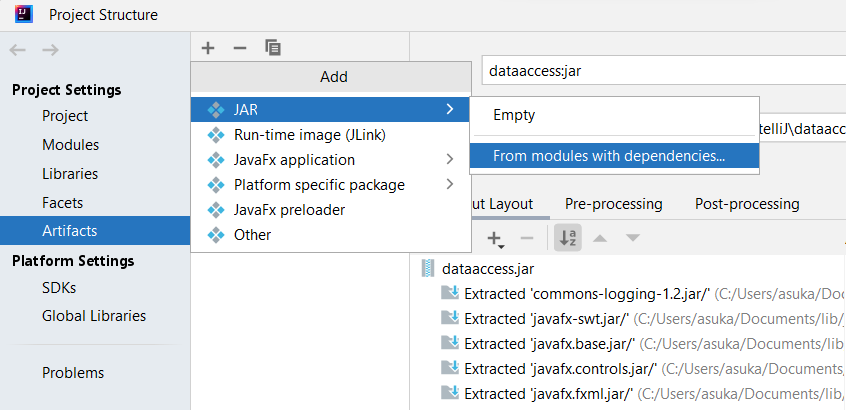
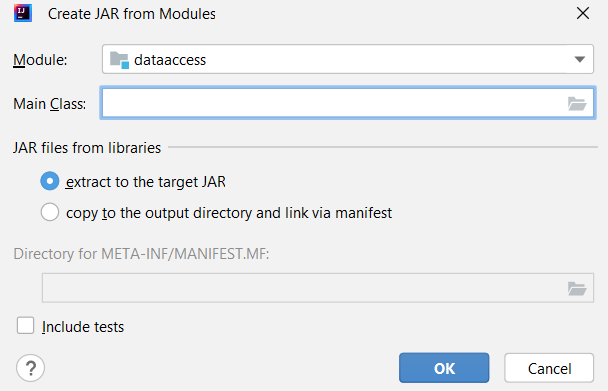
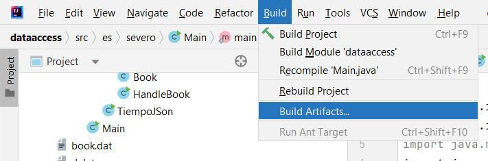
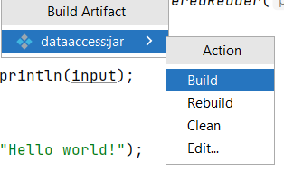

# Cómo crear un jar en IntelliJ

1. Vamos a File --> Project Structure

2. En la sección Artifacts, seleccionamos el símbolo "+" y seleccionamos el formato .jar --> "From modules with dependencies"

4. Le decimos cuál es la clase main y aceptamos.

5. Todavía no hemos construido el .jar. Para crearlo vamos al menú "Build" --> "Build Artifact".

6. Seleccionamos "Build".

El .jar estará en la carpeta del proyecto dentro de /out/artifacts/...