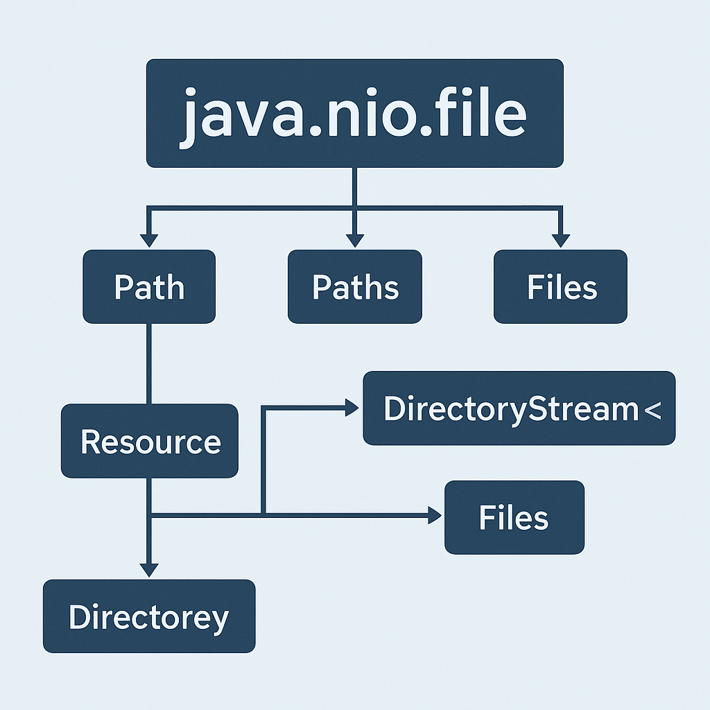

# 📁 Gestión de ficheros con Java

## Ficheros

Un fichero es un conjunto lógico de información o de datos que se designa con un nombre y se configura como una unidad autónoma completa para el sistema o el usuario. Un archivo o fichero informático es un conjunto de bits que son almacenados en un dispositivo. Para poder acceder a ellos haremos uso de una ruta (path) ya sea relativa o absoluta.

```properties
../Ada/Ejemplo/src/Main.java                --> Ruta relativa
c:\User\Patricia\Ada\Ejemplo\src\Main.java  --> Ruta absoluta
```

---

## 🕰️ `java.io` vs `java.nio`

Java ofrece varias formas de trabajar con archivos y directorios. A lo largo del tiempo, el lenguaje ha ido evolucionando:

- **`java.io`** fue la primera API de entrada/salida. Apareció con **Java 1.0** (en 1996) y ofrecía clases como `File`, `InputStream`, `OutputStream`, `Reader`, `Writer`, etc. Permitía hacer operaciones básicas, pero de forma limitada y poco robusta.

- **`java.nio`** (New Input/Output) se introdujo en **Java 1.4** (2002), y se amplió con el paquete **`java.nio.file` en Java 7** (2011). Esta nueva API ofrece clases modernas como `Path`, `Files` o `DirectoryStream`, y un enfoque más seguro y potente para trabajar con el sistema de archivos.

---

## 🧭 Introducción al sistema de archivos en Java

En Java existen **dos formas principales de trabajar con archivos y carpetas**:

- `java.io.File`: fue la primera API que ofrecía funciones básicas para trabajar con el sistema de archivos.
- `java.nio.file`: introducida en Java 7, es **más moderna, potente y segura**.

### ⚠️ ¿Cuál usar?

Aunque `java.io.File` aún funciona, tiene muchas limitaciones. Por eso **recomendamos usar `java.nio.file` siempre que sea posible**.

---

### ✅ ¿Por qué usar `java.nio.file` hoy?

- Mejor gestión de errores (lanzando excepciones con mensajes útiles)
- Soporte para rutas absolutas, relativas y enlaces simbólicos
- Métodos directos para copiar, mover, borrar o leer archivos
- Más control y modularidad

> En esta unidad aprenderás directamente a usar `java.nio.file`, pero también conocerás brevemente las limitaciones de `java.io.File` para que puedas comparar y entender por qué hoy se considera una API anticuada.

## 🆚 Comparativa entre `java.io.File` y `java.nio.file`

| Funcionalidad | `java.io.File` (limitada) | `java.nio.file` (moderna) |
|---------------|----------------------------|----------------------------|
| **Crear archivo** | `file.createNewFile()`<br>❌ Devuelve `false`, sin detalles | `Files.createFile(path)`<br>✅ Lanza excepción útil |
| **Comprobar si existe** | `file.exists()` | `Files.exists(path)` |
| **Crear directorio** | `file.mkdir()` | `Files.createDirectory(path)` |
| **Listar archivos** | `file.listFiles()`<br>❌ Devuelve `null` si falla | `DirectoryStream<Path>`<br>✅ Más controlado |
| **Eliminar archivo** | `file.delete()`<br>❌ Devuelve `false` | `Files.delete(path)`<br>✅ Con control de errores |
| **Copiar/Mover archivos** | ❌ No se puede directamente | ✅ `Files.copy()`, `Files.move()` |
| **Leer archivo completo** | ❌ Necesita bucles y buffers | ✅ `Files.readAllLines(path)` |
| **Manejo de errores** | ❌ Poca información | ✅ Lanza excepciones claras |

---

## 📂 ¿Qué hay dentro de `java.io`?
El paquete `java.io` es uno de los más antiguos de Java, e incluye **clases para:**

### 1. Entrada/salida en archivos
- `File` → representa rutas de archivos/directorios
- `FileInputStream`, `FileOutputStream` → lectura/escritura en binario
- `FileReader`, `FileWriter` → lectura/escritura en texto

### 2. Lectura/escritura con buffers
- `BufferedReader`, `BufferedWriter`
- `BufferedInputStream`, `BufferedOutputStream`

### 3. Serialización
- `ObjectInputStream`, `ObjectOutputStream`
- `Serializable` (interfaz)

### 4. Comunicación entre procesos
- `PipedInputStream`, `PipedOutputStream`
- `PipedReader`, `PipedWriter`

### 5. Flujos abstractos
- `InputStream`, `OutputStream` (abstractas)
- `Reader`, `Writer` (abstractas)

### 6. Otros
- `PrintWriter`, `PrintStream`
- `IOException`, `EOFException`, `FileNotFoundException`, etc.

---

### Crear un objeto File

```java
File f = new File("C:\\Users\\temp\\data.txt");
```
Un objeto `File` NO es el fichero real. No contiene los datos que contiene el fichero. Es un objeto que contiene métodos que afectan a un archivo o directorio en particular y las funciones para la manipulación real del archivo.

---

## 🧠 Curiosidad didáctica

- `java.io` es una **gran colección de clases que forman parte del núcleo de Java** desde sus inicios.
- Muchas de ellas son **abstractas o extensibles**, pensadas para que puedas combinarlas (por ejemplo: envolver un `FileReader` con un `BufferedReader`).
- Aunque hoy en día muchas tareas se pueden hacer mejor con `java.nio`, algunas de estas clases aún **tienen utilidad complementaria**, sobre todo en flujos de texto o para serialización básica.

## 📂 ¿Qué hay dentro de `java.nio.file`?

El paquete `java.nio.file` fue introducido en Java 7 y es parte de la API moderna para trabajar con rutas, archivos y directorios de forma segura y eficiente.

### 🔧 Clases principales

- **`Path`**
  Representa una ruta (ya sea de un archivo o un directorio) de forma independiente del sistema operativo. Ejemplo:

  ```java
  Path ruta = Path.of("archivos/ejemplo.txt");
  ```

- **`Paths`**
  Clase auxiliar que se usa para construir objetos `Path` a partir de una cadena de texto.

- **`Files`**
  Clase con métodos estáticos para operar directamente sobre archivos y carpetas: crear, borrar, copiar, mover, leer y escribir.

- **`DirectoryStream`**
  Permite recorrer el contenido de un directorio como si fuera una colección. Es seguro y compatible con `try-with-resources`.

---

## 🛠️ Operaciones básicas con ficheros

- **Crear un objeto Path que representa la ruta relativa al fichero nota.txt, dentro del directorio documentos. Si nota.txt no existe no falla, Paths.get(...) solo crea un objeto Path, es decir, una representación en memoria de una ruta. No comprueba si existe ni intenta acceder al fichero.**
    ```java
    Path archivo = Paths.get("documentos/nota.txt");
    ```
!!! Warning
    ❗Importante: Esto NO crea el fichero físicamente. Solo estás creando una referencia lógica en Java que apunta a esa ruta.

- **Comprobar si existe un fichero:**

  ```java
  boolean exists = Files.exists(archivo);
  ```

- **Crear un archivo. Devuelve la ruta del fichero creado:**

  ```java
  Path newFile = Files.createFile(archivo);
  ```

- **Borrar un fichero:**

  ```java
  Files.delete(archivo);
  ```

- **Copiar un fichero. Devuelve la ruta del fichero copiado:**

  ```java
  Path copiedFile = Files.copy(archivo, Paths.get("copia.txt"), StandardCopyOption.REPLACE_EXISTING);
  ```

- **Mover (o renombrar) un fichero. Devuelve la ruta del fichero movido:**

  ```java
  Path movedFile = Files.move(archivo, Paths.get("nuevos/nota.txt"), StandardCopyOption.REPLACE_EXISTING);
  ```

- **Devolver el tamaño en bytes del fichero representado por Path:**

  ```java
  Path path = Path.of("fichero.txt");
  long tamaño = Files.size(path);
  ```
Si el path apunta a un fichero, devuelve el tamaño del contenido del fichero.
Si el path apunta a un directorio, lanza una excepción (IOException o AccessDeniedException), ya que NO SE PUEDE MEDIR EL TAMAÑO DE UN DIRECTORIO.
---

## 📁 Operaciones básicas con directorios

- **Paths.get es un método estático que crea un objeto de tipo Path. En este caso, crea una ruta relativa al directorio actual con el nombre "nuevaCarpeta".:**
    ```java
    Path carpeta = Paths.get("nuevaCarpeta");
    ```
!!! Warning
    ¿La carpeta existe? No necesariamente. Esta línea solo crea la representación de la ruta como objeto Path, pero no crea la carpeta en el sistema de archivos.

- **Crear un directorio. Devuelve la ruta del nuevo directorio creado:**

  ```java
  Path newDir = Files.createDirectory(carpeta);
  ```

- **Crear varios directorios anidados. Devuelve la ruta del último directorio creado:**

  ```java
  Path lastNewDir = Files.createDirectories(Paths.get("usuarios/admin/documentos"));
  ```
!!! Warning
    Crea todos los directorios necesarios en la ruta dada, si no existen. Si ya existen, NO lanza excepción. Si no especificas una ruta absoluta, se crean en el directorio actual. El ejemplo creará una ruta compuesta por 3 directorios:
    usuarios/
    usuarios/admin/
    usuarios/admin/documentos/

- **Listar el contenido de un directorio. Abre un flujo (DirectoryStream<Path>) con todos los elementos (ficheros y subdirectorios) que contiene la ruta especificada. No es recursivo (no entra dentro de subdirectorios):**

  ```java
  try (DirectoryStream<Path> stream = Files.newDirectoryStream(Path.of("/home"))) {
    for (Path archivo : stream) {
        System.out.println(archivo.getFileName());
    }
  } catch (IOException e) {
    e.printStackTrace();
  }
  ```

- **Comprobar si una ruta es un directorio:**

  ```java
  boolean isDir = Files.isDirectory(carpeta);
  ```

---

## 🖼️ Vista general de `java.io`

La siguiente imagen muestra la jerarquía de clases dentro del paquete `java.io`:


## 🖼️ Vista general de `java.nio.file`

La siguiente imagen muestra las clases más importantes dentro de `java.nio.file`:



---

## ✅ Buenas prácticas con `java.nio.file`

- Usa `try-catch` para manejar excepciones como `IOException`.
- Si abres un recurso que debe cerrarse (como un `DirectoryStream`), usa `try-with-resources`. Recursos se refiere a objetos como streams, buffers, o lectores que ocupan memoria activa del sistema operativo.
- Divide tu código en métodos pequeños y reutilizables para mantenerlo limpio.
- Comenta el código si haces operaciones delicadas (como borrar o mover archivos).
- Siempre verifica si los archivos o directorios existen antes de operar sobre ellos.
- Usa REPLACE_EXISTING en copias o movimientos si quieres sobreescribir.

---