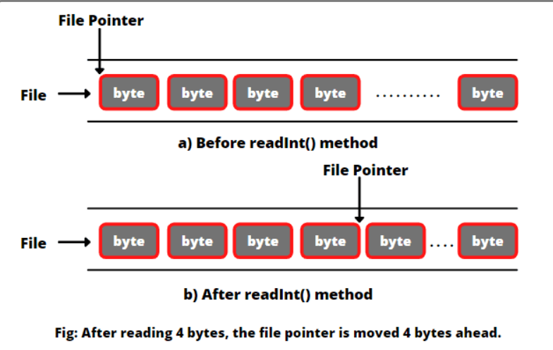

# 🔁 Operaciones con ficheros de acceso aleatorio en Java

Los **ficheros de acceso aleatorio** permiten **leer y escribir en cualquier posición** del fichero, sin necesidad de recorrerlo secuencialmente desde el inicio.

Se utilizan cuando necesitamos **modificar partes concretas de un fichero** sin tener que cargarlo entero a memoria. Muy usados en bases de datos, archivos binarios estructurados, etc.

Aunque puedes guardar texto en ellos (usando por ejemplo `writeUTF()` o `writeChars()`), la clase `RandomAccessFile` escribe y lee bytes directamente y trata los datos como secuencias de bytes con posiciones concretas. Por tanto:

Los datos no están codificados como texto plano (como UTF-8), sino en su representación binaria interna.

Se trabaja con int, double, char, etc., codificados en binario según el estándar de Java.

Incluso los métodos de texto como `writeUTF()` guardan la longitud y caracteres como bytes binarios.

---

## 🧰 Clase principal: `RandomAccessFile`

La clase `java.io.RandomAccessFile` permite acceder a cualquier parte de un fichero para leer o escribir datos. Soporta acceso **de lectura y escritura**, según el modo de apertura (`"r"`, `"rw"`, etc.).

## ✅ Modos de apertura

| Modo    | Descripción                                    |
| ------- | ---------------------------------------------- |
| `"r"`   | Solo lectura                                   |
| `"rw"`  | Lectura y escritura                            |
| `"rws"` | Escritura sin buffer, sincronización inmediata |
| `"rwd"` | Escritura de datos (no metadatos), sin buffer  |

---

## 📂 Escritura y lectura de datos binarios

```java
try (RandomAccessFile raf = new RandomAccessFile("datos.bin", "rw")) {
    raf.writeInt(100);      // escribe un entero (4 bytes)
    raf.writeDouble(3.14);  // escribe un double (8 bytes)

    raf.seek(0);            // mueve el puntero al inicio

    int valor = raf.readInt();         // lee 4 bytes desde el inicio
    double decimal = raf.readDouble(); // lee los siguientes 8 bytes

    System.out.println("Leído: " + valor + ", " + decimal);
} catch (IOException e) {
    e.printStackTrace();
}
```

---

## 🔍 Métodos importantes de `RandomAccessFile`

| Método                 | Descripción                                                                   |
| ---------------------- | ----------------------------------------------------------------------------- |
| `seek(long pos)`       | Mueve el puntero de lectura/escritura a la posición indicada                  |
| `getFilePointer()`     | Devuelve la posición actual del puntero                                       |
| `length()`             | Devuelve el tamaño del fichero (en bytes)                                     |
| `setLength(long l)`    | Cambia el tamaño del fichero                                                  |
| `readX()` / `writeX()` | Métodos para leer y escribir tipos primitivos (`int`, `double`, `char`, etc.) |

---

## 🔄 Ejemplo: Modificar un valor sin tocar el resto

```java
try (RandomAccessFile raf = new RandomAccessFile("numeros.dat", "rw")) {
    raf.writeInt(10); // pos 0
    raf.writeInt(20); // pos 4
    raf.writeInt(30); // pos 8

    raf.seek(4); // vamos a la segunda posición
    raf.writeInt(999); // sobrescribimos el valor 20
} catch (IOException e) {
    e.printStackTrace();
}
```

---

## Puntero de la clase `RandomAccessFile`

Un fichero de acceso aleatorio se comporta como **un gran array de bytes** almacenados en el sistema de archivos.
Hay un puntero especial, o índice en el array implícito, llamado **file pointer** (**puntero de fichero**). El puntero indica la posición actual en el fichero.

Se coloca en uno de estos bytes en el fichero y se puede mover a cualquier posición arbitraria antes de leer o escribir.
**En otras palabras, se lleva a cabo una operación de lectura o escritura en la ubicación del puntero.**

Cuando se abre un `RandomAcessFile`, el puntero se establece en 0, lo que indica el inicio del fichero. Para mover el file pointer, se ejecuta el método `seek`, pasándole un valor long, que es la posición en el fichero a la que deseamos movernos.

**Para obtener la posición del file pointer** se ejecuta el método `getFilePointer()`.

Cuando leemos o escribimos datos en el archivo usando métodos de lectura o escritura, el puntero del archivo avanza al siguiente elemento de datos (es decir, el siguiente byte). Pero, dependiendo del tipo de método de lectura o escritura que estemos usando, el puntero se moverá un determinado número de bytes cuando finalicen esas operaciones.

Por ejemplo, si leemos un valor int usando el método readInt() del archivo, JVM lee 4 bytes usando el puntero, y ahora el puntero del archivo está 4 bytes por delante de la posición anterior, como se muestra en la figura a continuación.



```java
RandomAccessFile raf = ....

raf.seek(position); //mueve el puntero a una posición
raf.seek(0); //mueve el puntero al inicio del fichero
raf.seek(raf.length()); //mueve el puntero al final del fichero
```

---

## Ejemplo de un programa que añade texto al final de un fichero

```java
public static void main(String[] args) {
    //Se abre con el puntero al inicio del fichero
    try (RandomAccessFile ra = new RandomAccessFile("files/file.dat", "rw")) {
        ra.writeUTF("Java");
        ra.writeChar('\n');
        ra.seek(0); //muevo el puntero al inicio del fichero
        ra.seek(ra.length());//muevo el punto al final del fichero
        ra.writeUTF("Acceso aleatorio");
    } catch (IOException e) {
        throw new RuntimeException(e);
    }
}
```

---

## ❓ Diferencias con otros tipos de ficheros

| Tipo de fichero                      | Acceso             | Memoria usada | Uso típico                        |
| ------------------------------------ | ------------------ | ------------- | --------------------------------- |
| Secuencial (`FileInputStream`, etc.) | De principio a fin | Baja          | Logs, texto plano                 |
| Acceso aleatorio                     | Cualquier posición | Media/Alta    | Bases de datos, estructuras fijas |

---

## 💪 Ventajas del acceso aleatorio

- Leer y escribir directamente en una posición sin recorrer todo el archivo.
- Mayor rendimiento cuando se necesita acceder a partes específicas.
- Permite estructuras como ficheros indexados o registros fijos.

---

## 🚫 Inconvenientes

- Más complejidad en la gestión del puntero.
- Requiere mayor precisión en el diseño del formato del fichero.
- No hay soporte directo para estructuras complejas como listas u objetos.

---

## 🤔 Cuándo usar acceso aleatorio

- Cuando se necesite **acceder, modificar o leer partes específicas** del fichero con frecuencia.
- Cuando los **datos tienen una estructura fija** y conocida (ej. cada registro ocupa 100 bytes).
- Cuando se trabaja con **bases de datos simples sin SGBD** o ficheros de configuración binarios.

---

## 🧠 Recomendaciones

- Siempre usar `try-with-resources` para cerrar el `RandomAccessFile` correctamente.
- Documentar la estructura del fichero para no cometer errores con los `seek()`.
- Preferir formatos más legibles o portables (como JSON) si no se requiere rendimiento extremo o acceso directo.
