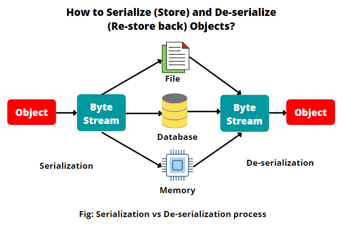

# 📎Serialización y deserialización de objetos en Java

En esta sesión aprenderás a **guardar objetos Java en archivos** y recuperarlos más tarde mediante el proceso de **serialización** y **deserialización**.

---

## 📦 ¿Qué es la serialización?

La **serialización** es el proceso de convertir un objeto en una secuencia de bytes que, representa el estado del objeto, incluidos sus datos y la estructura, para almacenarlo en un fichero, enviarlo por red o guardarlo en memoria. Se usa para:

- Guardar el estado de un objeto.
- Enviar objetos a través de sockets.
- Persistir datos sin usar una base de datos.

Después se hace la operación inversa **deserialización**, donde se reconstruye ese objeto desde los bytes.

---

## ✨ Clases y conceptos clave (`java.io`)

| Elemento             | Descripción                                                             |
| -------------------- | ----------------------------------------------------------------------- |
| `Serializable`       | Interfaz que debe implementar una clase para ser serializable.          |
| `ObjectOutputStream` | Clase para escribir objetos en un flujo de salida.                      |
| `ObjectInputStream`  | Clase para leer objetos desde un flujo de entrada.                      |
| `serialVersionUID`   | Identificador de versión para compatibilidad entre clases serializadas. |
| `transient`          | Palabra clave para excluir un atributo de la serialización.             |

---

## 📦 Serialización binaria de Java (`ObjectOutputStream`)


Imaginemos que tenemos la clase `Employee` que nos permitirá crear objetos de empleados y queremos enviar o guardar estos objetos.

📌 **Es obligatorio para serializar añadir `implements Serializable`** en la clase.
Serializable es una interfaz marcadora (marker interface).
No tiene métodos → solo sirve para indicar a la JVM: “esta clase se puede serializar”.

```java
class Employee implements Serializable {
    private String name;
    private int age;
    private List<String> address;

    public Employee(String name, int age, List<String> address) {
        this.name = name;
        this.age = age;
        this.address = address;
    }

    @Override
    public String toString() {
        return new StringJoiner(", ", Employee.class.getSimpleName() + "[", "]")
                .add("name='" + name + "'")
                .add("age=" + age)
                .add("address=" + address)
                .toString();
    }
}
```

```java title="WriteObject.java"
//Método para escribir objectos de empleados en un fichero
private static void writeObject(Path path, Employee employee) {
    try(ObjectOutputStream os = new ObjectOutputStream(Files.newOutputStream(path))) {
        os.writeObject(employee);
    } catch (IOException e) {
        throw new RuntimeException(e);
    }
}
```

## 🎆 Deserialización binaria de Java (`ObjectInputStream`)

La serialización por defecto escribe la clase del objeto, la firma de la clase, y los valores de los campos no estáticos. Estos elementos se utilizan para **restaurar el objeto y su estado durante la operación de lectura**. A este proceso se le conoce como reconstitución de los datos o **deserialización**.

```java title="ReadObject.java"
//Método para leer objectos que han sido serializados
private static void readObject(Path path) {
    try(ObjectInputStream os = new ObjectInputStream(Files.newInputStream(path))) {
        System.out.println((Employee) os.readObject());
    } catch (IOException | ClassNotFoundException e) {
        throw new RuntimeException(e);
    }
}
```




*¿Qué pasaría si cambiamos el campo age de la clase Employee de int a long después de haberlo serializado y, ahora volvemos a leerlo?*

Que se generaría una excepción de tipo `InvalidClassException` con el mensaje clase incompatible, con serialVersionUID diferentes.

## 📤 ¿Qué es el campo serialVersionUID?

El campo `serialVersionUID` **es un campo que crea el compilador implícitamente en tiempo de ejecución si no se declara explícitamente**, para las clases serializables. *Se basa en detalles de la clase como el número de campos, sus tipos y declaraciones, ...*

Por tanto, cambiar un campo como hemos hecho antes, generará un UID diferente. Cuando leemos un objeto de un stream, el runtime comprueba el serialVersionUID almacenado. Que se almacena con el objeto escrito en el fichero .dat y lo compara con el compilado de la clase. Si no coinciden, entonces hay un problema de compatibilidad y el runtime lanza esa excepción de clase inválida.

!!! Note Nota
    También ocurre que, diferentes compiladores pueden generar diferentes versiones de UID. Incluso en nuevas versiones de Java también se generan diferentes versiones de UID para un mismo código, y puede ser que no seamos capaces de deserializar nuestros datos.

Para asegurarnos que esto no pase, **es encarecidamente recomendable incluir el campo de serialVersionUID como un campo estático de la clase** como se muestra a continuación:

```java
class Employee implements Serializable {
    private final static long serialVersionUID = 1L;

    private String name;
    private int age;
    private List<String> address;
    ...
}
```

{++Ha de ser de tipo long y se puede ver como una especie de número de versión de la clase.++}

Ahora si volvemos a probar podemos pensar que funciona, pero da otro error de tipos incompatibles. Aunque hayamos pasado de int a long sigue habiendo repercusiones. Por eso es importante entender las reglas de la serialización.

## 🐱‍🚀 ¿Qué puede ser un cambio incompatible? ¿Qué no me va a dejar deserializar?
1. Cambiar el tipo declarado de un campo primitivo. (Es porque los tipos de datos primitivos
toman cierta cantidad de espacio y si eso cambia cuando vayamos a leer tendremos que cambiar
cuántos bytes leemos)
2. Eliminar campos.
3. Cambiar un campo de no estático a estático.
4. Cambiar la clase de jerarquía.
5. Hay más que podemos encontrar en la documentación de java en incompatible-changes.

## 🐱‍🚀 ¿Qué cambios son compatibles con serialization-deserilization?
1. Añadir campos.
2. Cambiar el acceso a un campo. Private, public, etc.
3. Cambiar un campo de estático a no-estático. Es como añadir un campo a la clase.

## 🪅 El modificador transient

**Se utiliza para indicar que un campo no debe serializarse.** Esto puede ser últil para variables o atributos que contienen información sensible. O simplemente variables que no queremos que persistan de ninguna manera, ya sea en ficheros o bases de datos.

```java
class Employee implements Serializable {
    private final static long serialVersionUID = 1L;

    private final transient long accountId;
    private String name;
    private int age;
    private List<String> address;
    ...
}
```

Si probamos a escribir un objeto Employee con su accountId, veremos que al deserializarlo el accountId será 0, no se escribirá nada porque lo hemos declarado como **transitorio o transient**.

## 🌐 Otras formas de serializar objetos en Java

Hasta ahora hemos visto la **serialización binaria nativa** con `ObjectOutputStream`, pero no es la única forma de persistir o enviar objetos. Según el caso de uso, te interesará usar formatos **portables**, **legibles**, o **muy eficientes**.

### 🔀 Comparativa rápida

| Método                     | Formato       | Ventajas principales                                     | Inconvenientes / Avisos                         |
|---------------------------|---------------|----------------------------------------------------------|-------------------------------------------------|
| `ObjectOutputStream`      | Binario (Java)| Simple en Java, guarda estructura y estado               | No portable entre lenguajes, versión de clases  |
| JSON                      | Texto (JSON)  | Interoperable, legible, muy usado en APIs y microservicios              | Tipado laxo, tamaño mayor que binario, integración con otros lenguajes    |
| XML                       | Texto (XML)   | Estandarizado, validación con XSD                        | Verboso, más pesado                             |
| Bases de datos            | Estructurado  | Consulta/filtrado, persistencia robusta                  | No es serialización 1:1 del objeto, no estás guardando el objeto completo directamente, sino su información descompuesta en otra forma de representación.             |

---