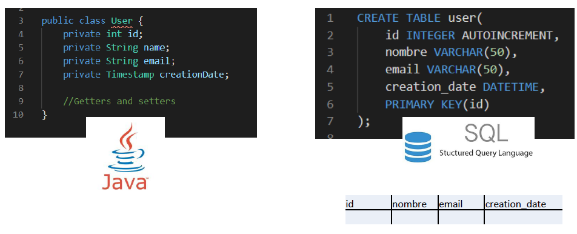

# ⛓️ Desfase objeto - relacional

Las bases de datos relacionales no están diseñadas para almacenar objetos, ya que existe un desfase entre las construcciones típicas que proporciona el modelo relacional y las proporcionadas por la programación basada en objetos.

El desfase objeto-relacional consiste en la diferencia de aspectos que existen entre la programación orientada a objetos y la base de datos.

Hay que recordar que el modelo relacional trata con relaciones y conjuntos y que, en las BD relacionales tenemos reglas de integridad:

+ Todas las tablas deben tener una clave primaria
+ La clave primaria tiene que ser única y no puede ser NULL
+ Para relacionar dos tablas usamos una foreign key

Sin embargo, el modelo de Programación Orientada a Objetos trata con objetos y las asociaciones entre ellos. Por esta razón, el problema entre estos dos modelos surge en el momento de querer persistir los objetos.

## Mapeo objeto - relacional

Al trabajar con POO y BDR tenemos que estar continuamente gestionando los objetos para escribir la sentencia SQL, o recolectar todos los atributos para componer un objeto cuando leemos información desde la base de datos.

A este conjunto de técnicas se le conoce como mapeo objeto-relacional. Y puede hacerse ayudándose de alguna herramienta o bien manualmente por el programador.

