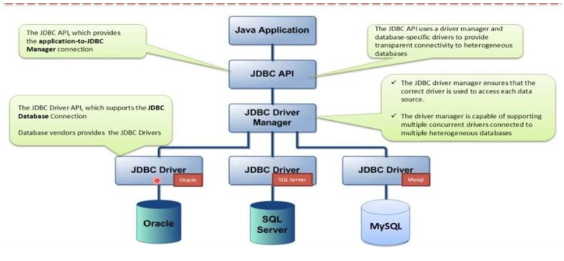

# ⚙️ Conectores o drivers

Un **conector** o **driver** es un mecanismo que permite a un lenguaje de programación conectarse, y trabajar, contra una base de datos. Se encarga de mantener el diálogo con la base de datos, para poder llevar a cabo el acceso y manipulación de los datos.

Algunos de los más conocidos son:

+ **ODBC (Open Database Connectivity)**. Es un estándar viejo. Esta tecnología proporciona una interfaz común para tener acceso a bases de datos SQL heterogéneas. ODBC está basado en SQL (Structured Query Language) como un estándar para tener acceso a datos. ODBC permite la conexión fácil desde varios lenguajes de programación y se utiliza mucho en el entorno Windows.

+ **JDBC (Java Data Base Connectivity)**.

En este curso, nos vamos a centrar en JDBC, puesto que, desde el punto de vista de Java, es una de las tecnologías más importantes de conectividad a la base de datos. Y, además, Java 8 ha eliminado el puente JDBC-ODBC, lo que significa que los controladores ODBC de Microsoft ya no funcionan.

## JDBC

Casi de forma simultánea a ODBC, la empresa Sun Microsystems, en 1997 sacó a la luz JDBC, un API conector de bases de datos, implementado específicamente para usar con el lenguaje Java. Se trata de un API bastante similar a ODBC en cuanto a funcionalidad, pero adaptado a las especificidades de Java. Es decir, la funcionalidad se encuentra capsulada en clases (ya que Java es un lenguaje totalmente orientado a objetos) y, además, no depende de ninguna plataforma específica, de acuerdo con la característica multiplataforma defendida por Java.

Es una API que permite la ejecución de operaciones contra una base de datos desde Java independientemente del sistema operativo donde se ejecute o de la base de datos a la cual se acceda.



Es importante destacar también que JDBC no exige ninguna instalación, ni ningún cambio sustancial en el código a la hora de utilizar uno u otro controlador. Esta característica se sustenta, en primer lugar, en la utilidad de Java que permite cargar programáticamente cualquier clase a partir de su nombre; en segundo lugar, en la funcionalidad de la clase DriverManager (de la API JDBC), que sin necesidad de indicarle el driver específico que hay que utilizar es capaz de encontrarlo y seleccionarlo de entre todos los que el sistema tenga cargados en memoria.

A pesar de eso tampoco es mucho problema ya que actualmente podemos encontrar un driver JDBC para prácticamente cualquier SGBDR existente. El conector lo proporciona el fabricante de la base de datos o bien un tercero.

### Conexión con la BBDD desde JDBC

Antes de empezar a desarrollar aplicaciones JDBC es necesario aseguramos que tenemos instalado el SGBD, y además que tenemos acceso desde el lugar donde estemos desarrollando la aplicación.
Una vez verificado el sistema gestor de base de datos, será necesario obtener el controlador JDBC del sistema gestor. Generalmente, cada fabricante pondrá a disposición de sus usuarios los diferentes tipos de controladores que tenga para sus productos.
Sea cual sea el tipo de controlador que finalmente necesita, éste tendrá como mínimo una biblioteca en formato .jar con todas las clases de la API JDBC. Habrá que añadir el archivo .jar como biblioteca de nuestra aplicación.

Para descargar el driver JDBC para MySQL podemos hacerlo desde el repositorio de Maven:

[MySQL JDBC](https://mvnrepository.com/artifact/mysql/mysql-connector-java)

### Establecimiento y cierre de conexión

Las clases que afectan a la gestión de la conexión con la BBDD son:

+ `DriverManager`: esta clase se utiliza para registrar el controlador para un tipo de base de datos específico (por ejemplo, MySQL en este tutorial) y para establecer una conexión de base de datos con el servidor a través de su método `getConnection()`.

+ `Connection`, es una interfaz que representa una conexión a la base de datos establecida (sesión) desde la cual podemos crear declaraciones para ejecutar consultas y recuperar resultados, obtener metadatos sobre la base de datos, cerrar conexión, etc.Los objetos `Connection` mantendrán la capacidad de comunicarse con el sistema gestor mientras permanezcan abiertos. Esto es, desde que se crean hasta que se cierran utilizando el método close.

El objeto `Connection` está totalmente vinculado a una fuente de datos, por eso en pedir la conexión hay que especificar de qué fuente se trata siguiendo el protocolo JDBC e indicando la url de los datos, y en su caso el usuario y password.

!!! example "Example 🤓"
    * **jdbc**:*bbdd*://_server_:_port_/_schema_
    * **jdbc**:postgresql://localhost:5432/severo

La url seguirá el protocolo JDBC, comenzará siempre por la palabra **jdbc** seguida de dos puntos. El resto dependerá del tipo de controlador utilizado, del host donde se aloje el SGBD, del puerto que este use para escuchar las peticiones y del nombre de la base de datos o esquema con el que queremos trabajar.

```java
import java.sql.Connection;
import java.sql.DriverManager;
import java.sql.SQLException;

...

public static void main(String[] args) {
    String user = "patricia";
    String password = "marti";
    String url = "jdbc:mysql://localhost/severo_ad";

    try (final Connection connection = DriverManager.getConnection(url, user, password)) {
        System.out.println(connection.getCatalog());
    } catch (SQLException ex) {
        System.out.println("SQLException: " + ex.getMessage());
        System.out.println("SQLState: " + ex.getSQLState());
        System.out.println("VendorError: " + ex.getErrorCode());
    }
}
```

### Operaciones básicas

El API JDBC distingue dos tipos de consultas:

+ **Consultas**: SELECT
+ **Actualizaciones**: INSERT, UPDATE, DELETE, sentencias DDL.

### Interfaces y clases principales de JDBC

- `Statement` y `PreparedStatement`: estas interfaces se utilizan para ejecutar consultas SQL estáticas y consultas SQL parametrizadas, respectivamente. `Statement` es la superinterfaz de la interfaz `PreparedStatement`, que se utiliza para consultas parametrizadas. Sus métodos comúnmente utilizados son:
    - **`boolean execute(String sql)`**: ejecuta una sentencia SQL general. Devuelve verdadero si la consulta devuelve un `ResultSet`, falso si la consulta devuelve un recuento de actualizaciones o no devuelve nada. Este método solo se puede utilizar con una sentencia.
    - **`int executeUpdate(String sql)`**: ejecuta una sentencia INSERT, UPDATE o DELETE y devuelve un conteo actualizado que indica el número de filas afectadas (por ejemplo, 1 fila insertada, 2 filas actualizadas o 0 filas afectadas).

        ```java hl_lines='3'
        Statement stmt = con.createStatement();
        String q1 = "insert into userid values (1,root,Patricia Marti)";
        int x = stmt.executeUpdate(q1);
        ```

- `ResultSet executeQuery(String sql)`: ejecuta una sentencia SELECT y devuelve un objeto `ResultSet` que contiene los resultados devueltos por la consulta.

    ```java hl_lines='4'
    Statement stmt = con.createStatement();
    String q1 = "select * from userid where id = '" 
                + id + "' AND pwd = '" + pwd + "'";
    ResultSet rs = stmt.executeQuery(q1);
    ```

- `ResultSet`: contiene los datos de la tabla devueltos por una consulta SELECT. Este objeto se usa para iterar sobre las filas en el conjunto de resultados usando el método `next()`.

!!! example "🤓 SQLException: Es la excepción que se lanza cuando hay algún problema entre la base de datos y el programa Java JDBC. Contiene los siguientes métodos:"

    * `.getMessage()`, nos indica la descripción del mensaje de error.
    * `.getSQLState()`, devuelve un código SQL estándar definido por ISO/ANSI y el Open Group que identifica de forma unívoca el error que se ha producido. [SQLState Official](https://dev.mysql.com/doc/connector-j/8.0/en/connector-j-reference-error-sqlstates.html)
    * `.getErrorCode(`), es un código de error que lanza la base de datos. En este caso el código de error es diferente dependiendo del proveedor de base de datos que estemos utilizando.
    * `.getCause()`, nos devuelve una lista de objetos que han provocado el error.
    * `.getNextException()`, devuelve la cadena de excepciones que se ha producido. De tal manera que podemos navegar sobre ella para ver en detalle de esas excepciones.

### Liberación de recursos

!!! danger "Danger 😬"
    Se debe cerrar explícitamente `Statement`, `ResultSet` y `Connection` cuando ya no se necesiten, a menos que se declaren con un try-catch-with-resources.

Las instancias de `Connection` y las de `Statement` almacenan, en memoria, mucha información relacionada con las ejecuciones realizadas. Además, mientras permanecen activas mantienen en el SGBD un conjunto importante de recursos abiertos, destinados a servir de forma eficiente las peticiones de los clientes. El cierre de estos objetos permite liberar recursos tanto del cliente como del servidor.

Aunque se haya cerrado la conexión, los objetos `Statements` que no se habían cerrado expresamente permanecen más tiempo en memoria que los objetos cerrados previamente, ya que el garbage collector de Java deberá hacer más comprobaciones para asegurar que ya no dispone de dependencias ni internas ni externas y se puede eliminar.
Es por ello que se recomienda proceder siempre a cerrarlo manualmente utilizando el método `close()`. El cierre de los objetos `Statement` asegura la liberación inmediata de los recursos y la anulación de las dependencias.

Si en un mismo método queremos cerrar un objeto `Statement` y `Connection`, lo haremos siguiendo estos pasos:

1.  Cerramos el `Statement` y

2.  la instancia `Connection`.

!!! failure "Failure 😵‍💫"
    Si lo hiciéramos al revés, cuando intentáramos cerrar el `Statement` nos saltaría una excepción de tipo `SQLException`, ya que el cierre de la conexión lo habría dejado inaccesible.

Cuando se cierra un objeto `Statement`, su objeto `ResultSet` actual, si existe, también se cierra. Pero eso no ocurre cuando se cierra la conexión.

```java
try (Connection connection = dataSource.getConnection();
    Statement statement = connection.createStatement()) {

    try (ResultSet resultSet = statement.executeQuery("SELECT * FROM ....")) {
        // Do actions.
    }
}
```
