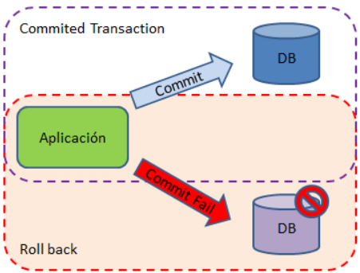

# ⚡Transacciones

En el ámbito de las Bases de Datos, una **transacción** es cualquier conjunto de sentencias SQL que se ejecutan como si de una sola se tratara. La idea principal es poder ejecutar varias sentencias, que están relacionadas de alguna manera, de forma que, si cualquiera de ellas fallara o produjera un error, no se ejecutara ninguna más e incluso se deshicieran todos los cambios que hayan podido efectuar las que ya se habían ejecutado dentro de la misma transacción, por eso decimos, que **las transacciones se consideran unitarias**. Es decir, las operaciones que componen la transacción se deben ejecutar todas o ninguna. Esto ayuda a preservarla integridad de los datos e impide posibles desfases entre clientes y servidor.

De entrada, cualquier sentencia SQL se considera una transacción en sí misma y si se produce un error durante su ejecución se anularán todas las operaciones simples derivadas de la ejecución de la sentencia.

Una transacción tiene dos finales posibles, **`COMMIT`** o **`ROLLBACK`**. Si se finaliza correctamente y sin problemas se hará con `COMMIT`, con lo que los cambios se realizan en la base de datos, y si por alguna razón hay un fallo, se deshacen los cambios efectuados hasta ese momento, con la ejecución de `ROLLBACK`.



Por defecto, al menos en **MySQL**, en una conexión trabajamos en modo autocommit con valor **true**. Eso significa que cada consulta es una transacción en la base de datos, es decir, que los cambios se aplicarán en la base de datos una vez que la query se haya ejecutado correctamente.

Por tanto, si queremos definir una transacción de varias operaciones, estableceremos el modo **autocommit** a false con el método `setAutoCommit` de la clase `Connection`.

En modo `no autocommit` las transacciones quedan definidas por las ejecuciones de los métodos `commit` y `rollback`. Una transacción abarca desde el último commit o rollback hasta el siguiente commit. Los métodos `commit` o `rollback` forman parte de la clase `Connection`.

En la siguiente porción de código, se puede ver un ejemplo sencillo de cómo se puede utilizar `commit` y `rollback`: tras las operaciones se realiza el `commit`, y si ocurre una excepción, al capturarla realizaríamos el `rollback`.

```java hl_lines='10 15 16 18'
public static void execute (String [] sqlqueries) throws SQLException {
    boolean autocommit = true;
    String user = "patricia";
    String password = "marti";
    String url = "jdbc:mysql://localhost/severo_ad";

    try (final Connection con = DriverManager.getConnection(url, user, password)) {
        try (Statement stmt = con.createStatement()) {
            autocommit = con.getAutoCommit();
            con.setAutoCommit(false);

            for (String query : sqlqueries) {
                stmt.executeUpdate(query);
            }
            con.commit();
            con.setAutoCommit(autocommit);
        } catch (SQLException ex) {
            con.rollback();
            throw ex;
        }
    }
}
```
