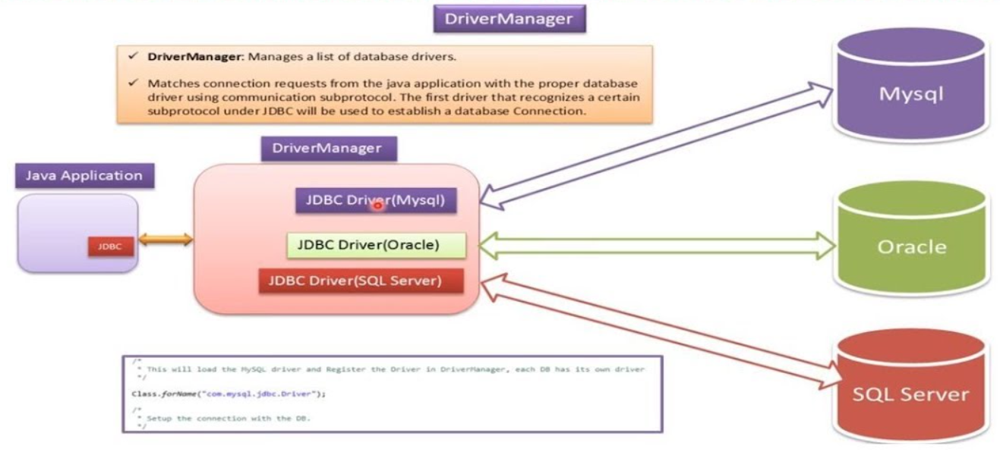

# 🧠 Mejora del rendimiento

Otro aspecto importante que mide la calidad de las aplicaciones es la **eficiencia** con la que se consigue comunicar con el SGBD. Para **optimizar** la conexión es importante reconocer qué procesos pueden actuar de cuello de botella y bajo qué circunstancias o qué otras agilizan las respuestas de los SGBD.

1.  En primer lugar, {++analizaremos la petición de conexión++} a un SGBD porque se trata de un proceso costoso pero inevitable que hay que considerar.

2.  En segundo lugar, {++estudiaremos las sentencias predefinidas (`PreparedStatement`)++}, porqué su uso facilita la creación de datos clave e índices temporales de modo que sea posible anticiparse a la demanda o disponer de los datos de forma mucho más rápida.

## 🪐 Ciclo de vida de una conexión

El establecimiento de una conexión es un procedimiento bastante lento, tanto en la parte cliente como la parte servidor. En la parte cliente, `DriverManager` debe descubrir el controlador correcto de entre todos los que tenga que gestionar. La mayoría de veces las aplicaciones trabajarán sólo con un único controlador, pero hay que tener en cuenta que `DriverManager` no conoce a priori qué URL de conexión corresponde a cada controlador, y para averiguarlo envía una petición de conexión a cada controlador que tenga registrado, el controlador que no le devuelve error será el correcto.

En el lado servidor, se creará un contexto específico y se habilitarán un conjunto de recursos para cada cliente conectado. Es decir, que durante la petición de conexión del SGBD debe gastar un tiempo considerable antes de no dejar operativa la comunicación cliente-servidor.

Este elevado gasto de tiempo concentrado en el momento de la petición de conexión nos hace plantear si podemos considerar ineficiente abrir y cerrar la conexión cada vez que tengamos que ejecutar una sentencia SQL, como hemos hecho hasta ahora. Desafortunadamente no hay una única respuesta, sino que depende de la frecuencia de uso de la conexión y el número de conexiones contra un mismo SGBD coexistiendo al mismo tiempo.



Como en todo, se trata de encontrar {==el punto de equilibrio entre la cantidad de recursos empleados por conexión y la rentabilidad que se saca en mantenerlas abiertas==}. 

* Si el número de clientes, y por tanto de conexiones, es bajo y la frecuencia de uso es alta, será preferible mantener las conexiones abiertas mucho tiempo. 

* Por el contrario, si el número de conexiones es muy alto y el uso infrecuente, lo que será preferible será abrir y cerrar la conexión cada vez que se necesite. 

Mientras tanto, habrá una multitud de casos en que la solución consistirá en mantener las conexiones abiertas, pero no permanentemente. Se puede dar **un tiempo de vida a cada conexión**, o bien cerrarlas después de restar inactiva una cantidad determinada de tiempo, o se puede usar el criterio de **mantener un número máximo de conexiones abiertas**, cerrando las más antiguas o las más inactivas cuando se sobrepase el límite.

!!! note "😶‍🌫️ Nota"
    Por otra parte, hay que tener en cuenta también que una misma aplicación puede trabajar con varias conexiones simultáneamente para incrementar la eficiencia. Cada conexión abre un hilo de ejecución independiente, por lo que es posible el envío simultáneo de peticiones.

## ⚡ Sentencias predefinidas

**`PreparedStatement`** presenta ventajas sobre su antecesor **`Statement`** cuando tengamos que trabajar con sentencias que haya que ejecutar varias veces. 

| ⭐Statement⭐                                                                    | ⭐PreparedStatement⭐                                                                            |
|------------------------------------------------------------------------------|----------------------------------------------------------------------------------------------|
| Statement is usually parsed and executed each time.                          | PreparedStatement is parsed once and executed with different parameters repeatedly.          |
| A statement is a static Sql statement.It does not support parameters.        | A PreparedStatement is a dynamic Sql statement.It does supports parameters.                  |
| It is slower because every time the statements get parsed and executed.      | This is faster because this is precompiled once and gets executed with different parameters. |
| Statement verifies metadata against database everytime.                      | PreparedStatement verifies metadata against database only once.                              |
| If we want to execute sql statement once it is recommended to use statement. | If we want to execute sql statements repeatedly it is recommended to use PreparedStatement.  |

La razón es que cualquier sentencia SQL, cuando se envía el SGBD será compilada antes de ser ejecutada.
Usando un objeto `Statement`, cada vez que hacemos una ejecución de una sentencia, ya sea vía executeUpdate o bien vía executeQuery, el SGBD la compilará, ya que le llegará en forma de cadena de caracteres.

En cambio, al `PreparedStament` la sentencia nunca varía y por lo tanto se puede compilar y almacenar dentro del mismo objeto, por lo que las siguientes veces que se ejecute no habrá que compilarla. Esto reducirá sensiblemente el tiempo de ejecución. La parametrización, además, ayuda a crear sentencias muy genéricas que se puedan reutilizar fácilmente.

En algunos sistemas gestores, además, usar `PreparedStatement` puede llegar a suponer más ventajas, ya que utilizan la secuencia de bytes de la sentencia para detectar si se trata de una sentencia nueva o ya se ha servido con anterioridad. De esta manera se propicia que el sistema almacene las respuestas en la caché, de manera que se puedan entregar de forma más rápida.

!!! important "Important 🤔"
    The use of a `Statement` in JDBC should be 100% localized to being used for DDL (ALTER, CREATE, GRANT, etc) as these are the only statement types that cannot accept BIND VARIABLES. `PreparedStatements` or `CallableStatements` should be used for EVERY OTHER type of statement (DML, Queries). As these are the statement types that accept bind variables.

    This is a fact, a rule, a law -- **use prepared statements EVERYWHERE. Use STATEMENTS almost no where**.

### 📝 Ejemplos de problemas con Statement

- [x] 1. `Statement` acepta cadenas como consultas SQL. Por lo tanto, el código se vuelve menos legible cuando concatenamos cadenas SQL:

```java
public void insert(PersonEntity personEntity) {
    String query = "INSERT INTO persons(id, name, age, email) VALUES(" + personEntity.getId() 
                    + ", '" + personEntity.getName() + ", '" + personEntity.getAge() 
                    + ", '" + personEntity.getEmail() + "')";

    Statement statement = connection.createStatement();
    statement.executeUpdate(query);
}
```

- [x] 2. Es vulnerable a la **inyección de SQL**. 

```java
public void check(String name) {
    String query = "SELECT * FROM users WHERE name = '" + name + "';";

    Statement statement = connection.createStatement();
    statement.executeUpdate(query);
}
```

Si un usuario malintencionado escribe como nombre de usuario a consultar: 

> **`Alicia'; DROP TABLE usuarios; SELECT * FROM datos WHERE nombre LIKE '%`**

Se generaría la siguiente consulta SQL, (el color verde es lo que pretende el programador, el azul es el dato, y el rojo, el código SQL inyectado):


En la base de datos se ejecutaría la consulta en el orden dado, se seleccionarían todos los registros con el nombre 'Alicia', se borraría la tabla 'usuarios' y finalmente se seleccionaría toda la tabla "datos", que no debería estar disponible para los usuarios web comunes.'
