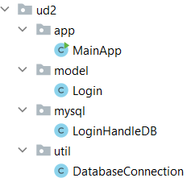
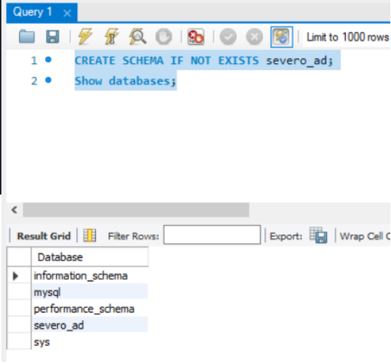
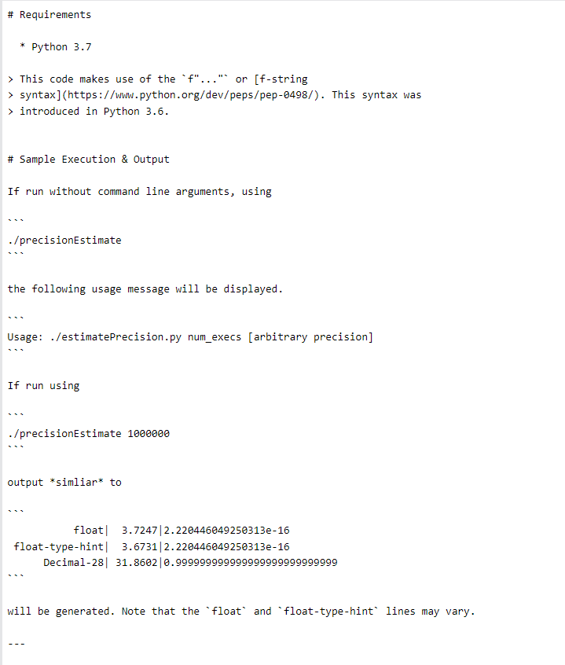
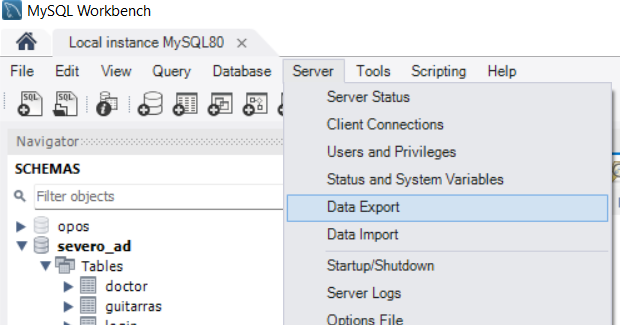
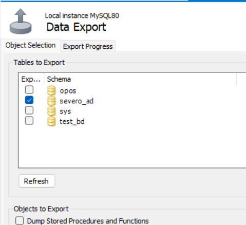

# 🧭 Desarrollo de aplicaciones completas con JDBC

Para las tareas de clase vamos a seguir una estructura que iremos perfilando basada en el **MVC** **(modelo - vista - controlador)**.
En el IntelliJ, crearemos un nuevo proyecto con la siguiente distribución de paquetes:



---

## 1️⃣ - Creando la BBDD

Asegúrate de que tienes el servidor de base de datos instalado y la base de datos creada con las tablas necesarias para tu aplicación.  



Creamos también la tabla **login** con la que vamos a trabajar en los ejemplos:

```sql
CREATE TABLE `login` (
    `id` int NOT NULL AUTO_INCREMENT,
    `user_name` varchar(50) NOT NULL,
    `password` varchar(255) NOT NULL,
    `created_at` datetime DEFAULT CURRENT_TIMESTAMP,
    PRIMARY KEY (`id`),
    UNIQUE KEY `user_name` (`user_name`)
);
```

---

## 2️⃣ - Clase de conexión con Singleton de DataSource

Conectar a la BD es un coste muy grande, ya que es un proceso lento, por lo tanto, usaremos un **Singleton de `DataSource` con pool de conexiones**.  
Esto es mucho más eficiente y seguro en aplicaciones reales.

Esta clase estará ubicada dentro del paquete **_util_**.

> Ejemplo de conexión a la BBDD usando Singleton:

```java title="DataSourceSingleton.java"
import com.zaxxer.hikari.HikariConfig;
import com.zaxxer.hikari.HikariDataSource;
import javax.sql.DataSource;

public final class DataSourceSingleton {
    private static final HikariDataSource ds;

    static {
        HikariConfig cfg = new HikariConfig();
        cfg.setJdbcUrl("jdbc:mysql://localhost:3306/severo?useSSL=false");
        cfg.setUsername("patricia");
        cfg.setPassword("marti");

        cfg.setMaximumPoolSize(10);
        cfg.setMinimumIdle(2);
        cfg.setConnectionTimeout(10000);
        cfg.setIdleTimeout(600000);
        cfg.setMaxLifetime(1800000);

        ds = new HikariDataSource(cfg);
    }

    private DataSourceSingleton() {}

    public static DataSource getDataSource() { return ds; }
}
```

---

## 3️⃣ - Creando el modelo

{++El modelo contiene una representación de los datos que maneja la aplicación y su lógica de negocio++}.

Para el ejemplo, el modelo de `Login` debe contener los atributos que contiene la tabla login como variables de la clase.
Normalmente los modelos de la clase se encuentran en un paquete llamado **_model_**.

```java title="Login.java"
public class Login {

    private int id;
    private String username;
    private String password;
    private LocalDateTime createdAt;

    //constructors

    //getters y setters

    @Override
    public String toString() {
        return "Login{" +
                "id=" + id +
                ", username='" + username + '\'' +
                ", password='" + password + '\'' +
                ", createdAt=" + createdAt +
                '}';
    }
}
```

---

## 4️⃣ - Clases para la manipulación de la base de datos

Dentro del paquete **_mysql_** añadiremos clases que serán las encargadas de manipular la información contra la base de datos. 

En el ejemplo tenemos una clase que realiza la manipulación de la información referente a la tabla login.

```java title="LoginAccessDB.java"
public class LoginAccessDB {

    public List<Login> getLogins() throws SQLException {
        String sql = "SELECT * FROM login";
        List<Login> lista = new ArrayList<>();

        try (Connection con = DataSourceSingleton.getDataSource().getConnection();
             Statement st = con.createStatement();
             ResultSet rs = st.executeQuery(sql)) {

            while (rs.next()) {
                Login login = new Login();
                login.setId(rs.getInt("id"));
                login.setUsername(rs.getString("user_name"));
                login.setPassword(rs.getString("password"));
                login.setCreatedAt(rs.getTimestamp("created_at").toLocalDateTime());
                lista.add(login);
            }
        }
        return lista;
    }
}
```

!!! note "😶‍🌫️ Nota"
    Más adelante veremos el patrón DAO para estructurar mejor el acceso a BD.

---

## 5️⃣ - Test

Por último comprobamos que todo funciona correctamente haciendo una pequeña prueba en nuestro `main`.

```java title="MainApp.java"
public class MainApp {

    public static void main(String[] args) {
        LoginAccessDB loginHandleDB = new LoginAccessDB();
        try {
            for (Login l: loginHandleDB.getLogins()) {
                System.out.println(l);
            }
        } catch (SQLException ex) {
            System.out.println("SQLException: " + ex.getMessage());
            System.out.println("SQLState: " + ex.getSQLState());
            System.out.println("VendorError: " + ex.getErrorCode());
        }
    }
}
```

---

## 6️⃣ CRUD básico con JDBC

Ejemplos de operaciones clásicas:

```java
// INSERT
String insert = "INSERT INTO login(user_name, password) VALUES(?, ?)";
try (Connection con = DataSourceSingleton.getDataSource().getConnection();
     PreparedStatement ps = con.prepareStatement(insert)) {
    ps.setString(1, "ana");
    ps.setString(2, "1234");
    ps.executeUpdate();
}

// UPDATE
String update = "UPDATE login SET password=? WHERE user_name=?";
try (Connection con = DataSourceSingleton.getDataSource().getConnection();
     PreparedStatement ps = con.prepareStatement(update)) {
    ps.setString(1, "nuevaPass");
    ps.setString(2, "ana");
    ps.executeUpdate();
}

// DELETE
String delete = "DELETE FROM login WHERE user_name=?";
try (Connection con = DataSourceSingleton.getDataSource().getConnection();
     PreparedStatement ps = con.prepareStatement(delete)) {
    ps.setString(1, "ana");
    ps.executeUpdate();
}
```

---

## 7️⃣ Uso de transacciones

Ejemplo de dos operaciones que deben ir juntas:

```java
try (Connection con = DataSourceSingleton.getDataSource().getConnection()) {
    con.setAutoCommit(false);

    try (PreparedStatement ps1 = con.prepareStatement("UPDATE cuentas SET saldo = saldo - ? WHERE id=?");
         PreparedStatement ps2 = con.prepareStatement("UPDATE cuentas SET saldo = saldo + ? WHERE id=?")) {

        ps1.setInt(1, 100);
        ps1.setInt(2, 1);
        ps1.executeUpdate();

        ps2.setInt(1, 100);
        ps2.setInt(2, 2);
        ps2.executeUpdate();

        con.commit();
    } catch (SQLException e) {
        con.rollback();
    }
}
```

---

## 8️⃣ Procedimientos almacenados

Ejemplo en MySQL:

```sql
DELIMITER //
CREATE PROCEDURE obtenerLogin(IN userName VARCHAR(50))
BEGIN
    SELECT * FROM login WHERE user_name = userName;
END //
DELIMITER ;
```

Invocación en Java:

```java
String sql = "{ call obtenerLogin(?) }";
try (Connection con = DataSourceSingleton.getDataSource().getConnection();
     CallableStatement cs = con.prepareCall(sql)) {

    cs.setString(1, "patricia");
    ResultSet rs = cs.executeQuery();
    if (rs.next()) {
        System.out.println(rs.getString("user_name"));
    }
}
```

---

## 9️⃣ - Fichero README

**_Readme_**: el propio nombre, {++léeme++}, indica su propósito: {++ser leído++}. El archivo readme **es el primer archivo que un desarrollador debe mirar antes de embarcarse en un proyecto**, por lo que también es esencial saber cómo escribir un buen archivo readme, para que toda la información relevante se presente de forma compacta.

!!! advice "Consejo"
    El nombre del archivo se escribe **README** en mayúsculas. De este modo, los sistemas que diferencian entre mayúsculas y minúsculas listarán el archivo antes que todos los demás archivos que empiezan con minúsculas.


### ¿Qué suelen incluir los ficheros README?

Suelen incluir información sobre:

- Una descripción general del sistema o proyecto.
- El estado del proyecto, que es particularmente importante si el proyecto está todavía en desarrollo. En él se mencionan los cambios planeados y la dirección de desarrollo del proyecto, y se especifica directamente si un proyecto está terminado.
- Los requisitos del entorno de desarrollo para la integración.
- Una lista de las tecnologías utilizadas y, cuando proceda, enlaces con más información.
- Bugs conocidos y posibles correcciones de errores.
- Sección de preguntas frecuentes con todas las preguntas planteadas hasta la fecha.
- Información sobre derechos de autor y licencias.

### Cómo escribir un fichero README

El contenido del fichero README debe estar en inglés.



[Cómo crear un fichero README](https://www.makeareadme.com/)

---

## Exportar la BBDD de MySQL

En MySQL workbench seleccionamos **Server --> Data Export**



Selecciono el esquema de BBDD que quiero exportar y hago click en **_Start export_**



Workbench me muestra dónde se ha generado el fichero:

