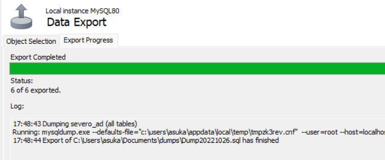

#  🧭 Estructura de un proyecto con JDBC

Para las tareas de clase vamos a seguir una estructura que iremos perfilando basada en el **MVC** **(modelo - vista - controlador)**.
En el IntelliJ, crearemos un nuevo proyecto con la siguiente distribución de paquetes:


## 1️⃣ - Creando la BBDD

Lo primero que tendremos que hacer asegurarnos de que tenemos el servidor de base de datos instalado y la base de datos creada con las tablas que necesitemos para nuestra aplicación.


Creamos también la tabla **login** con la que vamos a trabajar en los ejemplos:

```sql
CREATE TABLE `login` (
    `id` int NOT NULL AUTO_INCREMENT,
    `user_name` varchar(50) NOT NULL,
    `password` varchar(255) NOT NULL,
    `created_at` datetime DEFAULT CURRENT_TIMESTAMP,
    PRIMARY KEY (`id`),
    UNIQUE KEY `user_name` (`user_name`)
);
```

## 2️⃣ - Clase `Connection`

Conectar a la BD es un coste muy grande, ya que es un proceso lento, por lo tanto, implementaremos la clase de conexión a la base de datos utilizando el patrón singleton. 

Esta clase estará ubicada dentro del paquete **_util_**.

> Ejemplo de conexión a la BBDD usando Singleton:

```java title="DatabaseConnection.java"
public class DatabaseConnection {

    private static Connection connection = null;

    private DatabaseConnection() {}

    static
    {
        String url = "jdbc:mysql://localhost/severo";
        String user = "patricia";
        String password = "marti";
        try {
            connection = DriverManager.getConnection(url, user, password);
        } catch (SQLException e) {
            e.printStackTrace();
        }
    }

    public static Connection getConnection() {
        return connection;
    }

    public static void close() throws SQLException {
        connection.close();
    }
}
```

## 3️⃣ - Creando el modelo

{++El modelo contiene una representación de los datos que maneja la aplicación y su lógica de negocio++}.

Para el ejemplo, el modelo de `Login` debe contener los atributos que contiene la tabla login como variables de la clase Normalmente los modelos de la clase se encuentran en un paquete llamado **_model_**.

```java title="Login.java"
public class Login {

    private int id;
    private String username;
    private String password;
    private LocalDateTime createdAt;

    //constructors

    //getters y setters

    @Override
    public String toString() {
        return "Login{" +
                "id=" + id +
                ", username='" + username + '\'' +
                ", password='" + password + '\'' +
                ", createdAt=" + createdAt +
                '}';
    }
}
```

## 4️⃣ - Clases para la manipulación de la base de datos

Dentro del paquete **_mysql_** añadiremos clases que serán las encargadas de manipular la información contra la base de datos. 

En el ejemplo tenemos una clase que realiza la manipulación de la información referente a la tabla login.

```java title="LoginAccessDB.java"
public class LoginAccessDB {

private static Connection con = DatabaseConnection.getConnection();

    public List<Login> getLogins() throws SQLException {

        String sql = "SELECT * FROM login";
        try (Statement statement = con.createStatement()) {
            List<Login> lg = new ArrayList<>();
            ResultSet resultSet = statement.executeQuery(sql);

            while (resultSet.next()) {
                Login login = new Login();
                login.setId(resultSet.getInt(1));
                login.setUsername(resultSet.getString("username"));
                login.setPassword(resultSet.getString("password"));
                login.setCreatedAt(resultSet.getTimestamp("created_at").toLocalDateTime());
                lg.add(login);
            }

            return lg;
        }
    }
}
```

!!! note "😶‍🌫️ Nota"
    Más adelante veremos que hay clases que siguen el patrón **_DAO_** que se encargan del acceso a base de datos.

## 5️⃣ - Test

Por último comprobamos que todo funciona correctamente haciendo una pequeña prueba en nuestro `main` o punto de entrada al programa.

```java title="MainApp.java"
public class MainApp {

    public static void main(String[] args) {
        LoginAccessDB loginHandleDB = new LoginAccessDB();
        try {
            for (Login l: loginHandleDB.getLogins()) {
                System.out.println(l);
            }
        } catch (SQLException ex) {
            System.out.println("SQLException: " + ex.getMessage());
            System.out.println("SQLState: " + ex.getSQLState());
            System.out.println("VendorError: " + ex.getErrorCode());
        }
    }
}
```

## 6️⃣ - Fichero README

**_Readme_**: el propio nombre, {++léeme++}, indica su propósito: {++ser leído++}. El archivo readme **es el primer archivo que un desarrollador debe mirar antes de embarcarse en un proyecto**, por lo que también es esencial saber cómo escribir un buen archivo readme, para que toda la información relevante se presente de forma compacta.

!!! advice "Consejo"
    El nombre del archivo se escribe **README** en mayúsculas. De este modo, los sistemas que diferencian entre mayúsculas y minúsculas listarán el archivo antes que todos los demás archivos que empiezan con minúsculas.


### ¿Qué suelen incluir los ficheros README?

Suelen incluir información sobre:

- Una descripción general del sistema o proyecto.
- El estado del proyecto, que es particularmente importante si el proyecto está todavía en desarrollo. En él se mencionan los cambios planeados y la dirección de desarrollo del proyecto, y se especifica directamente si un proyecto está terminado.
- Los requisitos del entorno de desarrollo para la integración.
- Una lista de las tecnologías utilizadas y, cuando proceda, enlaces con más información.
- Bugs conocidos y posibles correcciones de errores.
- Sección de preguntas frecuentes con todas las preguntas planteadas hasta la fecha.
- Información sobre derechos de autor y licencias.

### Cómo escribir un fichero README

El contenido del fichero README debe estar en inglés.


[Cómo crear un fichero README](https://www.makeareadme.com/)

## Exportar la BBDD de MySQL

En MySQL workbench seleccionamos **Server --> Data Export**


Selecciono el esquema de BBDD que quiero exportar y hago click en **_Start export_**


Workbench me muestra dónde se ha generado el fichero:

