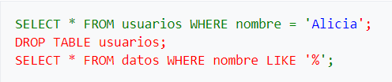

# ✍️ Modificación de datos con JDBC

## 📘 Sentencias SQL DML

El **lenguaje de manipulación de datos (DML)** permite insertar, modificar y eliminar registros en las tablas de una base de datos.  
Las sentencias más utilizadas son:

- **INSERT** → Añade registros.  
- **UPDATE** → Modifica registros existentes.  
- **DELETE** → Elimina registros.  

Ejemplos:

```sql
INSERT INTO alumnos (id, nombre, edad) VALUES (1, 'Ana', 20);

UPDATE alumnos SET edad = 21 WHERE id = 1;

DELETE FROM alumnos WHERE id = 1;
```

---

## 💻 Uso con Statement (No recomendado en DML)

Podemos ejecutar sentencias DML en Java con el método `executeUpdate()` de la interfaz `Statement`. Pero no es muy recomendable.
Su uso se ceñiría solamente para consultas estáticas a las que no se les pasa ningún parámetro.

Ejemplo:

```java
try (final Connection con = DriverManager.getConnection(url, user, password);
     Statement st = con.createStatement()) {

    String sql = "INSERT INTO alumnos (id, nombre, edad) VALUES (2, 'Luis', 22)";
    int filas = st.executeUpdate(sql);

    System.out.println("Filas insertadas: " + filas);

} catch (SQLException e) {
    e.printStackTrace();
}
```

⚠️ **No es recomendable su uso**. Por seguridad y eficiencia es mejor usar `PreparedStatement` para DML.

---

## 🛠️ Uso con PreparedStatement - Recomendado

`PreparedStatement` es una versión mejorada de `Statement` que permite **parametrizar sentencias SQL** mediante el uso de `?`.  
Esto evita errores, facilita la reutilización de la sentencia y protege contra inyecciones SQL.  

Ejemplo:

```java
String sql = "INSERT INTO alumnos (id, nombre, edad) VALUES (?, ?, ?)";

try (final Connection con = DriverManager.getConnection(url, user, password);
     PreparedStatement ps = con.prepareStatement(sql)) {

    ps.setInt(1, 3);
    ps.setString(2, "María");
    ps.setInt(3, 19);

    int filas = ps.executeUpdate();
    System.out.println("Filas insertadas: " + filas);

} catch (SQLException e) {
    e.printStackTrace();
}
```

### 🎯 Obtener el ID autogenerado tras un INSERT

Usa `prepareStatement(sql, Statement.RETURN_GENERATED_KEYS)`.
Tras `executeUpdate()`, llama a `ps.getGeneratedKeys()`.

Si la tabla tiene clave compuesta o múltiples claves, el ResultSet puede traer varias columnas.

```java
String sql = "INSERT INTO alumnos (nombre, edad) VALUES (?, ?)";

try (Connection con = DriverManager.getConnection(url, user, password);
     PreparedStatement ps = con.prepareStatement(sql, Statement.RETURN_GENERATED_KEYS)) {

    ps.setString(1, "María");
    ps.setInt(2, 19);

    int filas = ps.executeUpdate();
    System.out.println("Filas insertadas: " + filas);

    try (ResultSet rs = ps.getGeneratedKeys()) {
        if (rs.next()) {
            long idGenerado = rs.getLong(1); // primera columna devuelta
            System.out.println("ID generado: " + idGenerado);
        }
    }
} catch (SQLException e) {
    e.printStackTrace();
}

```

### 🧩 Consejos adicionales

- 🪄 Batch inserts: si usas addBatch() + executeBatch(), puedes recorrer ps.getGeneratedKeys() para obtener todos los IDs generados.        
- 🔢 Tipo del ID: usa getInt(1) o getLong(1) según el tipo de la columna.       
- Si la clave primaria no es autoincremental (por ejemplo, UUID), deberás gestionarla manualmente en la aplicación.    

---

### 🔒 Prevención de SQL Injection

El uso de `PreparedStatement` es la mejor práctica para prevenir **SQL Injection**.  
Ejemplo de riesgo con `Statement`:

```java
String usuario = "pepe";
String password = "' OR '1'='1";

String sql = "SELECT * FROM usuarios WHERE user='" + usuario + "' AND pass='" + password + "'";
// Devuelve todos los usuarios, ya que la condición siempre es verdadera.
```

Con `PreparedStatement`:

```java
String sql = "SELECT * FROM usuarios WHERE user=? AND pass=?";

try (PreparedStatement ps = con.prepareStatement(sql)) {
    ps.setString(1, usuario);
    ps.setString(2, password);
    ResultSet rs = ps.executeQuery();
}
```

En este caso, los parámetros se envían al SGBD de forma segura, sin alterar la estructura de la sentencia.

---

### Otro Ejemplo SQL Inyection

```java
public void check(String name) {
    String query = "SELECT * FROM users WHERE name = '" + name + "';";

    Statement statement = connection.createStatement();
    statement.executeUpdate(query);
}
```

Si un usuario malintencionado escribe como nombre de usuario a consultar: 

> **`Alicia'; DROP TABLE usuarios; SELECT * FROM datos WHERE nombre LIKE '%`**

Se generaría la siguiente consulta SQL, (el color verde es lo que pretende el programador, el azul es el dato, y el rojo, el código SQL inyectado):



En la base de datos se ejecutaría la consulta en el orden dado, se seleccionarían todos los registros con el nombre 'Alicia', se borraría la tabla 'usuarios' y finalmente se seleccionaría toda la tabla "datos", que no debería estar disponible para los usuarios web comunes.'

---

## 📌 Resumen

- El DML (`INSERT`, `UPDATE`, `DELETE`) modifica registros de la base de datos.  
- `PreparedStatement` es preferible porque:  
  - Permite parametrizar valores.  
  - Mejora el rendimiento en ejecuciones repetidas.  
  - Previene ataques de SQL Injection.  

---
