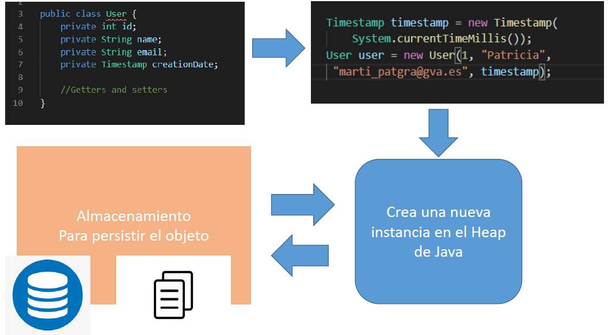
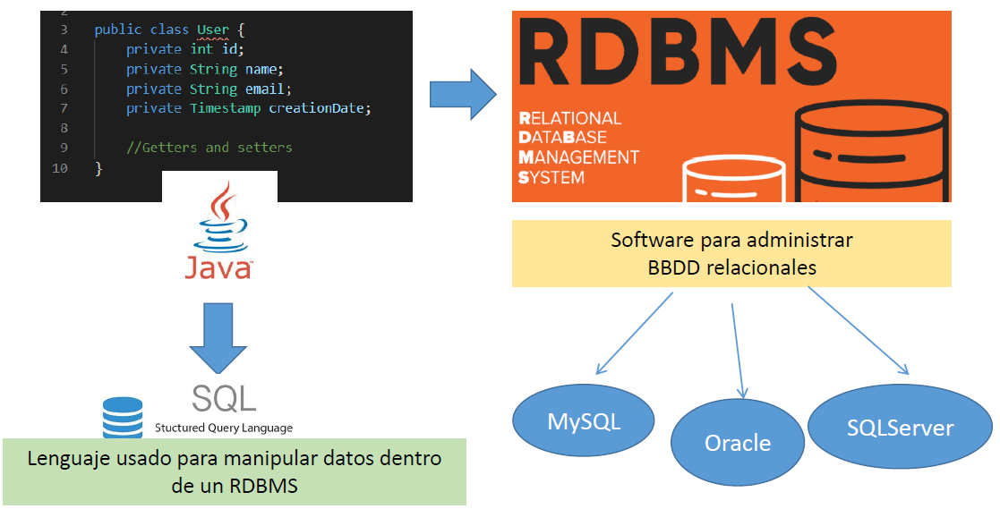

# 💾 Persistencia de la información

En la mayoría de aplicaciones, los datos no deben desaparecer al cerrar el programa: necesitamos guardarlos de forma **persistente** para poder volver a utilizarlos más tarde.  
A esta capacidad de **guardar el estado de un objeto en un almacenamiento** (ficheros, bases de datos, etc.) y restaurarlo posteriormente se le llama **persistencia de la información**.

Hoy en día, la mayoría de aplicaciones informáticas necesitan almacenar y gestionar grandes volúmenes de datos.  
Estos datos suelen guardarse en **bases de datos relacionales**, ya que son las más extendidas y estandarizadas.

---

## 📂 Tipos de bases de datos

Una **base de datos** es una herramienta que recopila datos, los organiza y los relaciona para que puedan consultarse y analizarse de forma eficiente.  
Las más modernas incorporan motores de análisis que permiten obtener informes y resultados complejos.

Existen distintos tipos de bases de datos según su modelo de almacenamiento:

- **Relacionales (SQL)** → Representan la información en forma de **tablas** con filas y columnas que se relacionan mediante claves. Se consultan con el lenguaje **SQL**.  
- **Distribuidas** → Reparten los datos entre varios servidores o nodos, aumentando la disponibilidad y tolerancia a fallos.  
- **NoSQL** → No siguen un modelo tabular. Incluyen bases de datos de documentos (MongoDB), clave–valor (Redis), orientadas a columnas (Cassandra) o a grafos.  
- **Orientadas a objetos** → Guardan objetos completos, más cercanas al paradigma de la Programación Orientada a Objetos.  
- **Gráficas** → Optimizadas para representar y consultar relaciones complejas (ej.: redes sociales, rutas).  

---

### 📝 Bases de datos relacionales y SQL

Las **bases de datos relacionales** (RDB) almacenan la información en tablas relacionadas entre sí mediante **claves primarias y foráneas**.  
Su lenguaje estándar es **SQL (Structured Query Language)**, que permite:

- 🏗️ **Definir estructuras de datos** (**DDL – Data Definition Language**).  
- ✍️ **Insertar, modificar o eliminar registros** (**DML – Data Manipulation Language**).  
- 🔍 **Realizar consultas** para obtener información (**DQL – Data Query Language**).  

---

## 🛠️ Sistemas gestores de bases de datos (DBMS / RDBMS)

Un DBMS (Database Management System) es el software encargado de gestionar cómo se almacenan, mantienen y recuperan los datos.

Cuando el DBMS sigue el modelo relacional, se denomina RDBMS (Relational DBMS).

---

## 📈 Evolución y necesidad de estándares

En el pasado, trabajar con bases de datos resultaba complejo debido a la gran diversidad de productos, cada uno con su propio lenguaje y características.
Para solventar este problema, se estandarizó el uso de SQL y, en el caso de Java, se creó una API común: **JDBC**.

👉 En las siguientes secciones estudiaremos cómo usar JDBC en Java para acceder a diferentes bases de datos sin depender directamente de cada gestor.
