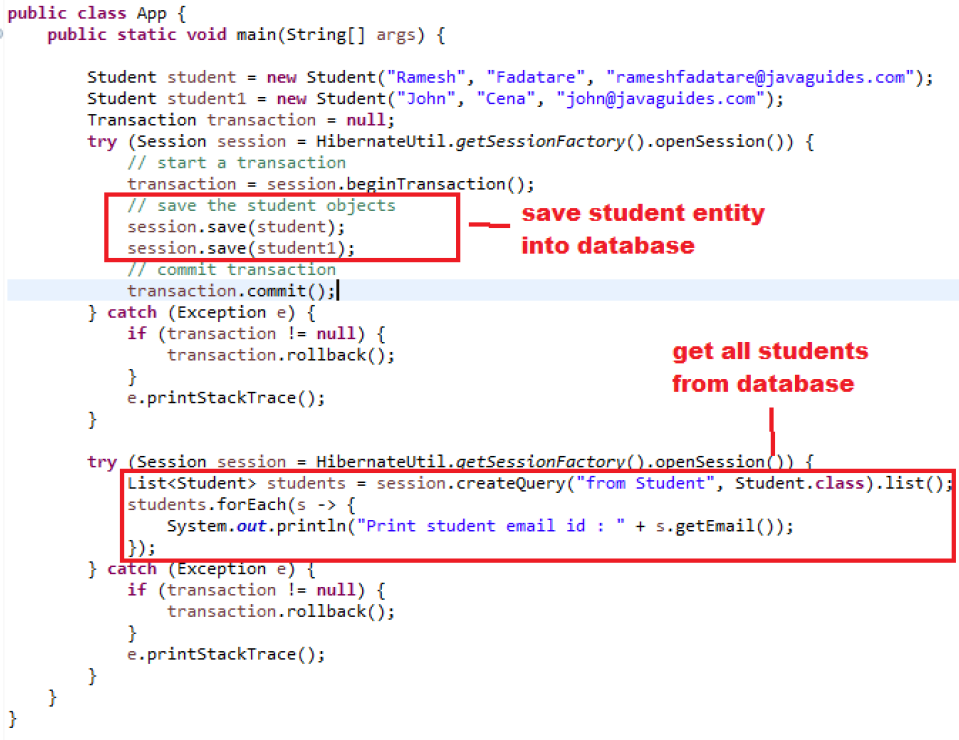

# 💾 Herramientas mapeo objeto - relacional (ORM)

## Problemas con JDBC

Aunque JDBC nos permitía abstraer la conexión del driver con la base de datos correcta, **todavía presenta limitaciones**:

- Número importante de líneas de código
- Invertir tiempo en los dos modelos relacional y orientado a objetos
- Cuánto mayor crece la base de datos más complicado se hace el mantenimiento
- Manejo de conexión, cierre de conexión, etc
- Seguimos teniendo desfase en el mapeo objeto modelo relacional, JDBC no solventa del todo este desfase puesto que todavía tenemos que descomponer el objeto para construir la sentencia **INSERT, DELETE o UPDATE** que queremos utilizar.

## ¿Por qué necesitamos un ORM?

Las herramientas ORM (**Object Relational Mapping**) intentan aprovechar la madurez y la eficiencia de las bases de datos relacionales minimizando en lo posible el desfase objeto relacional.

Se trata de bibliotecas y marcos de programación que definen un formato para expresar múltiples situaciones de transformación entre ambos paradigmas.

En cierta forma podríamos decir que _implementan una base de datos orientada a objetos virtual para que aportan características propias del paradigma OO_, pero el sustrato donde se acaban almacenando los objetos es un SGBD relacional.

## ORM

Un ORM intenta hacer todas estas tareas pesadas por nosotros. Deberemos definir la forma en la que estableceremos la correspondencia entre las clases y las tablas una sóla vez (indicando qué propiedad se corresponde con qué columna, qué clase con qué tabla, etc).

Después, podremos hacer cosas como utilizar **POJO**'s(Plain Old Java Objects) de nuestra aplicación y decirle a nuestro ORM que los haga persistentes, con una instrucción similar a esta `save(myObject)`. Es decir, **_una herramienta ORM puede leer o escribir en la base de datos utilizando objetos directamente_**.

{== Una herramienta ORM permite tomar un objeto Java y hacerlo persistente, cargar el objeto de la base de datos en memoria y hacer consultas a las tablas de la base de datos. ==}

### Ventajas de ORM

❇️ Ayudan a reducir el tiempo de desarrollo de software. La mayoría de las herramientas ORM disponibles, permiten la creación del modelo a través del esquema de la base de datos, es decir, el usuario crea la base de datos y la herramienta automáticamente lee el esquema de tablas y relaciones y crea un modelo ajustado.

❇️ Abstracción de la base de datos.

❇️ Reutilización.

❇️ Permiten persistir objetos a través de un método save o persist y generar el SQL correspondiente.

❇️ Permiten recuperar los objetos persistidos a través de un método load o get.

❇️ Lenguaje propio para realizar las consultas.

❇️ Independencia de la base de datos.

❇️ Incentivan la portabilidad y escalabilidad de los programas de software.

### Desventajas de ORM

✴️ **Tiempo utilizado en el aprendizaje**. Este tipo de herramientas suelen ser complejas por lo que su correcta utilización lleva un tiempo que hay que emplear en ver el funcionamiento correcto y ver todo el partido que se le puede sacar.

✴️ **Menor rendimiento (aplicaciones algo más lentas)**. Esto es debido a que todas las consultas que se hagan sobre la base de datos, el sistema primero deberá de transformarlas al lenguaje propio de la herramienta, luego leer los registros y por último crear los objetos.

✴️ **Sistemas complejos**. Normalmente la utilidad de ORM desciende con la mayor complejidad del sistema relacional.