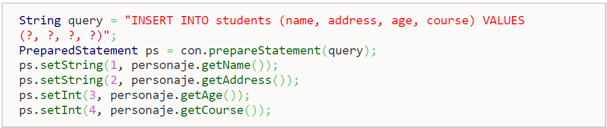

# 🗂️ Fundamentos del ORM

## 🧩 Concepto de mapeo objeto‑relacional (ORM)

> **Idea clave:** El *mapeo objeto-relacional* es el conjunto de reglas que **relaciona tu modelo orientado a objetos (clases, atributos, asociaciones, herencia)** con el **modelo relacional** de una base de datos (**tablas, columnas, claves y relaciones**). Un ORM implementa este mapeo para que trabajes con **objetos** y no con SQL de bajo nivel.

### Correspondencias básicas
- **Clase ↔ Tabla**
- **Atributo ↔ Columna**
- **Identidad ↔ Clave primaria**
- **Asociación ↔ Relación**

---

## ⚙️ Problemas con JDBC y necesidad de un ORM

Aunque JDBC nos permitía abstraer la conexión del driver con la base de datos correcta, **todavía presenta limitaciones**:

- Número importante de líneas de código.  
- Necesidad de trabajar con los dos modelos (relacional y orientado a objetos).  
- Cuanto mayor crece la base de datos más complicado resulta el mantenimiento.  
- Gestión manual de conexión, cierre de conexión, etc.  
- Persisten los problemas del **desfase objeto-relacional**: debemos descomponer los objetos para construir sentencias **INSERT, DELETE o UPDATE**.



### 🧪 ¿Por qué necesitamos un ORM?

Un ORM (Object Relational Mapping) actúa como una capa intermedia que:  
- Define cómo mapear clases ↔ tablas y atributos ↔ columnas.  
- Permite trabajar con objetos en memoria y sincronizarlos con la base de datos.  
- Ofrece una API unificada para operaciones de persistencia.

Ejemplo con Hibernate:

```java
Usuario u = new Usuario("ana", "1234");
session.save(u);
```

### ✅ Ventajas de ORM
- Menos código repetitivo.  
- Persistencia de objetos con `persist()`.  
- Recuperación sencilla de objetos con `get()` o `load()`.  
- Lenguaje propio de consultas (HQL, JPQL).  
- Independencia del motor de base de datos.  

### ❌ Desventajas de ORM
- Curva de aprendizaje pronunciada.  
- Menor rendimiento relativo (traducción de consultas).  
- Complejidad en sistemas con modelos relacionales muy avanzados.  

---

## 🔌 Características de las herramientas ORM

Las herramientas ORM comparten una serie de **características comunes**:

- **Abstracción del acceso a la base de datos**: el programador trabaja con objetos.  
- **Automatización del mapeo**: entre clases ↔ tablas y atributos ↔ columnas.  
- **Gestión de sesiones y estados**: objetos transitorios, persistentes, separados.  
- **Lenguaje de consultas orientado a objetos**: HQL (Hibernate Query Language), JPQL (Java Persistence Query Language).  
- **Gestión de transacciones** integrada.  
- **Independencia del motor de BD**: cambiar de MySQL a PostgreSQL sin apenas modificar código.  
- **Compatibilidad con herencia y relaciones complejas**.  

### 📦 Herramientas ORM más utilizadas

- **Hibernate** (Java).  
- **JPA (Jakarta Persistence API)** – estándar en Java EE y Spring.  
- **EclipseLink** (implementación oficial de JPA).  
- **MyBatis** (Java, con mayor control de SQL).  
- **Entity Framework** (C#/.NET).  
- **Django ORM** (Python).  
- **Sequelize** (Node.js).  

---