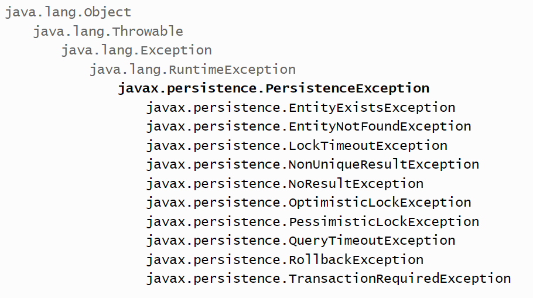

# Jakarta - JPA (Java Persistence API)

JPA es una **especificación** que ofrece Java para implementar un Framework Object Relational Mapping (ORM), ésta especificación indica cómo se debe realizar la persistencia de los objetos en programas Java. 

Fíjate que se ha destacado la palabra {++"especificación"++} porque **JPA no tiene una implementación concreta**, sino que, existen diversas tecnologías que implementan JPA para darle concreción.

Persistencia en este contexto cubre tres áreas:

- La API en sí misma, definida en el paquete `jakarta.persistence`
- El lenguaje de consulta Java Persistence Query Language (**JPQL**).
- Metadatos objeto/relacional.

!!! important "Importante"
    **The JPA was renamed as Jakarta Persistence** in 2019 and version 3.0 was released in 2020. This included the renaming of packages and properties from javax.persistence to jakarta.persistence.

## ¿Cómo funciona JPA?

Dado que es una especificación, JPA no proporciona clase alguna para poder trabajar con la información. {==Lo que hace es proveernos de una serie de interfaces que podemos utilizar para implementar la capa de persistencia de nuestra aplicación==}, apoyándonos en alguna implementación concreta de JPA.

Es decir, en la práctica significa que lo que vamos a utilizar es una biblioteca de persistencia que implemente JPA, no JPA directamente.

## Arquitectura


### 🔅 Entidades - Entity

El concepto de entidad está muy relacionado con los SGBD y los modelos relacionales, sobre todo en sus fases de diseño inicial con el que se denomina modelo Entidad-Relación. Para JPA, **las entidades son aquellos objetos de los que se desea almacenar su estado y que acabarán transformándose en tablas y relaciones**.

**En JPA todas las entidades son persistentes**, pero no todos los objetos lo son. Para hacer que un objeto sea persistente hay que calificarlo de entidad o bien debe formar parte del estado de una entidad (en forma de atributo, por ejemplo).

Todas las entidades se deben poder identificar de forma única a partir de su estado. Normalmente, será suficiente con una pequeña parte de sus atributos para lograr la identificación. La selección de atributos que cumplan este objetivo se denominan identificadores, y en el SGBD actuarán como clave primaria.

### 🔅 EntityManagerFactory y EntityManager

JPA implementa una interfaz llamada `EntityManager` que actuará de gestor de las entidades de la aplicación. Sobre esta clase recae toda la funcionalidad referida a los procesos de persistencia y sincronización de las entidades. Se trata, seguramente, **de la clase más importante de la biblioteca JPA**.


Un `EntityManager` asume toda la funcionalidad que una aplicación pueda necesitar, pero únicamente a nivel local. **JPA no permite instanciar los EntityManager directamente**, sino que obliga a instanciarlos desde un **`EntityManagerFactory`**, el cual a su vez sólo podrá ser instanciado por la clase `Persistence`. Por consiguiente , el `EntityManager` será el encargado de realizar todas las operaciones de tipo CRUD ( insertar , borrar ,seleccionar y actualizar etc) sobre las entidades.

La responsabilidad del **`EntityManagerFactory`** está restringida a la creación de gestores de entidades capaces de **compartir un contexto de persistencia** de forma coordinada.

En una aplicación, también en las distribuidas, **sólo puede haber una única instancia de EntityManagerFactory por cada SGBD** que haya que controlar. _Cualquier intento de duplicar la EntityManagerFactory podría dar resultados inconsistentes y totalmente inesperados_. Es por ello que JPA obliga a instanciar los `EntityManagerFactory` usando el método estático de la clase Persistence llamado `createEntityManagerFactory`.

!!! Important "Importante" 
    La primera vez que se instancie un EntityManager se conectará al SGBD y comprobará si existen todas las tablas necesarias para mantener la persistencia de las entidades que este EntityManager controle. En caso de que falte alguna, se generarán las sentencias de creación adecuadas de acuerdo con los metadatos leídas del mapeo.

### 🔅 JPA y PersistenceContext

¿Qué es un PersistenceContext? . En primer lugar hay que tener en cuenta que un **EntityManager persistirá un “conjunto de objetos”** ¿Pero qué objetos? Aquellos que hayan sufrido modificaciones a nivel de sus propiedades o atributos y no estén sincronizados. Esto es a lo que comunmente se le denomina **PersistenceContext**.


Para conseguir que alguno de nuestros objetos pase a ubicarse dentro del PersistenceContext bastará con invocar los métodos persist, merge, sobre él.


```java
public static void main(String[] args) {
    Persona yo = new Persona("Patricia", 12);
    EntityManagerFactory emf =
        Persistence.createEntityManagerFactory("default");
    EntityManager em = emf.createEntityManager();
    try {
        em.getTransaction().begin();
        em.persist(yo);
        em.getTransaction().commit();
    } catch (Exception e) {
        e.printStackTrace();
    } finally {
        em.close();
    }
}
```

### 🔅 Estados de las entidades en JPA

Una de las cosas mas importantes a entender en JPA son los distintos estados de las entidades que manejamos. JPA soporta 4 estados:

- **New o Transient (Transitorio)**: Una entidad es transitoria cuando se acaba de crear mediante el operador new, pero aún no ha sido gestionada por el EntityManager. En este estado, la entidad no tiene una representación persistente en la base de datos. No está asociado a ningún PersistenceContext.

- **Managed (Gestionado)**: Una entidad está gestionada cuando ha sido recuperada de la base de datos o persistida en la base de datos y se encuentra bajo el control de un EntityManager. En este estado, cualquier cambio realizado en la entidad se reflejará en la base de datos cuando se confirme la transacción.

- **Detached (Desconectado)**: Una entidad se encuentra en estado desconectado cuando ha sido gestionada por un EntityManager, pero ese EntityManager ya no la gestiona. Esto suele ocurrir cuando la transacción en la que se recuperó la entidad ha finalizado o si se ha cerrado el EntityManager.

- **Removed (eliminado)** : Es el estado en el cual se encuentra una entidad que esta todavia controlada por el PersistenceContext pero va a ser eliminada de la base de datos.

### 🔅 Relación de métodos JPA con estados de las entidades

- `persist()`: cambia el estado de un objeto que está en estado **new** al estado **managed** y lo asocia a un contexto de persistencia.
- `remove()`: pasa el estado de un objeto de **managed** a **removed**.
- `detach()`: un objeto que estaba en estado **managed** lo pasa a estado **detached**. Mantiene su identidad de persistencia pero ya no está asociado a ningún contexto de persistencia.
- `merge()`: se encarga de convertir un objeto nuevo o **detached** en uno nuevo **managed**. La diferencia fundamental con persist es que, persist no asume que el objeto existe en la base de datos previamente. Algo que si se puede dar con el método merge.

### 🔅 Fichero de persistencia

La configuración de cada `EntityManagerFactory` se consigue a través de un archivo XML llamado **persistence.xml**. Se encuentra situado en un directorio de la aplicación llamado META-INF de un proyecto Java. Este fichero se encarga de conectarnos a la base de datos y define el conjunto de entidades que vamos a gestionar, por tanto, dentro de este archivo escribiremos todas las configuraciones de conexión necesarias para cada SGBD. Cada configuración constituirá lo que llamamos **una unidad de persistencia**. 

Las unidades de persistencia se identifican por medio de un nombre, el cual pasaremos como parámetro al método `createEntityMangerFactory` de la clase Persistence, de modo que el **`EntityManagerFactory` creado estará configurado para conectarse a un SGBD específico**. 

!!! Note "Nota"
    Muchas aplicaciones Java conectan a varias bases de datos, por tanto tendrán diferentes EntityManagerFactorys. Cada uno estará ligado un PersistenceUnit diferente.

El formato XML del archivo sigue el esquema que puede verse en la figura. Del elemento raíz llamado Persistence se pueden describir tantos Persistence-Unit como sea necesario. 

Dentro de un **Persistence-Unit** encontramos el elemento **Provider**, que contendrá la clase principal de la herramienta que implementará JPA. También podemos incluir el conjunto de clases de nuestra aplicación a considerar entidades y que serán los objetos de la persistencia. Finalmente, el esquema presenta una manera de parametrizar la configuración en función de los diferentes providers o herramientas de implementación de JPA. Nos referimos al elemento Properties.

Ejemplo:

```xml title="persistence.xml"
<?xml version="1.0" encoding="UTF-8" ?>
<persistence xmlns="https://jakarta.ee/xml/ns/persistence"
             xmlns:xsi="http://www.w3.org/2001/XMLSchema-instance"
             xsi:schemaLocation="https://jakarta.ee/xml/ns/persistence https://jakarta.ee/xml/ns/persistence/persistence_3_0.xsd"
             version="3.0">
    <persistence-unit name="default">
        <class>es.severo.entity.Tramite</class>

        <properties>
            <property name="hibernate.connection.url" value="jdbc:mysql://localhost:3306/testdb2"/>
            <property name="hibernate.connection.driver_class" value="com.mysql.cj.jdbc.Driver"/>
            <property name="hibernate.connection.username" value="root"></property>
            <property name="hibernate.connection.password" value="root"></property>
            <property name="hibernate.show_sql" value="true"/>
        </properties>
    </persistence-unit>
</persistence>
```

| Tag name                 | Description                                                                                                                                                                                                                                                                                                                                                                                                                                                                                                                                                                                                                                                                                                                                                                                                                                                                      |
|--------------------------|----------------------------------------------------------------------------------------------------------------------------------------------------------------------------------------------------------------------------------------------------------------------------------------------------------------------------------------------------------------------------------------------------------------------------------------------------------------------------------------------------------------------------------------------------------------------------------------------------------------------------------------------------------------------------------------------------------------------------------------------------------------------------------------------------------------------------------------------------------------------------------|
| 🌀 **`<persistence-unit>`** | Se define una con un nombre que debe ser único por cada proveedor que usemos. A esta persistence-unit se le puede poner un atributo transaction-type, cuyos valores pueden ser RESOURCE_LOCAL o JTA. |
| 🌀 **`<provider>`**         | Proveedor de persistencia. JPA sólo define la API o interfaces que se deben cumplir si se quiere usa JPA, pero no implementa esas clases. Necesitamos una librería externa que implemente esta API. Una de las más conocidas es Hibernate. Para este ejemplo, usaremos dos, Hibernate y EclipseLink. Por supuesto, para tener estos proveedores, necesitamos añadir el jar correspondiente a nuestro proyecto. Si usamos maven, las dependencias sería una de estas dos, según queramos EclipseLink o hibernate.                                                                                                                                                                                                                                                                                                                                             |
| 🌀 **`<class>`**          | Lo utilizamos para poner las clases que van a ser persistentes.                                                                                                                                                                                                                                                                                                                                                                                                                                                                                                                                                                                                                                                                                                                                                                                                                  |
| 🌀 **`<properties>`**     | Contiene los parámetros de conexión a la base de datos. Para ello, podemos usar bien propiedades generales definidas por JPA, o bien propiedades específicas del proveedor de persistencia que usemos, es decir, propiedades específicas de hibernate, de EclipseLink, etc. Yo he indicado las propiedades generales de JPA.                                                                                                                                                                                                                                                                                                                                                                                                                                                                                                                                                     |


El fichero es parte del standard y existirá en cualquier implementación de JPA que se utilice.

En resumen, para crear un **EntityManager** necesario tener un archivo llamado **persistence.xml** con el formato que se acaba de describir. Además, hay que crear un **EntityManagerFactory** configurándolo a partir de una unidad de persistencia incluida en el fichero persistence.xml, el cual nos permitirá obtener el **EntityManager**.

```java title="Codigo.java"
EntityManagerFactory emf = Persistence.createEntityManagerFactory(“default”); 
//Es el nombre que hemos puesto en <persistence-unit> en el fichero persistence.xml

EntityManager em = emf.createEntityManager();
```
Ejemplo de código para crear un EntityManager a partir del fichero anterior persistence.xml.

### 🔅 Transacciones y excepciones

En aplicaciones locales **EntityManager** dispone del método `getTransaction` para obtener la transacción en curso, si la hay, o para crear una de lo contrario. Una vez creada, la transacción se activa invocando el método begin y finaliza cuando se invoca commit.

Todas las excepciones generadas por JPA son de tipo **`RuntimeException`**. Este tipo de excepción presenta la particularidad de que **no se declarará en la firma del método** y, por tanto, **el uso de try-catch no es obligatorio**.




Este tipo de transacciones presentan la ventaja de poder escribir un código más limpio (sin sentencias try-catch intermedias), pero por el contrario el desarrollador tiene que ir mucho más cuidado de no olvidarse de hacer el tratamiento de las excepciones. 

!!! Help "Ayuda"
    Para facilitar este tratamiento, todas las excepciones JPA heredan de un antecesor común llamado **`PersistenceException`**.

## Implementaciones de JPA

La principal ventaja que JPA nos proporciona es que, si las bibliotecas de persistencia que utilices siguen la especificación JPA, podrás cambiar de una a otra, con más rendimiento o características mejores, sin tener que tocar tu código, simplemente cambiando las referencias.

Existen diversas implementaciones disponibles, como **_DataNucleus_**, **_ObjectDB_**, o **_Apache OpenJPA_**, pero las dos más utilizadas son **_EclipseLink_** y sobre todo {==**Hibernate**==}.

Hibernate, en la actualidad es casi el "estándar" de facto, puesto que es la más utilizada, sobre todo en las empresas. Es tan popular que existen hasta versiones para otras plataformas, como NHibernate para la plataforma .NET. Es un proyecto muy maduro (de hecho, la especificación JPA original partió de él), muy bien documentado y que tiene un gran rendimiento.

!!! important "Importante 🤔"
    Hibernate y HQL se crearon antes de la especificación JPA. Hasta la versión Hibernate 3, JPQL es un subconjunto de HQL.