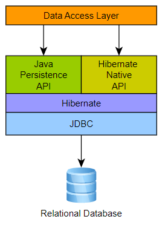
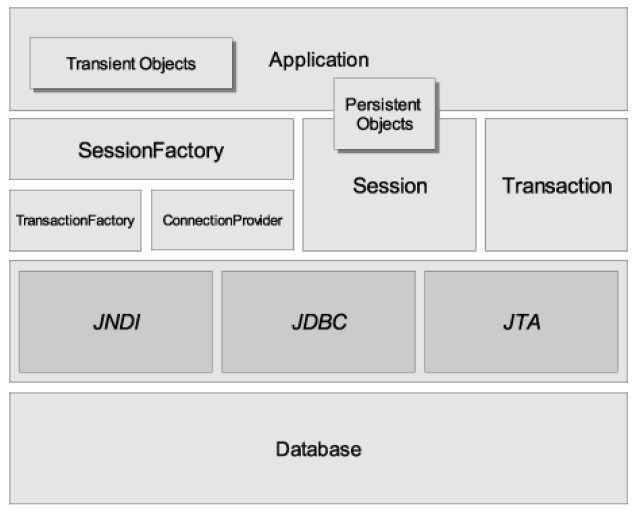
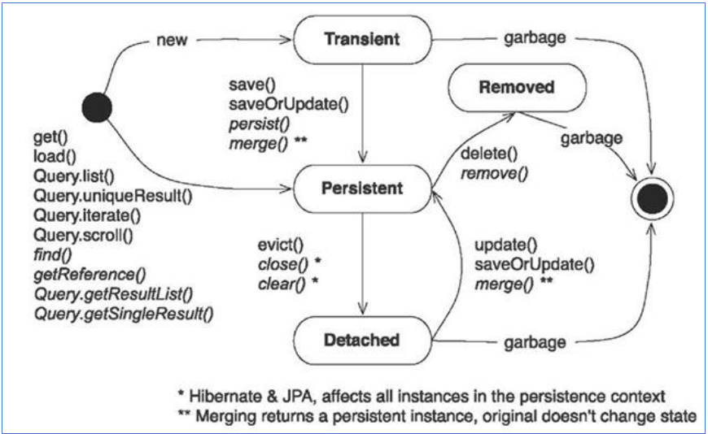

# 

🐻‍❄️ Hibernate, como una solución ORM, efectivamente "se ubica entre" la capa de acceso a datos de la aplicación Java y la base de datos relacional, como se puede ver en el diagrama siguiente.

[🌐 Documentación oficial](https://hibernate.org/orm/documentation/6.1/)

## ⚙️ Arquitectura

La arquitectura "completa" abstrae la aplicación de las APIs de JDBC/JTA y permite que Hibernate se encargue de los detalles.
Hibernate usa JDBC para conectar con la BBDD y ejecutar querys.

|||
|-|-|

---

## 📦 Clases persistentes (POJOs, entidades)

En JPA/Hibernate, una **clase persistente** es una clase “normal” (POJO) que el ORM gestiona para **leer/escribir su estado** en la base de datos. Habitualmente la marcamos con anotaciones JPA y la llamamos **entidad**.

---

## 1) Requisitos básicos de una entidad JPA
- `@Entity` en la clase (y opcional `@Table` para nombrar la tabla).
- **Identificador** con `@Id` (+ `@GeneratedValue` si es autogenerado).
- 🚀 Incluir atributos de clase con visibilidad privada, **private**.
- 🚀 Incluir **getters y setters**.
- **Constructor no-args** `public` o `protected` (lo usa el ORM).
- Clase **no final** y, si vas a usar proxies de Hibernate, **métodos no final** (para `LAZY`).
- Evita lógica pesada en constructor/no-args.
- Decide **acceso por campo** (anotaciones sobre atributos) o **por propiedad** (anotaciones en getters).

---

## 🧠 Sesiones y estados de un objeto

En JPA la unidad de trabajo es el **EntityManager (EM)**; en Hibernate clásico, la **Session**. Ambos gestionan el **contexto de persistencia** (caché de 1er nivel) y el **ciclo de vida** de las entidades.

---

## Persistence Context

- Es el **conjunto de entidades gestionadas** (*managed*) por un Session.

### 🧨 Estados de una entidad y transiciones

#### 🧣 `Transient` (o *new*)
Objeto creado con `new`, **no** está en BD ni gestionado por el EM.
```java
Usuario u = new Usuario("Ana", "ana@example.com"); // transient
```

#### 🧣 `Managed` (o *persistente*)
Bajo control del EM; cambios se detectan (**dirty checking**) y se sincronizan.
```java
em.persist(u);               // transient -> managed (INSERT en flush/commit)
Usuario v = em.find(Usuario.class, 1L); // managed
v.setNombre("Ana Maria");    // se hace UPDATE al sincronizar
```

#### 🧣 `Detached` (*separado*)
Entidad que **estuvo** managed pero ya **no** (cerrar EM, `clear()`, `detach()`).
```java
em.clear(); // todas pasan a detached
// v ahora es detached
Usuario w = em.merge(v); // devuelve una copia managed con los cambios
```

#### 🧣 `Removed`
Marcada para borrado; se ejecuta `DELETE` al sincronizar.
```java
em.remove(v); // managed -> removed (DELETE en flush/commit)
```

## Clase `HibernateUtil`

Crearemos esta clase de utilidad `HibernateUtil` para inicializar una sola vez el SessionFactory de Hibernate y exponerlo al resto de la aplicación. Usaremos el patrón Singleton. 

Así evitaremos crear SessionFactory repetidamente y mantenemos centralizado dónde se configura/gestiona Hibernate.

```java
public final class HibernateUtil {

    private static volatile SessionFactory sessionFactory;
    private static volatile StandardServiceRegistry registry;

    private HibernateUtil() { }

    public static SessionFactory getSessionFactory() {
        if (sessionFactory == null) {
            Properties props = loadAppProperties();
            init(props);
        }
        return sessionFactory;
    }

    private static synchronized void init(Properties properties) {
        if (sessionFactory == null) {
            registry = new StandardServiceRegistryBuilder()
                    .applySettings(properties)
                    .build();

            sessionFactory = new MetadataSources(registry)
                    .addAnnotatedClass(Customer.class)//entidades a cargar
                    .addAnnotatedClass(Order.class)
                    .buildMetadata()
                    .buildSessionFactory();
        }
    }

    private static Properties loadAppProperties() {
        try (InputStream in = Thread.currentThread()
                .getContextClassLoader()
                .getResourceAsStream("application.properties")) {

            if (in == null) {
                throw new IllegalStateException("No se encuentra application.properties en el classpath");
            }
            Properties p = new Properties();
            p.load(in);
            return p;
        } catch (Exception e) {
            throw new RuntimeException("Error cargando application.properties", e);
        }
    }

    public static void close() {
        //Closes caches and connections pools
        getSessionFactory().close();
    }
}
```

**Resumen de operaciones**  
- `persist(x)` → transient → managed  
- `remove(x)` → managed → removed  
- `merge(x)` → (detached/new) → managed (devuelve *otra instancia*)  
- `detach(x)` / `clear()` → managed → detached  
- `refresh(x)` → recarga desde BD (descarta cambios no sincronizados)  
- `flush()` → fuerza sincronización ahora



---