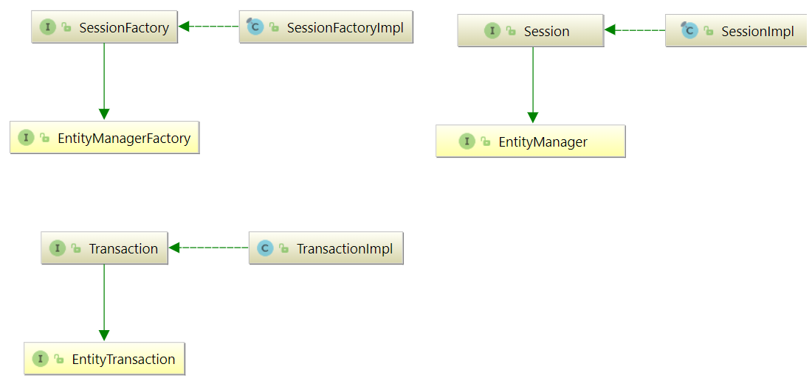

# 

🐻‍❄️ Hibernate, como una solución ORM, efectivamente "se ubica entre" la capa de acceso a datos de la aplicación Java y la base de datos relacional, como se puede ver en el diagrama siguiente.

[🌐 Documentación oficial](https://hibernate.org/orm/documentation/6.1/)

## Arquitectura

La arquitectura "completa" abstrae la aplicación de las APIs de JDBC/JTA y permite que Hibernate se encargue de los detalles.
Hibernate usa JDBC para conectar con la BBDD y ejecutar querys.

|||
|-|-|

Como proveedor de persistencia de Jakarta, Hibernate implementa las especificaciones de la API de persistencia de Java (JPA) y la asociación entre las interfaces de persistencia de Jakarta y las implementaciones específicas de Hibernate, que se pueden ver en el siguiente diagrama:



- 🤖 **SessionFactory**: inmutable, es una fábrica para instanciar objetos `Session`. `EntityManagerFactory` es el equivalente de Persistencia de Jakarta de `SessionFactory`. Una `SessionFactory` es muy costosa de crear, por lo que, para cualquier base de datos dada, la aplicación debe tener solo una SessionFactory asociada. SessionFactory mantiene los servicios que Hibernate usa en todas las sesiones, como cachés de segundo nivel, grupos de conexiones, integraciones de sistemas de transacciones, etc.

- 🤖 **Session**: En la nomenclatura de persistencia de Jakarta, la sesión está representada por un `EntityManager`. Session envuelve un JDBC java.sql.Connection y actúa como una fábrica para las instancias de **org.hibernate.Transaction**.

- 🤖 **Transaction**: `EntityTransaction` es el equivalente de Jakarta Persistence y ambos actúan como una API de abstracción para aislar la aplicación del sistema de transacciones subyacente en uso (JDBC o JTA).

## Persistence Context

Tanto la API `org.hibernate.Session` como la API `jakarta.persistence.EntityManager` representan un contexto para tratar con datos persistentes. Este concepto se denomina **contexto de persistencia**. Los datos persistentes tienen un estado en relación con un contexto de persistencia y la base de datos subyacente.

- 🧣 **Transient** (transitorio): la entidad acaba de ser instanciada y no está asociada con un contexto de persistencia. No tiene una representación persistente en la base de datos y, por lo general, no se ha asignado ningún valor de identificador (a menos que se haya utilizado el generador asignado). No está asociado a ninguna sesión.

- 🧣 **Persistent**: la entidad tiene un identificador asociado y está asociada con un contexto de persistencia. Puede o no existir físicamente en la base de datos todavía.

- 🧣 **Detached** (separado): la entidad tiene un identificador asociado pero ya no está asociada con un contexto de persistencia (generalmente porque el contexto de persistencia se cerró (sesión) o la instancia se desalojó del contexto).

- 🧣 **Removed**: la entidad tiene un identificador asociado y está asociada con un contexto de persistencia; sin embargo, está programada para su eliminación de la base de datos.


## Configuración Hibernate

Hibernate requiere saber de antemano dónde encontrar la información de configuración de la BBDD y de mapeo d que define cómo se relacionan las clases de Java con las tablas de la base de datos. Toda esta información generalmente se proporciona como un archivo de propiedades de Java estándar llamado **hibernate.properties**, o como un archivo XML llamado **hibernate.cfg.xml**.

La mayoría de las propiedades cogen los valores predeterminados y no es necesario especificarlos en el archivo de propiedades a menos que sea realmente necesario. {==Este archivo se guarda en el directorio raíz del classpath de su aplicación.==}

Para el ejemplo usaremos un fichero XML de configuración:

```xml title="hibernate.cfg.xml"
<?xml version="1.0" encoding="UTF-8" ?>
<hibernate-configuration xmlns="http://www.hibernate.org/xsd/orm/cfg">
    <session-factory>
        <property name="connection.driver_class">com.mysql.cj.jdbc.Driver</property>
        <property name="connection.url">jdbc:mysql://localhost:3306/testdb2</property>
        <property name="connection.username">root</property>
        <property name="connection.password">root</property>
        <property name="dialect">org.hibernate.dialect.MySQLDialect</property>

        <!--Mapeo mediante anotaciones -->
        <mapping class="es.severo.persistence.entity.Tramite"></mapping>
    </session-factory>
</hibernate-configuration>
```

[Website Oficial con todas las propiedades del fichero de configuración](https://docs.jboss.org/hibernate/orm/6.1/userguide/html_single/Hibernate_User_Guide.html#configurations-database-connection)

## Entity properties

Las clases que sean entidades deben cumplir las siguientes **convenciones recomendadas**:

- 🚀 Incluir atributos de clase con visibilidad privada, **private**.
- 🚀 Añadir **el constructor por defecto**, sin argumentos. Esto es un requisito de Jakarta e Hibernate para todas las clases persistentes. Hibernate necesita crear objetos para nosotros, utilizando Java Reflection.
- 🚀 Incluir **getters y setters**.
- 🚀 **Declarar atributos de identificador** (`@Id`) con nombres consistentes, y que se use un wrapper y no un tipo de dato primitivo. Ej Long o Integer. El atributo identificador no necesariamente necesita ser mapeado a la(s) columna(s) que definen físicamente la clave primaria. Sin embargo, debe asignarse a la(s) columna(s) que pueden identificar de forma única cada fila.
- 🚀 Mapear la entidad con las **anotaciones** necesarias. `@Entity` para denotar que es una entidad. Y las anotaciones que se requieran en los atributos.

--batches y flush and clear

## Hibernate Query Language - [HQL Official Website](https://docs.jboss.org/hibernate/orm/6.1/userguide/html_single/Hibernate_User_Guide.html#hql)

JPQL (Java Persistence Query Language) se inspiró en las primeras versiones de HQL y es un subconjunto del HQL moderno.

Si se desea el cumplimiento estricto de la persistencia de Jakarta, tendríamos que utilizar en la configuración la siguiente propiedad `hibernate.jpa.compliance.query=true`. Con esta configuración, cualquier intento de utilizar funciones HQL más allá del subconjunto JPQL dará como resultado una excepción. 

HQL (y JPQL) se basan libremente en SQL y son fáciles de aprender para cualquiera que esté familiarizado con SQL.

Hibernate usa un poderoso lenguaje de consulta (HQL) que es similar en apariencia a SQL. Sin embargo, en comparación con SQL, HQL está completamente orientado a objetos y comprende nociones como herencia, polimorfismo y asociación.

El lenguaje de consulta de Hibernate (HQL) y el lenguaje de consulta de persistencia de Java (JPQL) son lenguajes de consulta orientados a objetos basados ​​en SQL y muy similares a SQL.

**_HQL no es la única forma de escribir consultas en Hibernate:_**

- 🧨Criteria ofrece una API basada en Java con mayor seguridad de tipos en tiempo de compilación, y
- 🧨también son posibles las consultas SQL nativas.

Sin embargo, HQL es la opción más conveniente para la mayoría de las personas la mayor parte del tiempo.

### 💈 Hibernate DML language

Hibernate provee métodos para ejecutar sentencias DML.

+ **Insert**: para agregar objetos usamos el método `persist()`. En versiones anteriores se usaba `save()`, pero este método está deprecado y no se recomienda su uso.
+ **Update**: cuando modificamos un objeto usaremos `merge()` para guardar su estado en la base de datos. En versiones anteriores se usaba `saveOrUpdate()`, pero este método está deprecado y no se recomienda su uso.
+ **Delete**:  cuando queremos borrar un objeto en la base de datos usamos `remove()`. En versiones anteriores se usaba `delete()`, pero este método está deprecado y no se recomienda su uso.

```java
public static void main(String[] args) {
    Session session = null;
    try {
        session = HibenateUtil.getSessionFactory().openSession();
        session.beginTransaction();
        
        LocalDateTime now = LocalDateTime.now();
        Tramite tramite = new Tramite();
        tramite.setFecha(now);
        tramite.setTipo("Crédito");

        /* INSERT */
        //session.save(tramite);//deprecated
        session.persist(tramite);

        /* UPDATE */
        tramite.setTipo("Aval"):
        //session.saveOrUpdate(tramite);//deprecated
        session.merge(tramite);

        /* DELETE */
        //session.delete(tramite);//deprecated
        session.remove(tramite);

        session.getTransaction().commit();
    } catch (Exception e) {
        if (session.getTransaction() != null) {
            session.getTransaction().rollback();
            throw e;
        }
    } finally {
        if (session != null)
            session.close();
    }
}
```

### 💈 Obtener una entidad con sus datos inicializados

También es bastante común querer obtener una entidad junto con sus datos, es decir, cargar un objeto.

- Obtención de una referencia de entidad con sus datos inicializados con Jakarta Persistence

```java 
Person person = entityManager.find(Person.class, personId);
```

- Obtención de una referencia de entidad con sus datos inicializados con la API de Hibernate

```java 
Person person = session.find(Person.class, 1L);
```

- Obtención de una referencia de entidad con sus datos inicializados usando la API de Hibernate byId()

```java 
Person person = session.byId(Person.class).load(personId);
```
En ambos casos, se devuelve `null` si no se encuentra ninguna fila de base de datos coincidente.

- Obtención de una referencia de entidad Opcional con sus datos inicializados usando la API de Hibernate byId()

También es posible devolver un Java 8 Opcional:

```java
Optional<Person> optionalPerson = session.byId(Person.class).loadOptional(personId);
```

### 💈 Hibernate Query

La interfaz de sesión de Hibernate refina los tipos de devolución de las operaciones de `EntityManager` que crean objetos de consulta.

`Session#createQuery()`, `Session#createNamedQuery()` y otras operaciones similares devuelven una instancia de la extensión `org.hibernate.query.Query`.

Algunas formas sobrecargadas de estas operaciones devuelven un tipo sin formato, pero en **Hibernate 6 todas han quedado obsoletas y el uso del tipo Query sin formato ahora se desaconseja enfáticamente**. 

!!! important Importante
    Los programas deben migrar al uso de sobrecargas con seguridad de tipos que aceptan un objeto `Class<T>` y devuelven una `Query<T>` con tipo.

La interfaz de consulta de Hibernate ofrece operaciones adicionales que no están disponibles a través de TypedQuery, como veremos a continuación.


```java
Query<Tramite> query = session.createQuery(
                    "from Tramite where tipo = :tipoTram",
                            Tramite.class);
```

#### 🎐 _BINDING arguments en los parámetros de la query_

Una consulta puede tener parámetros con nombre o parámetros ordinales:

- **Named parameters**: se especifican usando la sintaxis: :name
- **Ordinal parameters**: se especifican usando la sintaxis ?1, ?2, etc.

```java title="named parameters"
    Query<Tramite> query = session.createQuery(
                    "from Tramite where tipo = :tipoTram",
                            Tramite.class)
                    .setParameter("tipoTram", "Crédito");
```

Los parámetros ordinales de estilo JPQL se numeran desde 1. Al igual que con los parámetros con nombre, un parámetro ordinal puede aparecer varias veces en una consulta.

```java title="ordinal parameters"
    Query<Tramite> query = session.createQuery(
                            "from Tramite where tipo = ?1",
                            Tramite.class)
                    .setParameter(1, "Crédito");
```

!!! warning Warning
    No es una buena idea mezclar _named parameters_ y _ordinales_ en una sola consulta.

#### 🎐 _EJECUTANDO la consulta_
La interfaz Query se utiliza para controlar la ejecución de la consulta. Ofrece tres tipos de resultados:

- `getResultList()`: es útil cuando la consulta puede devolver **cero o más de un resultado**.
- `getSingleResult()`: es solo para casos en los que la consulta siempre **devuelve exactamente un resultado**. Lanza una excepción cuando la base de datos devuelve cero o muchos resultados.
- `getResultStream()`: permite que los resultados se recuperen **de forma incremental**, utilizando un cursor de base de datos.

```java
    List<Person> persons = entityManager.createQuery(
	            "select p " +
	            "from Person p " +
	            "where p.name like 'John%' ",
	        Person.class).getResultList();

    Query<Tramite> query = session.createQuery(
            "from Tramite where tipo = :tipoTram",
                    Tramite.class)
            .setParameter("tipoTram", "Crédito");
    List<Tramite> tramites = query.getResultList();
    tramites.forEach(System.out::println);

    Query<Tramite> query2 = session.createQuery(
                    "from Tramite where tipo = ?1",
                    Tramite.class)
            .setParameter(1, "Crédito")
            .setMaxResults(1);//limitación de un resultado
    Tramite tramites2 = query2.getSingleResult();
    System.out.println(tramites2);

    try(Stream<Tramite> tramiteStream = session.createQuery(
            "from Tramite where tipo = ?1",
            Tramite.class)
            .setParameter(1, "Crédito")
            .getResultStream()) {

        List<Tramite> t = tramiteStream
                .skip(2)//salta los dos primeros, los quita
                .limit(5)//saca como máximo 5 ítems
                .collect(Collectors.toList());
        t.forEach(System.out::println);
    }
```

!!! warning Warning
    El método `getResultStream()` **no suele ser útil**. Casi siempre es una mala idea mantener abierto el cursor de una base de datos.

#### 🎐 _SCROLLING y STREAMING resultados_

La interfaz `org.hibernate.query` ofrece dos operaciones especializadas para leer los resultados de la consulta de manera incremental, **mientras mantiene un ResultSet JDBC abierto asignado a un cursor del lado del servidor**.

Si la aplicación no cierra un `ScrollableResults`, Hibernate cerrará automáticamente los recursos subyacentes cuando finalice la transacción. Sin embargo, es mucho mejor cerrar el `ResultSet` lo antes posible.

```java
try(ScrollableResults<Tramite> scrollableResults = session.createQuery(
                "from Tramite where tipo = ?1",
                Tramite.class)
        .setParameter(1, "Crédito")
        .scroll()) {

    while(scrollableResults.next()) {
        Tramite ta = scrollableResults.get();
        System.out.println(ta);
    }
}
```

De manera similar, `getResultStream()` es una operación especializada para leer resultados de consultas de manera incremental, mientras mantiene un ResultSet JDBC abierto asignado a un cursor del lado del servidor.

!!! warning Warning
    El método `getResultStream()` no es una forma conveniente de obtener un flujo de Java. Por ello, usaremos **`getResultList().stream()`** cuando queramos utilizar streams.

Ya hemos visto anteriormente un ejemplo de getResultStream, veamos ahora usando un stream a partir de `getResultList().stream()`

```java
try(Stream<Tramite> tramiteStream = session.createQuery(
                "from Tramite where tipo = :tipoTram",
                Tramite.class)
        .setParameter("tipoTram", "Crédito")
        .getResultList()
        .stream()) {
    List<Tramite> t = tramiteStream
            .collect(Collectors.toList());
    t.forEach(System.out::println);
}
```

Hibernate cerrará automáticamente los recursos cuando finalice la transacción. Sin embargo, es mucho mejor cerrar el `ResultSet` lo antes posible. El programa siempre debe cerrar un Stream ya sea explícitamente, llamando a close() o usando un bloque try-with-resources.

## Criteria - [Sitio Web Oficial](https://docs.jboss.org/hibernate/orm/6.1/userguide/html_single/Hibernate_User_Guide.html#criteria)

Las consultas Criteria ofrecen una alternativa de tipo seguro a las consultas HQL, JPQL y SQL nativas. **Son una forma programática y segura de escribir para expresar una consultas.**

Las consultas Criteria son esencialmente un grafo de objetos, donde cada parte del grafo representa una parte cada vez más atómica (a medida que navegamos por este grafo) de la consulta. 

### 🧮 Grafo Criteria

#### 1️⃣ El primer paso para realizar una consulta Criteria es construir el grafo

La interfaz `jakarta.persistence.criteria.CriteriaBuilder` es una fábrica para todas las piezas individuales de criteria. Se obtiene una instancia de jakarta.persistence.criteria.CriteriaBuilder llamando al método `getCriteriaBuilder()` de `jakarta.persistence.EntityManagerFactory` o `jakarta.persistence.EntityManager`.

#### 2️⃣ El siguiente paso es obtener un `jakarta.persistence.criteria.CriteriaQuery`

Esto se logra usando uno de los tres métodos en `CriteriaBuilder`:

⌛ <T> CriteriaQuery<T> createQuery( Class<T> resultClass ) --> Querys tipadas

⌛ CriteriaQuery<Tuple> createTupleQuery()

⌛ CriteriaQuery<Object> createQuery()

Cada uno tiene un propósito diferente según el tipo esperado en los resultados de la consulta.

El querys tipadas de Criteria (también conocida como CriteriaQuery<T>) indica los tipos esperados en el resultado de la consulta. Puede ser una entidad, un Integer o cualquier otro objeto.

#### 3️⃣ Seleccionar una entidad.

La forma más común de consulta es utilizando Roots - Los objetos Root definen la base a partir de la cual todas las join, paths y atributos están disponibles en la consulta. **Root es siempre un tipo de entidad**.

```java
CriteriaBuilder builder = session.getCriteriaBuilder();

CriteriaQuery<Address> criteria = builder.createQuery(Address.class);
Root<Address> root = criteria.from(Address.class);
criteria.select(root);//esto no sería necesario ponerlo
criteria.where(builder.equal(root.get(Address_.number), number));

List<Address> session.createQuery(criteria).getResultList();
```

La llamada al método CriteriaQuery#select en este ejemplo **no es necesaria porque la raíz (root) será la selección implícita** ya que solo tenemos una única raíz de consulta. Se ha añadido solo para completar el ejemplo.

#### 4️⃣ Selección de una expresión

La forma más simple de seleccionar una expresión es seleccionar un atributo particular de una entidad. Pero esta expresión también podría representar una agregación, una operación matemática, etc.

```java
CriteriaBuilder builder = session.getCriteriaBuilder();

CriteriaQuery<String> criteria = builder.createQuery(String.class);
Root<Address> root = criteria.from(Address.class);
criteria.select(root.get(Address_.street));
criteria.where(builder.equal(root.get(Address_.number), number));

List<String> addresses = session.createQuery(criteria).getResultList();
```

En el ejemplo, la consulta se escribe como `java.lang.String` porque ese es el tipo de los resultados (el tipo del atributo Address#street es java.lang.String). 

Debido a que una consulta puede contener varias referencias a la entidad Address, las referencias de atributos siempre deben calificarse. Esto se logra mediante la llamada al método Root#get.

#### 5️⃣ Selección de múltiples atributos

Hay formas diferentes de realizar una select de varios atributos usando Criteria. Los valores devueltos se pueden recoger como un Objet[], Tuple, o usando un wrapper.

**EJEMPLO CON OBJECT[]**

```java title="EjemploArrayObject"
CriteriaBuilder builder = session.getCriteriaBuilder();

CriteriaQuery<Object[]> criteria = builder.createQuery(Object[].class);
Root<Address> root = criteria.from(Address.class);

Path<Long> idPath = root.get(Address_.id);
Path<String> nickNamePath = root.get(Address_.street);

criteria.multiselect(idPath, nickNamePath);
criteria.where(builder.equal(root.get(Address_.number), number));

List<Object[]> objects = session.createQuery(criteria).getResultList();
```

Un mejor enfoque para seleccionar múltiples valores en la select **es usar un *wrapper* o usar el `jakarta.persistence.Tuple`**.

**EJEMPLO CON Tuple**

```java title="EjemploTuple"
CriteriaBuilder builder = session.getCriteriaBuilder();

CriteriaQuery<Tuple> criteria = builder.createQuery(Tuple.class);
Root<Address> root = criteria.from(Address.class);

Path<Long> idPath = root.get(Address_.id);
Path<String> nickNamePath = root.get(Address_.street);

criteria.multiselect(idPath, nickNamePath);
criteria.where(builder.equal(root.get(Address_.number), number));

List<Tuple> tuples = session.createQuery(criteria).getResultList();
```

**EJEMPLO CON Wrapper**

Otra alternativa a la selección de valores múltiples es seleccionar un objeto que "envuelva" los valores múltiples. Volviendo a la consulta de ejemplo, en lugar de devolver un array de [id, street], declaramos una clase que contenga estos valores y la usamos como un contenedor o objeto de retorno.

```java title="EjemploWrapper"
CriteriaBuilder builder = session.getCriteriaBuilder();

CriteriaQuery<AddressWrapper> criteria = builder.createQuery(AddressWrapper.class);
Root<Address> root = criteria.from(Address.class);

Path<Long> idPath = root.get(Address_.id);
Path<String> nickNamePath = root.get(Address_.street);

criteria.multiselect(idPath, nickNamePath);
criteria.where(builder.equal(root.get(Address_.number), number));

List<AddressWrapper> wrappers = session.createQuery(criteria).getResultList();
```

Para cada fila del resultado, decimos que nos gustaría que el constructor correspondiente creara una instancia de `AddressWrapper` con los argumentos necesarios. Esta expresión contenedora se pasa en el select.

## POM proyecto

```xml title="pom.xml"
<?xml version="1.0" encoding="UTF-8"?>
<project xmlns="http://maven.apache.org/POM/4.0.0"
         xmlns:xsi="http://www.w3.org/2001/XMLSchema-instance"
         xsi:schemaLocation="http://maven.apache.org/POM/4.0.0 http://maven.apache.org/xsd/maven-4.0.0.xsd">
    <modelVersion>4.0.0</modelVersion>

    <groupId>es.severo</groupId>
    <artifactId>adahibernate</artifactId>
    <version>1.0-SNAPSHOT</version>
    <dependencies>

        <dependency>
            <groupId>org.hibernate.orm</groupId>
            <artifactId>hibernate-core</artifactId>
            <version>6.1.5.Final</version>
        </dependency>

        <dependency>
            <groupId>mysql</groupId>
            <artifactId>mysql-connector-java</artifactId>
            <version>8.0.31</version>
        </dependency>

        <dependency>
            <groupId>org.hibernate.orm</groupId>
            <artifactId>hibernate-jpamodelgen</artifactId>
            <version>6.1.5.Final</version>
        </dependency>

        <dependency>
            <groupId>jakarta.xml.bind</groupId>
            <artifactId>jakarta.xml.bind-api</artifactId>
            <version>4.0.0</version>
        </dependency>
    </dependencies>

    <properties>
        <maven.compiler.source>11</maven.compiler.source>
        <maven.compiler.target>11</maven.compiler.target>
    </properties>

    <build>
        <plugins>
            <plugin>
                <groupId>org.codehaus.mojo</groupId>
                <artifactId>build-helper-maven-plugin</artifactId>
                <version>3.0.0</version>
                <executions>
                    <execution>
                        <id>add-source</id>
                        <phase>generate-sources</phase>
                        <goals>
                            <goal>add-source</goal>
                        </goals>
                        <configuration>
                            <sources>
                                <source>target/generated-sources/annotations</source>
                            </sources>
                        </configuration>
                    </execution>
                </executions>
            </plugin>
        </plugins>
    </build>

</project>
```