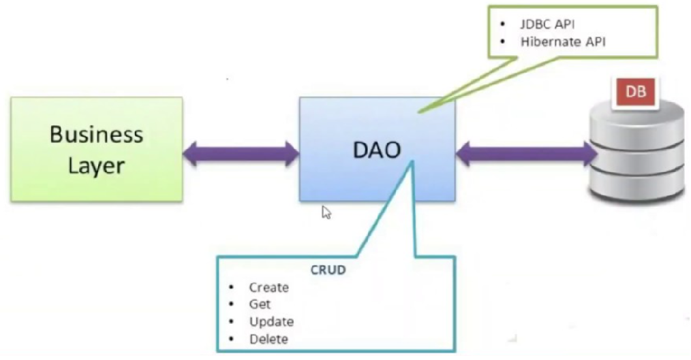

# Patrón DAO - Data access object

Si bien es posible inyectar el acceso a la fuente de datos donde los necesitemos, no es una buena idea _-de hecho resulta horrible-_ ir repartiendo su uso por el código de nuestro proyecto sin seguir criterio alguno. Crearemos un caos que violará los principios de encapsulación y desacoplamiento de la programación orientado a objetos.

Incluso habrá ocasiones en las que necesitaremos tener más de una fuente de datos o la fuente de datos que tenemos variará, lo que nos obligaría a refactorizar gran parte del código.

La solución estándar consiste en recurrir al **patrón de diseño Data Access Object (objeto de acceso a datos), más conocido por las siglas DAO**. Las clases DAO son las responsables de implementar todas las operaciones con una fuente y\o almacenamiento de datos. Fuera de ellas, el código no tiene conocimiento sobre cómo se realiza la persistencia; puede ser una base de datos relacional o «no SQL», ficheros de texto, etcétera. 



Exponemos una API y todo lo demás **queda encapsulado y abstraído en los DAOs**, los cuales, generalmente, obtendremos con una factoría. Por lo común, cuando la fuente de datos es una base de datos relacional, una clase DAO contiene todas las operaciones centradas en una tabla, es decir, crearemos un DAO para cada cada entidad que lo requiera.

## 🪀 1. Creación de las interfaces DAO

Lo primero que haremos será **crear las interfaces de las entidades que requieran acceso a la base de datos**. Creamos interfaces para exponerlas en forma de API sus operaciones. Ya que la implementación de éstas estará en otras clases para encapsular las operaciones.

Usaremos los ejemplos de clase `Person` y `Address` que tenían una relación muchos a muchos.

```java title="PersonDAO.java"
public interface PersonDAO {

    Optional<Person> findById(Long id);

    void create(Person person);

    void save(Person person);

    void deleteById(Long id);

    void delete(Person person);
}
```

!!! note "Nota"
    En el DAO suelen ir las operaciones comunes usadas para la entidad. La nomenclatura suele ser nombre de la entidad seguido de la palabra `DAO`.

## 🪀 2. Implementación de las interfaces DAO

Cada interfaz DAO tendrá su implementación. Las clases que implementan las interfaces serán nombradas como entidad + DAO + Impl: `PersonDAOImpl`.

```java title="PersonDAOImpl.java"
public class PersonDAOImpl implements PersonDAO {

    @Override
    public Optional<Person> findById(Long id) {
        try (Session session = HibenateUtil.getSessionFactory().openSession();) {
            return Optional.ofNullable(session.find(Person.class, id));
        }
    }

    @Override
    public void create(Person person) {
        try (Session session = HibenateUtil.getSessionFactory().openSession();) {
            Transaction tx = null;
            try {
                tx = session.beginTransaction();
                session.persist(person);
                tx.commit();
            } catch (RuntimeException e) {
                if (tx != null)
                    tx.rollback();
                e.printStackTrace();
            }
        }
    }

    @Override
    public void save(Person person) {
        try (Session session = HibenateUtil.getSessionFactory().openSession();) {
            session.beginTransaction();
            session.merge(person);
            session.getTransaction().commit();
        }
    }

    @Override
    public void deleteById(Long id) {
        try (Session session = HibenateUtil.getSessionFactory().openSession();) {
            session.beginTransaction();
            session.remove(session.find(Person.class, id));
            session.getTransaction().commit();
        }
    }

    @Override
    public void delete(Person person) {
        try (Session session = HibenateUtil.getSessionFactory().openSession();) {
            session.beginTransaction();
            session.remove(person);
            session.getTransaction().commit();
        }
    }
}
```

Si hiciéramos lo mismo para la entidad `Address`, es decir, creáramos la interfaz `AddressDAO` y su implementación `AddressDAOImpl` nos daríamos cuenta de que las clases serían muy parecidas a `PersonDAO` y `PersonDAOImpl`, ya que contendría los mismos métodos con la única diferencia de que cambia la entidad. Entonces estaríamos creando mucha cantidad de código redundante.

## 🪀 3. Creación de un DAO genérico

**Para mejorar la reusabilidad y legilibidad del código** deberíamos hacer uso de los genéricos que nos ofrece Java. Por tanto, se ha de crear un DAO general que incluya las funcionalidades más genéricas de los DAO, `GenericDAO`.

```java title="GenericDAO.java"
public interface GenericDAO<T> {

    Optional<T> findById(Long id);

    void create(T entity);

    void save(T entity);

    void deleteById(Long id);

    void delete(T entity);
}
```

Todos los DAOs heredarán de `GenericDAO`, lo que quiere decir que todos los DAO contendrán esos métodos, cumplirán con esas funciones.

## 🪀 4. Implementación del DAO genérico

```java title="GenericDAOImpl.java"
public class GenericDAOImpl<T> implements GenericDAO<T> {

    private final Class<T> entityClass;

    public GenericDAOImpl(Class<T> entityClass) {
        this.entityClass = entityClass;
    }

    @Override
    public Optional<T> findById(Long id) {
        try (Session session = HibenateUtil.getSessionFactory().openSession();) {
            return Optional.ofNullable(session.find(entityClass, id));
        }
    }

    @Override
    public void create(T entity) {
        try (Session session = HibenateUtil.getSessionFactory().openSession();) {
            Transaction tx = null;
            try {
                tx = session.beginTransaction();
                session.persist(entity);
                tx.commit();
            } catch (RuntimeException e) {
                if(tx != null)
                    tx.rollback();
                e.printStackTrace();
            }
        }
    }

    @Override
    public void save(T entity) {
        try (Session session = HibenateUtil.getSessionFactory().openSession();) {
            session.beginTransaction();
            session.merge(entity);
            session.getTransaction().commit();
        }
    }

    @Override
    public void deleteById(Long id) {
        try (Session session = HibenateUtil.getSessionFactory().openSession();) {
            session.beginTransaction();
            session.remove(session.find(entityClass, id));
            session.getTransaction().commit();
        }
    }

    @Override
    public void delete(T entity) {
        try (Session session = HibenateUtil.getSessionFactory().openSession();) {
            session.beginTransaction();
            session.remove(entity);
            session.getTransaction().commit();
        }
    }
}
```

La creación de esta clase genérica conlleva los siguientes cambios en las clases DAO:

```java title="AddressDAO.java"
public interface AddressDAO extends GenericDAO<Address> {

}
```

```java title="AddressDAOImpl.java"
public class AddressDAOImpl extends GenericDAOImpl<Address> implements AddressDAO {

    public AddressDAOImpl() {
        super(Address.class);
    }
}
```

Ahora mismo la clase `AddressDAO` no definiría ningún método nuevo, solo los que ya hereda de GenericDAO. Por tanto, ¿para qué nos sirve tener esta clase? Ahora mismo, podríamos eliminarla, ya que no tiene ninguna funcionalidad extra, pero en un futuro si queremos realizar una operación muy específica, o una query relacionada con esa tabla, deberemos definir ese método dentro de `AddressDAOImpl`.
