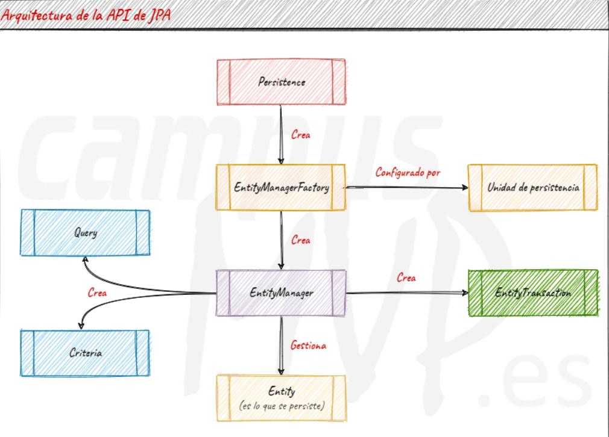
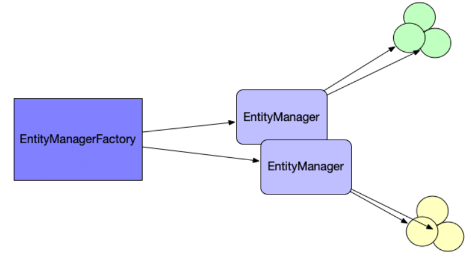
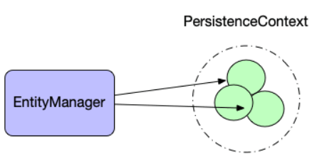
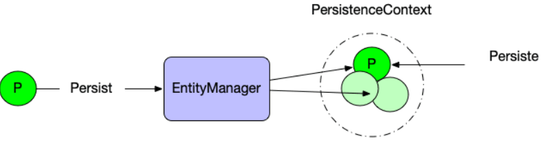

# 🏛️ Jakarta – JPA (Java Persistence API)

JPA es una **especificación** que define *cómo* debe gestionarse la **persistencia de objetos** en aplicaciones Java.  
👉 Al ser una especificación, **JPA no es una librería concreta**: necesita un **proveedor** (implementación) como **Hibernate**, **EclipseLink**, **OpenJPA**, etc.

> **Renombrado:** En 2019 *Java EE* pasó a la *Eclipse Foundation* y JPA se renombró a **Jakarta Persistence**. Desde **Jakarta Persistence 3.0** (2020), los paquetes cambiaron de `javax.persistence` a **`jakarta.persistence`**.

---

## 🧠 ¿Qué cubre JPA?
- **API** (interfaces, anotaciones) en `jakarta.persistence`  
- **Lenguaje de consultas** **JPQL** (Java Persistence Query Language)  
- **Metadatos** para el mapeo objeto/relacional (anotaciones o XML)

!!! important "Importante"
    JPA define **interfaces** (p. ej., `EntityManager`), no clases de uso directo. Para usarlas necesitas una **implementación** (Hibernate, EclipseLink…).

---

## 🧱 Arquitectura general



Componentes clave:  
- **Entidades** (`@Entity`): clases cuyo **estado** queremos guardar en BD.  
- **EntityManagerFactory (EMF)**: fábrica de `EntityManager`. Es **pesada**, **thread‑safe** y suele existir **una por *persistence unit*** en toda la aplicación.  
- **EntityManager (EM)**: gestiona el **contexto de persistencia** (*first‑level cache*) y el ciclo de vida de las entidades. **No es thread‑safe**; se usa **por transacción / petición**.  
- **Persistence Context**: conjunto de entidades **gestionadas** (estado *managed*) que el `EntityManager` sincroniza con la BD.

---

## 🧩 Entidades (`@Entity`)

Para JPA, **una entidad es un objeto cuyo estado se persiste** en una tabla.  
Toda entidad necesita una **identidad** (PK).

```java
import jakarta.persistence.*;

@Entity
@Table(name = "usuarios")
public class Usuario {
  @Id @GeneratedValue(strategy = GenerationType.IDENTITY)
  private Long id;

  @Column(nullable = false, length = 100)
  private String nombre;

  @Column(nullable = false, unique = true, length = 150)
  private String email;

  // getters/setters
}
```

- Las entidades pueden tener relaciones (`@OneToMany`, `@ManyToOne`, `@ManyToMany`) y tipos embebidos (`@Embeddable`).  
- El **diseño de la identidad** (PK) es clave para el rendimiento y la igualdad (`equals/hashCode`).

---

## 🏭 EntityManagerFactory y EntityManager



- **EMF** se crea normalmente al arrancar la aplicación:  
  ```java
  EntityManagerFactory emf =
      Persistence.createEntityManagerFactory("default");
  ```
  Mantén **una única instancia** (por *persistence unit*) y ciérrala al apagar la app.

- **EM** se crea cuando necesitas operar con datos y **no se comparte entre hilos**:  
  ```java
  EntityManager em = emf.createEntityManager();
  try {
    em.getTransaction().begin();
    // ... usar em.persist/merge/find/query
    em.getTransaction().commit();
  } finally {
    em.close();
  }
  ```

> **Regla práctica:** *EMF = singleton de la app*; *EM = por petición/uso/tx*.

---

## 🧰 Persistence Context (First‑Level Cache)



- El `EntityManager` mantiene un **conjunto de entidades gestionadas**.  
- La sincronización con la BD ocurre al **`commit`** o al **`flush()`**.  
- **Dirty checking**: si cambias un atributo de una entidad *managed*, JPA genera el `UPDATE` automáticamente al sincronizar.

Para conseguir que alguno de nuestros objetos pase a ubicarse dentro del PersistenceContext bastará con invocar los métodos persist, merge, sobre él.

Operaciones típicas:
```java
em.persist(ent);   // transient -> managed (INSERT en flush/commit)
em.merge(detached);// detached/new -> managed (SELECT/INSERT/UPDATE)
em.remove(ent);    // managed -> removed (DELETE en flush/commit)
em.flush();        // fuerza sincronización ahora
em.clear();        // vacía el contexto (pasa managed -> detached)
```



---
## 🔄 Estados de las entidades

| Estado                       | Significado                                                                                                                                          | Ejemplo                                               |
| ---------------------------- | ---------------------------------------------------------------------------------------------------------------------------------------------------- | ----------------------------------------------------- |
| **Transient (transitorio)**  | El objeto existe en memoria, pero **no en la BD ni en la sesión**.                                                                                   | `Customer c = new Customer("Ada");`                   |
| **Persistent (persistente)** | Está **asociada a una `Session`** (o `EntityManager`) y **Hibernate la rastrea**. Si cambias un atributo, el cambio se guardará al hacer `commit()`. | `session.persist(c);`                                 |
| **Detached (desasociado)**   | Existía en la BD, pero ya **no está siendo gestionada** (por ejemplo, la sesión se cerró).                                                           | Objeto obtenido con `find()` pero fuera del contexto. |
| **Removed (eliminado)**      | Está marcada para eliminarse en el commit.                                                                                                           | `session.remove(c);`                                  |


Relación con métodos:

| Método                    | Qué hace                                                 | Estado que afecta      |
| ------------------------- | -------------------------------------------------------- | ---------------------- |
| `persist(entity)`         | Inserta la entidad en el contexto (nuevo → persistente). | transient → persistent |
| `find(Entidad.class, id)` | Busca en BD y la mete en el contexto.                    | detached → persistent  |
| `merge(entity)`           | Reasocia una entidad detached, actualizando los cambios. | detached → persistent  |
| `remove(entity)`          | Marca la entidad para borrado al commit.                 | persistent → removed   |
| `refresh(entity)`         | Relee los valores desde la BD.                           | persistent             |
| `detach(entity)`          | La saca del contexto (deja de estar gestionada).         | persistent → detached  |
| `clear()`                 | Saca **todas** las entidades del contexto.               | persistent → detached  |
| `flush()`                 | Sincroniza el contexto con la BD sin cerrar la sesión.   | —                      |

---

## 🧪 Fichero de persistencia: `persistence.xml`

El **`EntityManagerFactory`** se configura mediante **unidades de persistencia** en `META-INF/persistence.xml`:

```xml title="META-INF/persistence.xml"
<?xml version="1.0" encoding="UTF-8"?>
<persistence xmlns="https://jakarta.ee/xml/ns/persistence"
             version="3.0">
  <persistence-unit name="default" transaction-type="RESOURCE_LOCAL">
    <class>es.severo.entity.Tramite</class>
    <properties>
      <property name="jakarta.persistence.jdbc.driver" value="com.mysql.cj.jdbc.Driver"/>
      <property name="jakarta.persistence.jdbc.url" value="jdbc:mysql://localhost:3306/testdb2"/>
      <property name="jakarta.persistence.jdbc.user" value="root"/>
      <property name="jakarta.persistence.jdbc.password" value="root"/>

      <property name="hibernate.show_sql" value="true"/>
      <property name="hibernate.format_sql" value="true"/>
    </properties>
  </persistence-unit>
</persistence>
```

**Claves del XML**
- **`<persistence-unit name="...">`**: identifica la unidad; ese nombre se usa en `createEntityManagerFactory(...)`.  
- **`transaction-type`**:  
  - `RESOURCE_LOCAL` → transacciones locales controladas por la app.  
  - `JTA` → transacciones gestionadas por un *application server*.  
- **`<class>`**: lista de entidades (algunos *runtimes* permiten *auto-scan*).  
- **`<properties>`**: conexión, *dialect*, *DDL*, *pooling*, etc.

> Puedes tener **varias** *persistence units* si conectas a **distintas BDs** o necesitas configuraciones separadas.

---
## 🔎 JPQL y consultas

**JPQL** consulta **entidades y sus atributos**, no tablas. JPA traduce JPQL → SQL.

```java
// Búsqueda por email
TypedQuery<Usuario> q = em.createQuery(
  "SELECT u FROM Usuario u WHERE u.email = :email", Usuario.class);
q.setParameter("email", "ana@example.com");
Usuario u = q.getSingleResult();
```

- **JOINs** siguen las relaciones del modelo:  
  `SELECT p FROM Pedido p JOIN p.usuario u WHERE u.nombre = :n`  
- **Criteria API** (tipado, dinámico) también está disponible.

---

## ⚙️ Transacciones y excepciones

En modo **`RESOURCE_LOCAL`**:
```java
em.getTransaction().begin();
try {
  // ... operaciones
  em.getTransaction().commit();
} catch (RuntimeException ex) {
  if (em.getTransaction().isActive()) em.getTransaction().rollback();
  throw ex;
}
```

- Las excepciones de JPA son **`RuntimeException`**, con raíz común **`PersistenceException`**.  
- En **`JTA`**, las transacciones las gestiona el contenedor (por ejemplo, usando anotaciones `@Transactional` en Jakarta EE/Spring).

---

## 🧵 Concurrencia y *thread-safety*

- **`EntityManagerFactory`** → **thread‑safe**; **una instancia** por *persistence unit*.  
- **`EntityManager`** → **no** thread‑safe; **no usar** como `static` ni compartir entre hilos. Crear por uso/petición/tx.  
- Cerrar siempre `EntityManager` en un `finally` (o equivalente del marco).

---

## 🧰 Implementaciones de JPA (providers)

- **Hibernate** (el más extendido; HQL, gran ecosistema).  
- **EclipseLink** (referencia de Jakarta).  
- **OpenJPA**, **DataNucleus**, **ObjectDB** (alcances específicos).

> Ventaja de JPA: **intercambiabilidad** de proveedores con cambios mínimos si sigues la especificación.

---