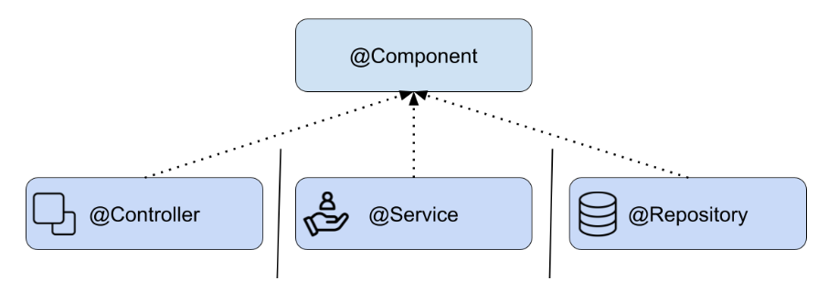
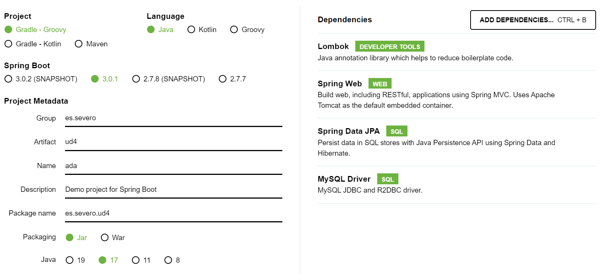

# 🖲️ Introducción a Spring Framework - [Web oficial](https://spring.io/)

_Debido al aumento de la complejidad que presentan la mayoría de los sistemas web_, tanto en temas de seguridad, funcionalidad y gráficas, la comunidad de desarrolladores se vio en la necesidad de diseñar ciertas ayudas, a fin de no tener que repetir código, reduciendo de este modo el tiempo y el espacio para el desarrollo de aplicaciones.

Lanzado por primera vez, como una plataforma de código abierto Java, en el mes de Junio del año 2003 bajo la licencia Apache 2.0, se convirtió desde entonces en {++el framework más popular para Java empresarial++}, para crear código de alto rendimiento, liviano y reutilizable. 

**Su finalidad es estandarizar, agilizar, manejar y resolver los problemas que puedan ir surgiendo en el trayecto de la programación.**

Spring se puede considerar como el padre del los frameworks Java, ya que da soporte a varios frameworks como: **Hibernate, Struts, Tapestry, EJB, JSF** entre otros.

La versión actual de Spring Framework es la 6.x.x y puedes obtener la documentación desde su [web oficial](https://docs.spring.io/spring-framework/docs/current/reference/html/).

## 🪔 Requisitos para crear un proyecto con Spring

Para crear un proyecto con Spring debemos realizar una serie de pasos:

1. Elegir el tipo de proyecto, es decir, elegir **la herramienta de construcción del proyecto**: Maven o Gradle y la versión de Java.
2. Seleccionar las **dependencias** que necesitamos y su versión.
3. Construir la **estructura de directorios** de nuestro proyecto, donde estará el código fuente, los ficheros properties, plantillas, etc.
4. Uso y configuración de **beans**.

## 🪔 Beans

Para entender el concepto de bean en Spring necesitamos entender antes una serie algunos conceptos y cómo administra Spring los objetos beans.

### 🪃 Dependency Injection (DI)

La **inyección de dependencias** es un patrón de diseño que tiene como objetivo tomar la responsabilidad de crear las instancias de las clases que otro objeto necesita y suministrárselo para que esta clase los pueda utilizar.

{++Habitualmente nuestras clases dependen de otras para funcionar.++}

### Ejemplo de DI

_Por ejemplo, **una clase que necesita buscar un registro en la base de datos necesitará de otra que se encargue de buscarlo**._

Pensemos en estas dos clases. Llamemos a la primera `PersonalDataService` que es la encargada de tomar decisiones sobre el negocio y a la segunda `PersonaDAO`, la cual se encargará de acceder a la base de datos. 

La clase `PersonalDataService` depende de la clase `PersonaDAO` para lograr el acceso a los datos en la base de datos, es decir, en la clase `PersonalDataService` sería la responsable de crear una instancia de la clase `PersonaDAO`.

>En la inyección de dependencias ‘alguien’ externo se encarga de las dependencias que las clases necesitan.

### 🪃 Inversion of Control (IoC)

Spring también maneja el concepto de inversión de control ocupándose de mantener en su ‘contexto’ (application context) todas las instancias de nuestra aplicación y de inyectarle esa instancia a quien la necesite.

**Spring llama a estas instancias beans.**


Los beans son las instancias de las clases que están disponibles para ser reutilizados y son gestionados dentro del contenedor de Spring (**Spring container**). Spring sabe qué dependencias existen entre las instancias y se encarga de satisfacerlas.

!!! Note Nota
    IoC es el trabajo que realiza Spring buscando estas dependencias entre los objetos y realizando el ‘set’ de estos beans en quien los requiera. Busca en su contenedor de beans la instancia adecuada y se la agrega al objeto **cumpliendo así con la inyección de dependencias**.

### 🪃 Definir un Bean

Para definir un nuevo bean en Spring tenemos dos opciones:

- Podemos definir explícitamente un nuevo bean mediante la anotación `@Bean`.
- Podemos marcar una clase Java como un bean, y permitir a Spring que lo descubra, esto se hace mediante el **escaneo de componentes**.

Estas son dos técnicas diferentes para añadir beans a nuestro contexto.

## 🪔 ¿Qué es un componente `@Component` en Spring?

Spring define un conjunto de anotaciones core que categorizan cada uno de los componentes asociandoles una responsabilidad concreta, es lo que llamamos Spring stereotypes.

Una clase con la anotación `@Component` es un candidato a ser escaneado mediante el proceso de negociación, e instanciado como un bean y añadido al contexto.

Cuando indicamos que una clase es un `@Component`, lo que hacemos es decirle a Spring que queremos que cree una instancia y la gestione.

```java
@Component
public class MyClass {
    public void doSomething() {
        //.. 
    }
}
```
Al momento de inicializar la aplicación, Spring hará lo siguiente:

- Buscará dentro de la aplicación las clases anotadas con` @Component`
- Creará una instancia de los componentes
- Dejará el componente en su contexto
- Buscará quién necesita esos componentes y los **inyectará** en quién los necesite.

### 🪃 Spring Stereotypes

Los estereotipos (Stereotypes) son componentes que extienden de `@Component`.

En estos momentos existen únicamente 4:

1. **@Component**: estereotipo general.

2. **@Repository**: será parte de la ‘capa’ de persistencia cuya función será el acceso a los datos.

3. **@Service**: será parte de la ‘capa’ de servicios encargado de gestionar las operaciones de negocio más importantes a nivel de la aplicación y aglutina llamadas a varios repositorios de forma simultánea.

4. **@Controller**: realiza las tareas de controlador y gestión de la comunicación entre el usuario y el aplicativo. Existe `@RestController` que es una especialización de controller.



## 🪔 Cómo crear un proyecto con Spring en IntelliJ

Podemos ayudarnos de la herramienta [spring initializr](https://start.spring.io/) para crear el proyecto.
Seleccionamos la siguiente configuración:



La exportamos y extraemos para abrir como un proyecto nuevo en IntelliJ.

Instalamos el plugin en IntelliJ llamado **JPA Buddy** que será una ayuda para desarrollar algunas funcionalidades.

## 🪔 Autoconfiguración del proyecto

La anotación `@SpringBootApplication` habilita el mecanismo de configuración automática de la aplicación en función de las dependencias jar que encuentre en el classpath y se encarga del escaneo de componentes.

## 🪔 Estructura del proyecto

La estructura de un proyecto en Spring debe contener los siguientes paquetes entre otros:


