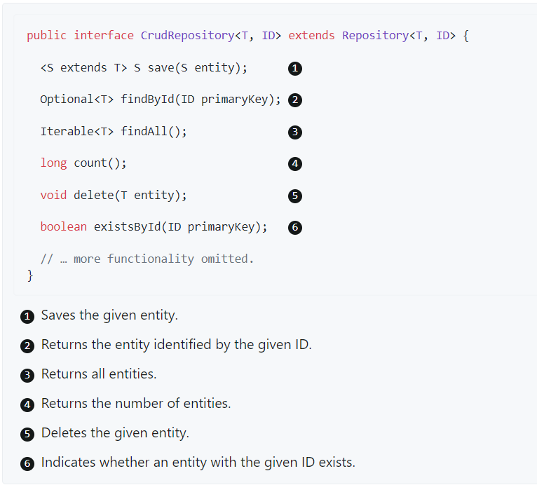
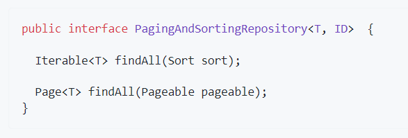
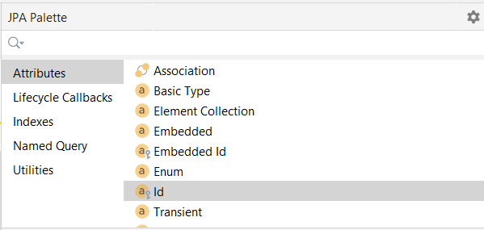
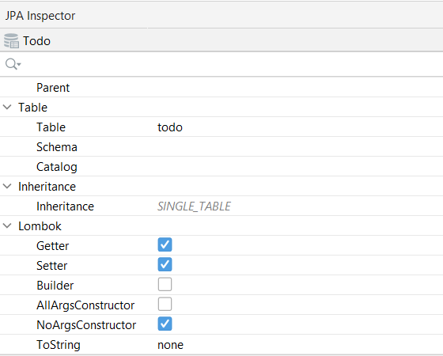

# ♨️ Trabajando con Spring Data JPA

Gracias a **[Spring Data JPA](https://spring.io/projects/spring-data-jpa#overview)**, que facilita el uso de tecnologías de acceso a datos, bases de datos relacionales y no relacionales, servicios de datos basados en la nube, etc., podemos trabajar con **Spring Data JPA repositories**. El objetivo del repositorio de Spring Data es reducir significativamente la cantidad de código repetitivo necesario para implementar capas de acceso a datos de persistencia.

**La interfaz central en la abstracción del repositorio de Spring Data es `Repository`**. Esta interfaz actúa principalmente como una interfaz de marcador para capturar los tipos con los que trabajar y para ayudarlo a descubrir interfaces que amplían esta. 

Las interfaces `CrudRepository` y `ListCrudRepository` brindan una funcionalidad **CRUD** sofisticada para la clase de entidad que se administra.



Además de `CrudRepository`, hay una abstracción `PagingAndSortingRepository` que agrega métodos adicionales para facilitar el acceso paginado a las entidades:



## 💮 Definir interfaces de repositorio

Para definir una interfaz de repositorio, primero se debe crear una clase de _dominio o entidad_. La interfaz debe extender el `Repository` y el tipo debe ser la clase de dominio y el tipo de ID.

Si desea exponer métodos CRUD para ese tipo de dominio, se puede extender de `CrudRepository` o una de sus variantes en lugar de `Repository`. `JpaRepository` es una especialización de `ListCrudRepository`.

```java title="PersonRepository.java"
public interface PersonRepository extends JpaRepository<Todo, Long> {
    //con esto heredamos todos los métodos definidos en JpaRepository y las clases que se extienden en ella
}
```

## 💮 Añadir entidades en IntelliJ

Dentro del paquete `entities` de proyecto, gracias al plugin que hemos instalado basta con hacer botón derecho sobre el paquete, _**New --> JPA Entity**_, y nos creará una entidad.

Para crear los campos de la entidad basta con hacer uso de la paleta de JPA. Para crear el atributo `id` de clave primaria hacemos doble click y rellenamos los campos.



Al utilizar **Lombok** nos podemos evitar escribir mucho código boilerplate, ya que el plugin lo hace por nosotros. Para ellos, hacemos click en la palabra `Todo` de la clase java, se mostrarán una serie de parámetros en la paleta JPA Inspector, hacemos check en las casillas de _Getter_, _Setter_ y _NoArgsConstructor_.



Esto añade en la clase de la entidad las siguientes anotaciones: **@Getter, @Setter y @NoArgsConstructor**. 

Lo que implica que genera por nosotros los getters y setters de todos los campos como públicos y el constructor por defecto.

```java title="Person.java"
@NoArgsConstructor
@Getter
@Setter
@Entity
@Table(name = "person")
public class Person {

    @Id
    @GeneratedValue(strategy = GenerationType.IDENTITY)
    @Column(name = "id", nullable = false)
    private Long id;

    @Column(name = "name")
    private String name;

    @Column(name = "active")
    private Boolean active;

}
```

## 💮 Query Methods

El mecanismo de creación de consultas integrado en la infraestructura del repositorio Spring Data es útil para crear consultas restrictivas sobre las entidades del repositorio.

El análisis de nombres de queries de consulta **se divide en sujeto y predicado**. 

- La primera parte (`find…By`, `exists…By`) define el sujeto de la consulta, 
- La segunda parte forma el predicado. La cláusula introductoria (sujeto) puede contener más expresiones. 

Cualquier texto entre `find` (u otras palabras clave introductorias) y `By` se considera descriptivo a menos que se use una de las palabras clave que limitan los resultados, como `Distinct` o `Top/First`.

Ejemplos de Query Methods

```java title="PersonRespository.java"
interface PersonRepository extends Repository<Person, Long> {

  List<Person> findByEmailAddressAndLastname(EmailAddress emailAddress, String lastname);

  // Enables the distinct flag for the query
  List<Person> findDistinctPeopleByLastnameOrFirstname(String lastname, String firstname);
  List<Person> findPeopleDistinctByLastnameOrFirstname(String lastname, String firstname);

  // Enabling ignoring case for an individual property
  List<Person> findByLastnameIgnoreCase(String lastname);
  // Enabling ignoring case for all suitable properties
  List<Person> findByLastnameAndFirstnameAllIgnoreCase(String lastname, String firstname);

  // Enabling static ORDER BY for a query
  List<Person> findByLastnameOrderByFirstnameAsc(String lastname);
  List<Person> findByLastnameOrderByFirstnameDesc(String lastname);

  // Like - where x.firstname like ?1 (parameter bound wrapped in %)
  List<Person> findByFirstnameContaining(String firstname);

  //Between -  where x.startDate between ?1 and ?2 - Busca las personas nacidas entre esas fechas
  List<Person> findByBirthDateBetween(LocalDate dateBegin, LocalDate dateEnd);
}
```

_En la documentación oficial de Spring Data JPA encontramos la siguientes tablas con las palabras clave admitidas:_

- [Query subject keywords](https://docs.spring.io/spring-data/jpa/docs/current/reference/html/#appendix.query.method.subject)
- [Query predicate keywords](https://docs.spring.io/spring-data/jpa/docs/current/reference/html/#appendix.query.method.predicate)

### Limitación de resultados

Se puede limitar los resultados de los métodos de consulta utilizando las palabras clave `first` o `top` indistintamente.
Podemos agregar un valor numérico opcional a `top` o `first` para especificar el tamaño máximo de resultado que devolverá la consulta. 

**Si se omite el número, se asume un tamaño de resultado de 1. **

Ejemplos [web oficial de Spring](https://docs.spring.io/spring-data/jpa/docs/current/reference/html/#repositories.limit-query-result):

```java
User findFirstByOrderByLastnameAsc();

User findTopByOrderByAgeDesc();

Page<User> queryFirst10ByLastname(String lastname, Pageable pageable);

Slice<User> findTop3ByLastname(String lastname, Pageable pageable);

List<User> findFirst10ByLastname(String lastname, Sort sort);

List<User> findTop10ByLastname(String lastname, Pageable pageable);
```

### Streaming los resultados de las consultas

Podemos procesar los resultados de los métodos de consulta utilizando Java 8 Stream<T> como tipo de retorno. 
