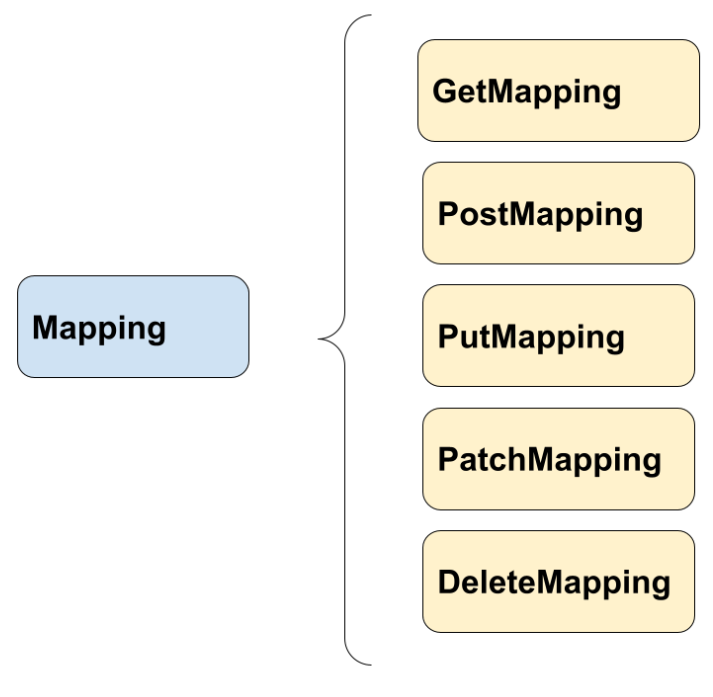

# 🔆 API Rest

Los desarrolladores de API pueden diseñar API por medio de varias arquitecturas diferentes. Las API que siguen el estilo arquitectónico de REST se llaman API REST. Los servicios web que implementan una arquitectura de REST son llamados servicios web RESTful. El término API RESTful suele referirse a las API web RESTful.

**La API RESTful es una interfaz que dos sistemas de computación utilizan para intercambiar información de manera segura a través de Internet.**

## ⚕️Rest Controller

Un _controller_ es un componente de Spring capaz de recibir peticiones http y responderlas.

Las clases que definimos como un controller es responsable de procesar las llamadas entrantes (request) que ingresan a nuestra aplicacion, validarlas y dar una respuesta (response).

Un **rest controller** es un tipo de controller que recibe peticiones con un formato de específico que cumple con formatos de solicitud RESTful habitualmente y mayormente en **JSON**, aunque a veces se usan otros como HTML, XML, o simplemente texto.

## ⚕️Cómo crear un controlador rest en Spring

El primer paso para crear un ‘controlador rest’ es anotar la clase que con `@RestController`.

Con esto Spring ya sabe que esa clase será un componente encargado de recibir llamadas.

En la clase también podemos definir la ruta raíz por la cuál partirán las llamadas externas con la anotación `@RequestMapping`.

```java title="TodoController.java"
@RestController
@RequestMapping("/person")
public class PersonController {

}
```

Dentro del controlador añadiremos los métodos con lo que se mapearán las diferentes rutas o paths.

## ⚕️Tipos de mapeo (mapping) en un controlador rest

Existen los siguientes tipos de mapeo que podemos usar en Spring:



- **_Get_**: para solicitar información de un recurso.
- **_Post_**: para enviar información a fin de crear o de actualizar un recurso.
- **_Put_**: para enviar información a fin de modificar un recurso.
- **_Patch_**: actualiza una parte del recurso.
- **_Delete_**: elimina un recurso específico.

### ¿Cuál es la diferencia entre Post , Put, Patch?

Habitualmente la diferencia entre Post y Put radica en que Post lo usamos para añadir un recurso y Put lo utilizamos para modificar un recurso en particular.

Patch también lo utilizamos para actualizar un recurso pero solo una parcialidad del mismo.

## ⚕️Ejemplos de mapeo

```java title="PersonController.java"
@RestController
@RequestMapping("/api")
public class PersonController {

    private final PersonService personService;

    public PersonController(PersonService personService) {
        this.personService = personService;
    }

    @GetMapping
    public List<Person> getPersons() {
        return personService.findAll();
    }

    @GetMapping("/person/{id}")
    public Person byId(@PathVariable("id") Long id) {
        return personService.find(id).orElseThrow();
    }

    @PostMapping("/person/")
    public Person newPerson(@RequestBody Person person) {
        return personService.create(person);
    }

    @PutMapping("/person/")
    public Person update(@RequestBody Person person) {
        return personService.update(person);
    }

    @PatchMapping("/person/")
    public Person change(@RequestBody Person person) {
        return personService.change(person);
    }

    @DeleteMapping("/person/{id}")
    public boolean delete(@PathVariable("id") Long id) {
        return personService.remove(id);
    }
}
```