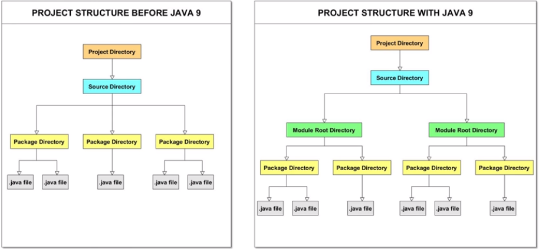

# Java Modules

_El sistema de módulos en Java es una característica que se introdujo en el JDK 9, y fue desarrollado bajo el nombre de código de proyecto Jigsaw._ Java 9 introdujo un nuevo componente de programa conocido como **modules**.

A partir de esta característica, las aplicaciones de Java se desarrollan como colecciones de módulos.

**El sistema de módulos fue diseñado para tener una configuración confiable, encapsulación fuerte y ser modular.** Su propósito es resolver los problemas típicos relacionados con el desarrollo y la implementación de aplicaciones anteriores a Java 9.

Esta nueva característica de Java 9 es conocida colectivamente como el Sistema de Módulos de la Plataforma Java o **JPMS**.

## ¿Qué es un módulo?

Un módulo es una colección nombrada de datos y código. Los módulos pueden contener código Java que está organizado como un conjunto de paquetes, que contienen clases Java, interfaces, etc.
Un módulo es un contenedor de paquetes.

Cada módulo debe tener la siguiente configuración:
- name: nombre único del módulo.
- inputs: qué necesita usar el módulo y qué es necesario para compilar y ejecutar el módulo.
- outputs: lo que el módulo exporta a otros módulos.

Los módulos estándar tienen nombres con el prefijo java. Ejemplos: java.sql, java.net, etc.
Por ejemplo, todos los nombres de los módulos de JavaFX tienen el prefijo javafx.

## Fichero module-info.java

Cada módulo viene con un archivo descriptor de módulo que describe el módulo y contiene metadatos sobre el módulo. Este fichero descriptor siempre se encuentra directamente en la carpeta raíz del módulo y siempre tiene el nombre de **module-info.java**.

## Ventajas de usar módulos

- Escalabilidad.
- Seguridad y mantenibilidad. 
- Mejora el rendimiento de la aplicación.
- Facilidad a la hora de desarrollar.

## Declaración de un módulo

Para declarar un módulo se utiliza la palabra reservada **_module_** seguido del nombre del módulo y llaves. La sintaxis es la siguiente:

```java
    [open] module <moduleName> {
        <module-statement>;
        <module-statement>;
        ...
    }
```

- [open]: es opcional, es el modificador que declara un módulo abierto, un módulo que exporta sus paquetes para los utilice el acceso reflexivo.
- <moduleName>: Es un campo obligatorio. No podemos tener dos módulos dentro del mismo código base con el mismo nombre. Es una buena práctica nombrar a los módulos con el mismo nombre que los paquetes. El nombre del módulo consta de uno o más identificadores de Java separados por el ".", similar a cómo se declaran los paquetes. Ejemplo: _es.education.common_
- Dentro de las llaves se puede añadir opcionalmente 0 o más metadatos sobre el módulo o **_module statements_**. Y estos statements o declaraciones pueden ser:
    - export statement: se usa para especificar los paquetes que exporta el módulo actual.
    - opens statement: NO se puede usar en módulos abiertos (open modules) porque todos los paquetes están abiertos en un módulo abierto.
    - requires statement: se usa para especificar el módulo que requiere el módulo actual. Si nuestro módulo depende de otros módulos, debemos especificarlo aquí. Podemos usarlos tantas veces como módulos requiera el nuestro.
    - uses statement: se usa para especificar el servicio que consume el módulo actual.
    - provides statement: se usa para especificar las implementaciones de servicio que brindan los módulos actuales.


**El nombre del módulo definido se puede usar en otras declaraciones de módulo para expresar relaciones entre módulos.**

En el siguiente diagrama se muestra una estructura de proyecto antes y después de utilizar modules:


Se trata de no crear aplicaciones como un gran proyecto java, sino de crear unidades modulares que funcionan juntas para formar una aplicación.

{++ Idealmente, los módulos son componentes reutilizables que resuelven requisitos específicos para esa aplicación. ++}

## Tipos de módulos

Jigsaw definió dos tipos de módulos:

### Named modules (módulos con nombre)

Cada módulo tiene un nombre. Pueden ser **normales o automáticos**. 
Éstos módulos deben ser declarados en el fichero module-info.java.

- Normal modules: (sin modificador open). No existen oficialmente como tal en JDK 9, hace referencia a los named modules que no son automáticos. Y hemos dicho que tienen un fichero descriptor, el module-info.java. Se declara usando la palabra reservada **module**. No exporta ninguno de sus paquetes por defecto. Y se divide entre **módulos básicos y abiertos (basic and open modules)**.
    - Basic modules: tampoco existe oficialmente, simplemente se usa el término para un módulo que no es abierto. Es decir, módulos que _no son automatic modules ni tampoco open modules_.
    - Open modules:  muchas librerías de terceros como Hibernate o Spring usan la reflexión para acceder a las partes internas de JDK en tiempo de ejecución. Estas librerías solo funcionan con módulos que son open. Se definen usando la palabra resevada **_open_**. Un módulo abierto hace que todos los paquetes dentro del módulo sean accesibles para una reflexión profunda. La palabra reservada open, se puede usar para un módulo o para declarar paquetes específicos como open.

- Automatic modules: no tienen fichero descriptor. Se crean después de agregar un fichero jar a la ruta del módulo. No se declara explícitamente por el desarrollador dentro del fichero descriptor del módulo. Más bien, se crea automáticamente cuando se coloca un fichero jar en la ruta del módulo. Requiere que por defecto todos los módulos de la plataforma, todos nuestros propios módulos y los demás módulos automáticos. Por defecto exporta todos sus paquetes. Son útiles para código de terceros.

### Unnamed modul (módul sin nombre)

No tiene nombre y tampoco lo declaramos. Exporta todos sus paquetes y lee todos los módulos en el JDK y en la ruta del módulo. Es un módulo formado por ficheros jar de la ruta de clase, y todos estos archivos jar forman el módulo sin nombre.
Un módulo con nombre NO PUEDE REQUERIR un módulo sin nombre.

### Aggregator modules

Por último tenemos los módulos agregados. Éstos existen por necesidad. Por ejemplo imaginad que nuestro módulo depende de 3 módulos. Podemos crear un **aggregator module** para esos tres módulos y de esta forma nuestro módulo solo dependería de este único módulo agregado que contiene los otros tres.

## Module Path y Class Path

JDK 9 introdujo el concepto de module path o ruta de módulo.
Module Path puede representar:

- Una ruta a una secuencia de carpetas que contienen módulos.
- Una ruta a un fichero jar modular.
- Una ruta a un fichero jmod (versión extendida de JAR).

El compilador utiliza una ruta de módulo para encontrar y resolver módulos. Cada módulo de un module path debe tener una declaración (module-info.java).

Class path representa una secuencia de ficheros java.

## Crear un módulo en IntelliJ

Con nuestra aplicación abierta, seleccionamos File --> New --> Module.
Se recomienda llamar a los paquetes igual que a los módulos.